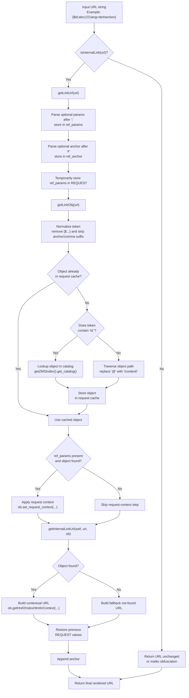

```mermaid
---
id: 1b0c4b74-0cce-485e-9d2a-7c9d47a60033
---
flowchart TD
    A["Input URL string<br/>Example: {$id:abc123;lang=de#section}"] --> B{"isInternalLink(url)?"}
    B -- "No" --> X["Return URL unchanged<br/>or mailto obfuscation"]
    B -- "Yes" --> C["getLinkUrl(url)"]

    C --> D["Parse optional params after ';'<br/>store in ref_params"]
    D --> E["Parse optional anchor after '#'<br/>store in ref_anchor"]
    E --> F["Temporarily store ref_params in REQUEST"]

    F --> G["getLinkObj(url)"]
    G --> H["Normalize token<br/>remove {$...} and strip anchor/comma suffix"]
    H --> I{"Object already <br/>in request cache?"}

    I -- "Yes" --> J["Use cached object"]
    I -- "No" --> K{"Does token <br/>contain 'id:'?"}
    K -- "Yes" --> L["Lookup object in catalog<br/>getZMSIndex().get_catalog()"]
    K -- "No" --> M["Traverse object path<br/>replace '@' with '/content/'"]

    L --> N["Store object <br/>in request cache"]
    M --> N
    N --> J

    J --> O{"ref_params present<br/> and object found?"}
    O -- "Yes" --> P["Apply request context<br/>ob.set_request_context(...)"]
    O -- "No" --> Q["Skip request-context step"]

    P --> R["getInternalLinkUrl(self, url, ob)"]
    Q --> R

    R --> S{"Object found?"}
    S -- "Yes" --> T["Build contextual URL<br/>ob.getHref2IndexHtmlInContext(...)"]
    S -- "No" --> U["Build fallback not-found URL"]

    T --> V["Restore previous <br/>REQUEST values"]
    U --> V
    V --> W["Append anchor"]
    W --> Y["Return final rendered URL"]

    X --> Y
```