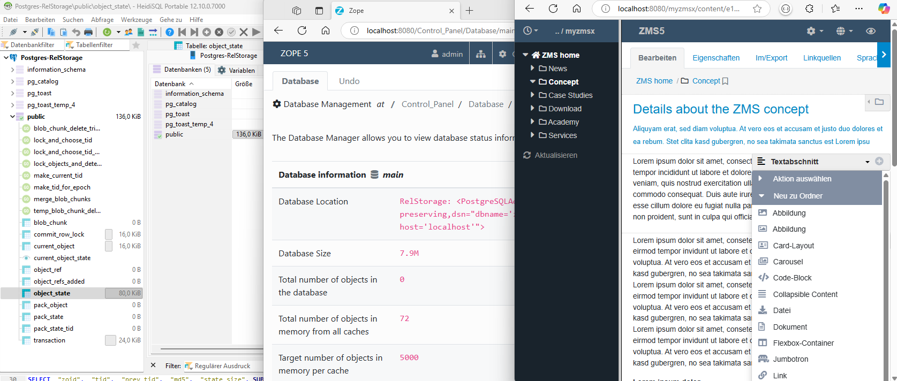

# Running ZMS in a Docker container on RelStorage

Important: *The presented Docker environment is not yet recommended for production, just for testing and exploration.* We do plan to evolve these to be production ready, but we are not there yet.

RelStorage stores the ZODB data in a RDBMS: the dockerfile installs - based on Py3.11-slim - Postgres (V15) as the database storing Zope/ZMS data. When Zope is started the first time a schema "zodb" an a postgres-user "zodbuser" is created SQL. The mounted configuration file ./ect/zope.ini tells Zope to store its data via the relstorage-interface

```xml
<zodb_db main>
  mount-point /
  <relstorage>
    <postgresql>
      dsn dbname='zodb' user='zodbuser' host='localhost' password='zodbuser'
    </postgresql>
  </relstorage>
</zodb_db>
```

## Configurations for Port-Forwarding

To get a direct access from outsiede the container to Zope (on port 8080) and Postgres (on port 5432) both applications need a modified configuration  files that are mounted from the host filesystem.
The crucial lines here are:

```
#./etc/zope.ini
host = 0.0.0.0

#./etc/postgres/15/main/postgresql.conf
listen_addresses = '*'

#./etc/postgres/15/main/pg_hba.conf
host  all  all  0.0.0.0/0  md5
```
---

_Screen-Image:_ The example environment is Windows 11 with WSSL/Ubuntu and Docker installed. Zope/ZMS are running in a Docker container on exposed port 8080 while Postgress can be reached (due to to upper conf modifications) from the host on 5432, e.g. with HeidiSQL.
