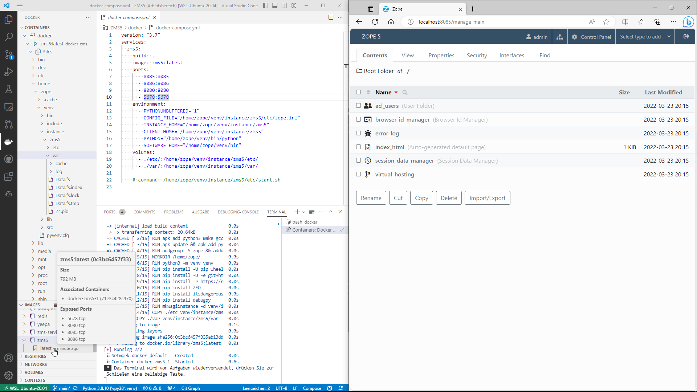
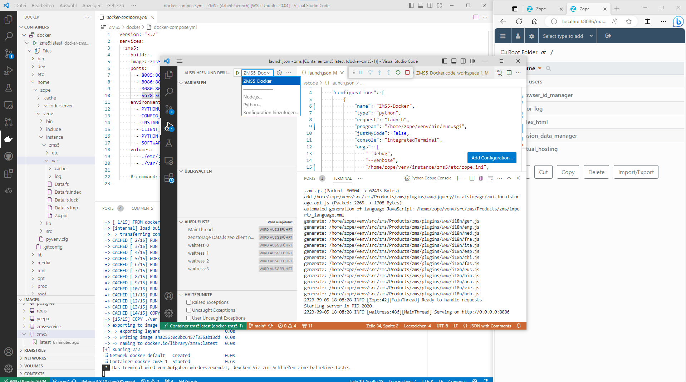
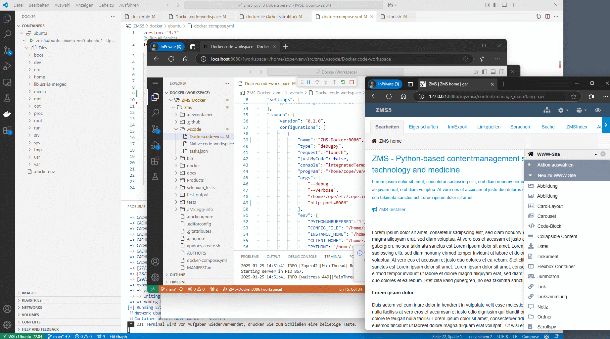

# Running ZMS in a Docker container with Ubuntu

Important: *The here presented Docker environment is not recommended for production, just for testing and exploration.*

The ZMS source folder `./docker` contains two minimalistic Docker files: 
1. the [dockerfile](https://github.com/zms-publishing/ZMS/blob/main/docker/ubuntu/dockerfile) for creating a Docker *image* and 
2. the [docker-compose](https://github.com/zms-publishing/ZMS/blob/main/docker/ubuntu/docker-compose.yml) file for building a Docker *container*.

The Docker image utilizes a minimal *Ubuntu 24.04*-Linux with a fresh compiled Python3 and some additional software packages (like mariadb and openldap). The ZMS installation happens with pip in a successively created virtual python environment (`/home/zope/venv`) and provides the ZMS code in the pip-"editable" mode from the ZMS source code folder (`/home/zope/venv/src/ZMS/.git`) whereas the Zope instance is placed in the home folder (`/home/zope/`)

To make Zope running there are some crucial config files needed which usually (created by `mkwsgiinstance`) are set on default values. In a Docker environment these defaults must be modified; moreover the Docker container provides a ZEO-server for running multiple Zope processes in parallel (e.g. an additional one for debugging). That is why a small set of config files is provided as presets via the the source-folders
1. ./docker/ubuntu/var
2. ./docker/ubuntu/etc
3. ./docker/ubuntu/Extensions

These sources will be copied into the *image* (on building) 
```yaml
# dockerfile
COPY ./etc etc
COPY ./var var
COPY ./Extensions Extensions
```
or referenced as *volume mounts* from the *container* (on composing):
```yaml
# docker-compose
    volumes:
      - ./etc/:/home/zope/etc/
      - ./var/:/home/zope/var/:rw
      - ./Extensions/:/home/zope/Extensions:rw
```


## Overview of Docker- and all Zope config-files

*Hint: to ease the file access from the container the config files are not restricted:* `chmod -r 777`
```
$ tree -p
.
├── [-rw-r--r--]  docker-compose.yml
├── [-rw-r--r--]  dockerfile
├── [drwxrwxrwx]  Extensions
├── [drwxrwxrwx]  etc
│   ├── [-rwxrwxrwx]  start.sh
│   ├── [-rwxrwxrwx]  zeo.conf
│   ├── [-rwxrwxrwx]  zope.conf
│   └── [-rwxrwxrwx]  zope.ini
└── [drwxrwxrwx]  var
    ├── [drwxrwxrwx]  cache
    ├── [drwxrwxrwx]  log
```

## Running the ZMS Container with VSCode

The VSCode Docker Extension [ms-azuretools.vscode-docker](https://marketplace.visualstudio.com/items?itemName=ms-azuretools.vscode-docker) is a perfect tool for handling containers. A right mouse click on the file ´docker-compose.yaml´ starts composing the container. Initially ZEO will be started and Zope will run on port 8085.



## Attach VSCode to the ZMS Container
Another right click on the running container-ID allows to intrude the container with VSCode and launch a new Zope instance in debugging mode. 
Hint: For this purpose the docker-container folder `/home/zope/venv/src/zms/docker/.vscode/` contains a prepared VSCode-workspace file and a launch file for starting Zope in debug-mode within the container [Docker.code-workspace](https://github.com/zms-publishing/ZMS/blob/main/docker/alpine/.vscode/Docker.code-workspace). The thus launched Zope instance will run port 8085.




## Browser-based VSCode server in a development container
In VPN environments, attaching VSCode to the container "in-situ" may not work due to firewall issues.
In this case a "ready for development" container might be a good alternative: The Ubuntu-ZMS container creates with it's `docker-compose` file a _devcontainer_ including a preinstalled VSCode server. After starting the Ubuntu-ZMS container, not only ZMS/Zope is running on port 8085, but also the VSCode server on port 8080.




Calling `http://localhost:8080` provides a browser-based VSCode view of the `/home/zope` folder; switching to the VSCode workspace file `/home/zope/venc/src/zms/.vscode/Docker.workspace` allows to start a new Zope instance on port 8086 for debugging within the VSCode GUI.
The locally created Docker image can be saved as tar-file ...

```sh
docker save -o $path_for_generated_tar_file $image_name
```
... and transferred / imported ontp the production server

```sh
docker load -i $path_to_image_tar_file
```