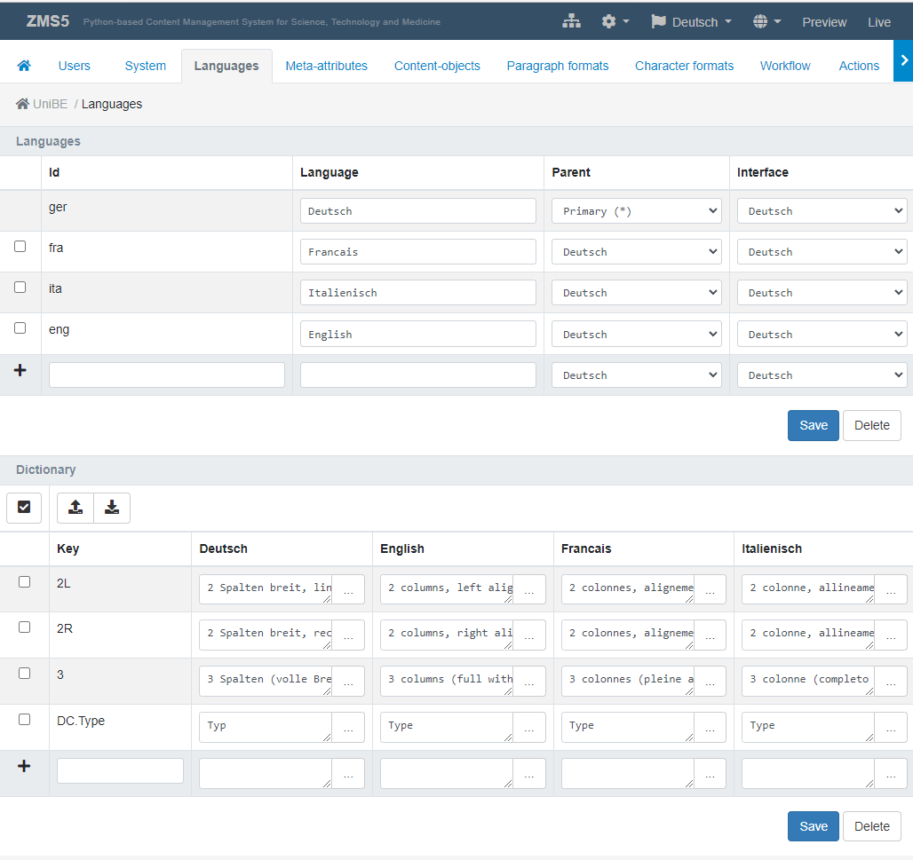

# ZMS Administration: The Configuration Menu
*@work...*

The configuration menu primarily provides ten options for the configuration of the ZMS client:
1. User: managing user accounts and access rights
2. System: system variables, multisite hierarchies, functional components
3. Languages: languages and their editorial dependencies 
4. Meta-Attributes: general content attributes
5. Content-Objects: modelling content classes
6. Paragraph-Formats: text block formats 
7. Character-Formats: text inline formats
8. Actions: additional / self-programmed helper functions
9. Search: configuring content indexing
10. Design: design themes and JS/CSS customization 

---

## Meta-Attributes
Meta attributes ("metas") are a set of general descriptions supporting the automatic processing of content entities (e.g. keyword search). The idea of schematic categorization of content has a long tradition; for web content it started 1994 with the Dublin Core (DC) Metadata Initiative [https://en.wikipedia.org/wiki/Dublin_Core]. ZMS refers to the DC metadata set and provides a minimal list of standard attributes. The ZMS administrator can add further attributes to the list and assign a data type to each of these attributes. In fact, each meta-attribute becomes another data type and extends the list of data types.
Since each content class can use these metas as its own attributes, the entire namespace of the attributes is reduced and template coding becomes easier.


_Administration of metadata_


## Content Objects
ZMS considers a document (_page_-like object class) as a sequence of block elements (_page elements_) which may nest further sub-blocks. _ZMS documents_ in turn are nested into a document tree with the help of _ZMS folders_.
The ZMS _content model_ (or _schema_) may contain an arbitray number of these content class definitions. To build such a content model ZMS offers a simple click GUI alloowing the user to seqeunce a set of given data types. The configured list of attributes will implicitly result into a specific GUI for content editing.
When initializing a new content object model ZMS starts an empty model just containing an TAL attribute called _standard_html_; later this TAL template will render the HTML output by processing the content objects's attributes. After completing the list of the content objects attributes the _standard_html_ has to be fitted to the attribute model. As a little helper to write a filling template code there is a _refresh_-button 
on the right top corner of the input field: by clicking a TAL code prototype considering the current attributes and their data types will replace the existing TAL code. This prototype can be easily adjusted to the desired TAL output code by rearranging the HTML code and adding the CSS-attributes the web design needs. 


_Administration of content model: the right screen shows a simple content object model 'carditem' consisting of three content attributes (image, text, url), a constant for the ZMI icon and a TAL attributes 'standard_html' for rendering the output html. The left screen shows the corresponding editing interface automatically generated by the content model._


_Nesting of content models: the left side shows a rendered example for a nested object model: 'card container' contains several 'card items'; the right side shows the 'big picture' of the content package with all the attributes and relations. The model may contain several templates which may be applied conditionally. CSS style sets may be applied as attributes of type resource/file. These snippets can be called via CSS import-rules._


## Multilingual GUI: Managing Display Label of Custom Content Models
### The ZMS Approach to Multilingualism
ZMS considers any content as multilingual using a _symmetric_ and _hierarchical_ content model. _Symmetric_ means that any content object contains all it's translations in parallel (imagine it as _slices_ of any content object). So there is no second or third website needed for the translations. And _hierarchical_ means, that translation will happen in a certain order of dependencies, starting with a _primary language_ used as an origin for the translation into the _secondary_ or _depending_ languages. As you can define the source or _parent_ for any language, a tree of translation dependencies can be built. This language dependecy graph allows a content organisation which is dominated by (business) reagions more than by one or several languages which are spoken there (eg-the French translation of Switzerland-German may differ from the French translation that is considered for France, same in other multilingual countries like Belgium, Ghana etc.) 
Besides the aquired content of the _parent_ language any language variant can contain exclusive, so called _local_ content, which again may be inherited to it's depending languages.


_Language Configuration: avaliables languages and their dependencies are set in the upper part. Language terms are set in the lower part, each row starting th language neutral term followed by its translations._  

### Configuring Multilingual Content-Objects
The ZMS content model fullfills two primary tasks:
1. providing an interface (GUI) for content production
2. rendering the content

In a content model some contents/attributes may be language independend, e.g. the date of an event while other have a specifc, translated value for any language, e.g. the event's descriptions. That is why the content object modelling GUI allows to choose the "mulilingual" option (checkbox marked with the globe icon, see upper picture "Administration of content model") for any attribute. Choosing this option invisibily multiplies the number of attributes according the number of configued languages, so that these attributes can be recorded specifically for each language.

To improve the GUI usability for local editors the display labels can be made multilingual, too, using the ZMS Language Dictionary. In general there are two way to accomplish this:

1. using explicitly a language-neutral display label
1. using implicitly the key as string identifier

Language-neutral display labels are written into the content model in capital letters und start with two specific prefixes
1. `TYPE_` for content class names, like TYPE_BOX
2. `ATTR_` for attributes names, Like ATTTR_TITLE

Using language neutral labels _need_ the corresponding translations in the language dictionary, of course.
The second option for translating display names is getting its translation by the key-value as a word stem. This happens implicitly if a language dict item is found according to the conventions (TYPE_/ATTR_-Prefix) and thus will overwrite the given display name (so display name can stay in natural language and will work without a translation dictionary, too)


## Paragraph Formats and Formatting Text Blocks
Text blocks can be edited in two modes: plain or _rich text_. The plain text editor uses a paragraph format for the whole block whereas the _rich text_ can apply the paragraph formats for any segment of the text stream in the input field.
Individual paragraph formats are defined by:
1. id
2. display name
3. nesting html element
4. html attributes
5. newline-tag
6. format may be used in plain text or/and _rich text_ editor
7. format ist used as a default
8. force the text block using the _rich text_ editor GUI

The configuraton form ends up with a preview of the rendered html output.


_Paragraph formats can be simply added by filling a small form for its properties._

### Standard Editor (Plain Text)
The Standard Text Editor provides plain text in a standard input field; besides declaring a format to the whole text block it is possible, to add inline HTML-tags manually. It easily can happen that the manually edited html code gets invalid. To prevent this, a config parameter `ZMS.ZMSTextarea.show_htmlcheck` adds a small helper line, that constantly shows the result of a realtime HTML validity checking.


_HTML Validity Check can be activated or deactivated by ZMS config parameter ZMS.ZMSTextarea.show_htmlcheck_

### Rich Text Editors (RTE)
ZMS comes with three RTE GUIs by default:
1. [CKEditor (HTML)](https://ckeditor.com)
2. [TinyMCE (HTML)](https://www.tiny.cloud/tinymce)
3. [Simple MDE (Markdown)](https://simplemde.com/)

The applied RTE is configured as a _system_ parameter "ZMS.richtext.plugin":


### Adding More Rich Text Editors as a Plugin (RTE)
The ZMS source code has a plugin folder `Products/zms/plugins/rte` (see on [github](https://github.com/zms-publishing/ZMS/tree/main/Products/zms/plugins)); here you can add the RTE code of your choice. It needs just a new folder and a TAL-template `Products/zms/plugins/rte/MyRTE/manage_form.zpt` that generates the RTE's HTML snippet and references the necessary CSS/JS modules as ZMS-resource links
```html
<link rel="stylesheet" href="/++resource++zms_/MyRTE/MyRTE.min.css">
<script src="/++resource++zms_/MyRTE/MyRTE.min.js"></script>
```
Actually these resource files are placed in the www-resource folder:
```
Products/zms/plugins/www/MyRTE/MyRTE.css
Products/zms/plugins/www/MyRTE/MyRTE.js
```

If these resources are available in the ZMS source code, it offers the new RTE "MyRTE" as an further select option for the configuration parameter ZMS.richtext.plugin

## Character-Formats: Text Inline Formats
Similar to the paragraph configuration ZMS allows adding individual character formats (_inline formats_). The inline formats are shown with the text field GUI and can be applied by mouse click.
A character format is defined by these properties:
1. id
2. display name
3. ZMS button icon
4. nesting html element
5. html attributes
6. additional javascript event-handling on button click

The configuraton form ends up with a preview of the rendered html output.


_GUI for defining individual character-formats_

## Search: Using Zope-ZCatalog
The ZCatalog module provides a simple index for Zope contents. ZMS can address this index by default: the admin menu *Search* allows to select all the content object classes and their attributes to be indexed.
Via *ZCatalog-Connector* tab the Zope objects containing the index are listed and can be administered (by buttons like *Delete*, *Refresh" etc.).


_Administration of metadata to be indexed_


_Administration of the indexer connector_


To show the search functionality in the 3rd view the templates need to provide the following references:
1. location of the search form
2. linking the JavaScript-Libs for asynchronous listing of the search results

First a ZMS document node is needed for showing the search form and the results; this can be an ordinary ZMSDocument object having an ordinary ZMSTextare containing the TAL code for the search form:

```html
<form class="search" method="get">

	<tal:block tal:condition="python:request.get('searchform',True)">
	<input tal:condition="python:request.get('searchform')" type="hidden" name="searchform" tal:attributes="value python:request.get('searchform')" />
	<input tal:condition="python:request.get('lang')" type="hidden" name="lang" tal:attributes="value python:request.get('lang')" />
	<input tal:condition="python:request.get('preview')" type="hidden" name="preview" tal:attributes="value python:request.get('preview')" />
	<legend tal:content="python:here.getZMILangStr('SEARCH_HEADER')">Search header</legend>
	<div class="form-group">
		<div class="col-md-12">
			<div class="input-group">
				<tal:block tal:content="structure python:here.getTextInput(fmName='searchform',elName='search',value=request.get('search',''))">the value</tal:block>
				<span class="input-group-btn">
			<button type="submit" class="btn btn-primary">
				<i class="fa fa-search icon-search"></i>
			</button>
				</span>
			</div>
		</div>
	</div><!-- .form-group -->
	<div class="form-group row" tal:condition="python:here.getPortalMaster() is not None or len(here.getPortalClients())>0">
		<div class="control-label col-md-12" tal:define="home_id python:here.getHome().id">
			<input type="hidden" name="home_id" tal:attributes="value python:request.get('home_id',home_id); data-value home_id">
			<input type="checkbox" class="form-check-input" onchange="var $i=$('input[name=home_id]');$i.val(this.checked?$i.attr('data-value'):'');" tal:attributes="checked python:['','checked'][request.get('home_id',home_id)==home_id]">
			<label class="form-check-label control-label">
				<strong tal:content="home_id">the home-id</strong> (local)
			</label>
		</div>
	</div><!-- .form-group -->
	</tal:block>

<div id="search_results" class="form-group" style="display:none">
	<div class="col-md-12">
		<h4 tal:content="python:here.getZMILangStr('SEARCH_HEADERRESULT')">
			Result
		</h4>
		<div class="header row">
			<div class="col-md-12">
				<span class="small-head">
					<span class="glyphicon glyphicon-refresh fas fa-spinner fa-spin" alt="Loading..."></span>
					<tal:block tal:content="python:here.getZMILangStr('MSG_LOADING')">loading</tal:block>
				</span>
			</div>
		</div><!-- .header.row -->
		<div class="line row"></div><!-- .row -->
			<div class="pull-right">
				<ul class="pagination"></ul>
			</div>
	</div>
</div>

</form>
```
The TAL code has two sections:
1. input form (with optional toggle for local search-results only inside current site) 
2. html placeholder for presenting search results and pagination 

The form's request is responded by an XML stream which is transformed into an HTML list by JavaScript. That is why the frontend code need to reference a special, ready to use JS module for handling the search gui:

```html
<script type="text/javascript" charset="UTF-8" src="/++resource++zms_/ZMS/zmi_body_content_search.js"></script>
```

**Hint-1:**
The page containing the search form may be linked from different navigation items. Instead of linking the node explicitly it might be easier to reference the page with a "permalink" (as metalement of the ZMS-root node). In the first element of the master template _standard_html_ the link to that page can defined as an object variable like this

```html
<html lang="en" 
	tal:define="zmscontext options/zmscontext;
		search_node python: zmscontext.getLinkObj( zmscontext.getConfProperty( 'ZMS.permalink.search', default='{$@content}'), request);">
```
and a link to the search page can be generated like this;

```html
<a href="#" class="nav-item pr-3" 
	tal:attributes="href python:search_node.getHref2IndexHtml(request)">
	<i class="fas fa-search"></i>&nbsp;
	<span tal:replace="python:zmscontext.getLangStr('SEARCH')">Suche</span>
</a>
```

**Hint-2:** 
If you are working with a multisite and a common index, you can filter the search results for  the current ZMS client just by adding the form variable "home_id" to the search form. E.g. , the ZMS client is named 'myzms', the search form could start like this:  

```html
<form class="search" method="get">
	<input type="hidden" name="home_id" value="myzms">
....
</form>
```

## Managing ZMS Custom Code & Configurations

ZMS can contain a lot of custom code defining metadata, content models, custom actions, workfow steps and Zope object bundeled as ZMS libraries.
To maintain this code externally ZMS offers a module called "Repository Manager"; the ZMS Administrator can activate this aditional functionality in the system menu:


_Adding the ZMS Repository Manager_

In general the Repository Manager allows the synchronisation of the ZMS custom code by _Export_/_Import_ (buttons) between ZODB and file-system. It's _properties menu_ provides the definition of a target folder where the ZMS code is replicated into the file system. The code differences between ZODB and file-system are shown in detail as a list of the diff-marked files.
The diffs are marked by a conventional color scheme:
1. green = new
2. red = deleted
3. yellow = modified

The diff-perspective can be changed between the working modes Export vs. Import: the Export-mode marks new code edited in ZODB as green whereas the Import-View will marks it as red (indicating the it will get overwritten on import). 


_ZMS Repository Manager menu: code files containg differences can be synct by "Export" (ZODB to file-system) or "Import" (file-system to ZODB)_


### ZMS Git Bridge

The ZMS Git bridge is a very simple approach to establish Git-based collaboration to the code management in ZMS. Thus the TTW-coding, which is very efficient for many project setups, still can be applied while combined with a professional code version management and deployment. 

In this scenario the system folder containing the exported Zope/ZMS code files will be a clone of an external Git repository. To synchronize the code by Git the ZMS Repository Manager can be extended by a set of specific ZMS-actions (named like _manage_repository\__*). As a default ZMS provides three preconfigured actions (gitconfig. gitpull, gitpush). These easily can be imported via the _Actions_ menu:


_Import three Git actions used in ZMS Repository Manager_

After importing the Git actions the ZMS Repository Manager shows an additional pop-up button "Repository Interactions". Any action is represented as a menu item.


_ZMS Repository Manager GUI enhanced by Git actions_


The additional menu provides there functions:
1. _Git Configuration_: needs the Git URL, allows the cloning of the repository
2. _Git Pull_: pulls the latest revsion by default; optionally entering a revision id may pull a specific revision; by clicking the checkbox "Hard Reset" forced pull will be performed and overwrite all local changes.
3. _Git Push_: allows entering a commit message and executes the Git push onto the repository server


_Git pull menu: per default the latest version is pulled, instead of latest "HEAD" a certain revision id can be pull. To overwrite local changes the option "Hard Reset"should activated; thus merging conflicts can be avoided._


_Git push menu: before executing the Git push a commit message can be entered_


_Git push return: after executing the Git push the commit will be shown on the Git repo (e.g. at github.com)_

---

### Some Hints about Git Configuration
The ZMS Git Bridge uses just a minimal set of Git commands:
1. Git Pull: pulls (combined with a checkout) the latest version of the main branch ("HEAD") or alternativly pulls a specified revision by a checkout command
2. Git Push:  pushes code status into the main branch

The Git URL (saved by the _Git Configuration_ menu) is (only) necessary if a cloning will be performed by the ZMS GUI and the .git/config file will be written initally.
If the git folder is already configured it is not needed to save the Git URL in the ZMS Git Configuration.

Actually it is recommended to configure the Git folder properly before using it with ZMS. Because the ZMS Git Bridge does not save any user data a special Git user and its certificate should be available in the file system and be accessible by the zope user.

EXAMPLE:

1. `/home/my/.ssh/my_cert`
2. `/home/my/.ssh/my_cert.pub`
3. `/home/my/.ssh/config` :

	```ini
	Host github.com
		HostName github.com
		IdentityFile ~/.ssh/my_cert
		User git
	```

4. `/home/my/src/myproject/.git/config` :

	```ini
	[user]
		name=mygituser
		email=mygituser@mydomain.tld
	[core]
		repositoryformatversion = 0
		filemode = true
		symlinks=true
		bare = false
		logallrefupdates = true
	[remote "origin"]
		url = git@github.com:mydomain/myproject.git
		fetch = +refs/heads/*:refs/remotes/origin/*
	[branch "master"]
		remote = origin
		merge = refs/heads/master
	```
