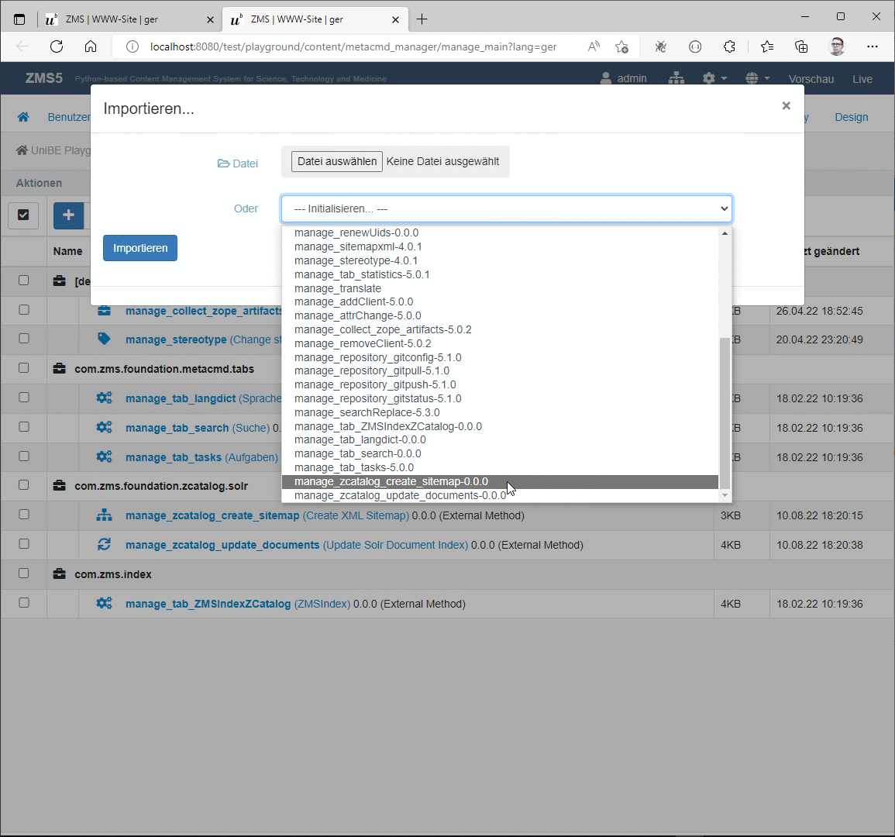
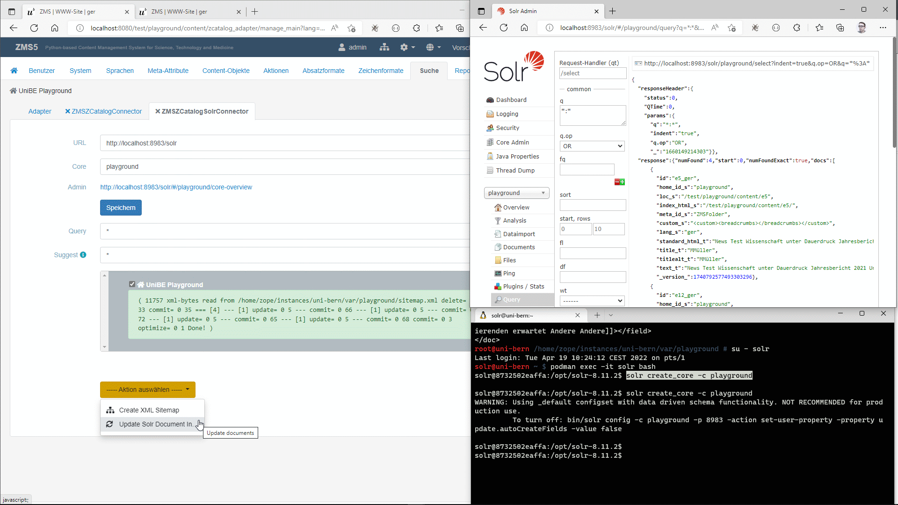
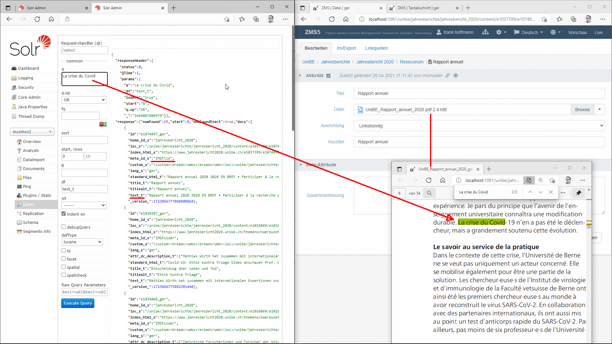
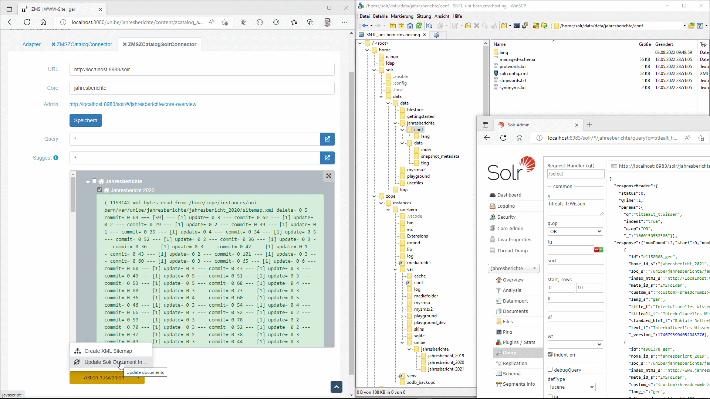

# Connecting Apache SOLR Search Engine

## Introduction
SOLR (pronounced "solar") is an open-source enterprise-search platform, written in Java. Its major features include full-text search, hit highlighting, faceted search, real-time indexing, dynamic clustering, database integration, NoSQL features and rich document (e.g., Word, PDF) handling. Solr runs as a standalone full-text search server and communicates via  REST-like HTTP/XML and JSON APIs [[1](https://en.wikipedia.org/wiki/Apache_Solr)].

The general setup of the Apache SOLR is described in detail on the website https://solr.apache.org/. For development and testing purposes the [SOLR Docker Image](https://hub.docker.com/_/solr/) provides a quick solution. The setup and configuration of SOLR is not part of this article; primarily it is about getting ZMS connected to a running SOLR server.

In principle the indexing process is done in two steps:
1. Creating: ZMS generates a "sitemap" file containing the structured content as an big XML file which is conformnt to the SOLR document schema.
2. Updating: the XML file is transferred to the SOLR server and indexed.

## Preparing ZMS
ZMS contains two default _actions_ for the SOLR connectivity:

1. manage_zcatalog_create_sitemap [[see Github](
https://github.com/zms-publishing/ZMS/blob/main/Products/zms/conf/metacmd_manager/manage_zcatalog_create_sitemap/manage_zcatalog_create_sitemap.py)]
2. manage_zcatalog_update_documents [[see Github](https://github.com/zms-publishing/ZMS/blob/main/Products/zms/conf/metacmd_manager/manage_zcatalog_update_documents/manage_zcatalog_update_documents.py)]

As a first step these _actions_ have to be imported into the ZMS client's configuration 


_Import ZMS Actions for the SOLR Connectivity: The ZMS administrator can import the two ZMS actions in the admin menu "actions". One action ("create sitemap") generates the XML-sitemap that will be indexed by the SOLR server and the other one ("update documents") triggers an update of the remote index by transferring the XML data on a http request._

After importing the ZMS actions the SOLR connector will be configured in the admin menu "search": by-default there are two search engine (or "catalog") connectors available:
1. ZMSZCatalogConnector
2. ZMSZCatalogSolrConnector


## Getting the SOLR server connected 

After adding the connector _ZMSZCatalogSolrConnector_ a new GUI for setting the connection URLs and managing the indexes. The following parameter must be configured in the ZMS-SOLR-GUI:
1. URL: Http-API-URL of the SOLR server
2. Core: name of the SOLR core for processing the ZMS content

### Create XML-Sitemap

The action "Create XML Sitemap" generates a schema conformant XML-stream that SOLR can process. Actually the actions iterates throught the ZMS content and delivers an XML stream as output; the actions Python code can be customized via ZMS-GUI at any time, e.g. if more fields are needed.


_SOLR Connection GUI: just 2 parameters are needed, the URL of the SOLR server and the name of the SOLR Core_

The enity corresponding to "index" in SOLR is called "core": unluckily the cores cannot added by the SOLR web-gui. So you have get a SSH connection to the SOLR server create a new core, e.g. "playground":

```shell
localhost:~$ ssh root@solr.server.hosting
root@server:~ $ su - solr
solr@server:~$ solr create_core -c playground
```

If SOLR is running in a Docker container, you need one more step to get into the container's shell, like this

```shell
localhost:~$ ssh root@solr.server.hosting
root@server:~ $ su - solr
solr@server:~$ podman exec -it solr bash
solr@8732502eaffa:/opt/solr-8.11.2$ solr create_core -c playground
```

**NOTE: Getting PDF Content into the XML Sitemap:** The sitemap creator is able to extract PDF content as plain text and add it to the XML file. This works if the Python module "PDFMiner" (https://pypi.org/project/pdfminer.six/) is installed in your Python virtual enviroment.
With the latest ZMS version this module will be installed as a default [requirement](https://github.com/zms-publishing/ZMS/blob/eb8fd67cdd35a8ddc75f0ca1a0d36975c420052d/requirements-full.txt#L24). If the modul is missing in your installation, please add it:

```shell
zope@server:~ $ ~/venv/bin/pip install pdfminer.six
```


_Indexing PDF Content: ZMS transfers the PDF content by extracting its plain text and adding it to the sitemap XML._

### Update Document Index

Executing the action "Update SOLR Document Index" transfers any pre-generated XML to the SOLR server. If a multisite is indexed for any ZMS clients an individual XML file will be saved in the ZMS server's filesystem and transferred to the declared core of the SOLR server.
HINT: Depending on the amount of content these actions can take some time.


_Update Document Index: Any ZMS Client has an individual sitemap XML file. All the files are transferred into the SOLR core by http on clicking the actions name._


# Example for Setting Up a Basic SOLR Server as a Docker Container

## SOLR Dockerfile

This Dockerfile allows you to create an image with a basic SOLR installation:

```docker
FROM solr:8

# apply security updates
USER root
RUN apt-get update && apt-get -y upgrade && apt-get clean
USER solr
```

## SOLR Service

This service file starts and stop the SOLR service within the Docker container from the host system. 

```shell
root@server:~$ systemctl status solr.service
```
On the host system the service config file is located in 
`/etc/systemd/system/solr.service`


```conf
[Unit]
Description=Apache SOLR search engine

[Service]
Type=simple
User=solr
Restart=always
Environment="GODEBUG=netdns=go"
# Need to remove the container first to build a new image with the same name
ExecStartPre=-/usr/bin/podman container stop solr
ExecStartPre=-/usr/bin/podman container rm solr
# Ensure securiy updates are applied each time solr is restarted
ExecStartPre=/usr/bin/podman build --pull --no-cache -f 
/home/solr/Dockerfile  -t solr:8-security-updated
ExecStart=/usr/bin/podman run --rm -it -v "/home/solr/data:/var/solr" -p 
8983:8983 --name solr solr:8-security-updated
ExecStop=/usr/bin/podman stop solr
[Install]
WantedBy=multi-user.target
```

<br/>
<br/>
<br/>
<br/>

<div style="background:yellow">

	To Do:
	1. Explaining Frontend Code for Search and processing result data
	2. Dealing with binaries: transfer doc, ppt etc. by URLs
	3. Customizing the field schema 

</div>