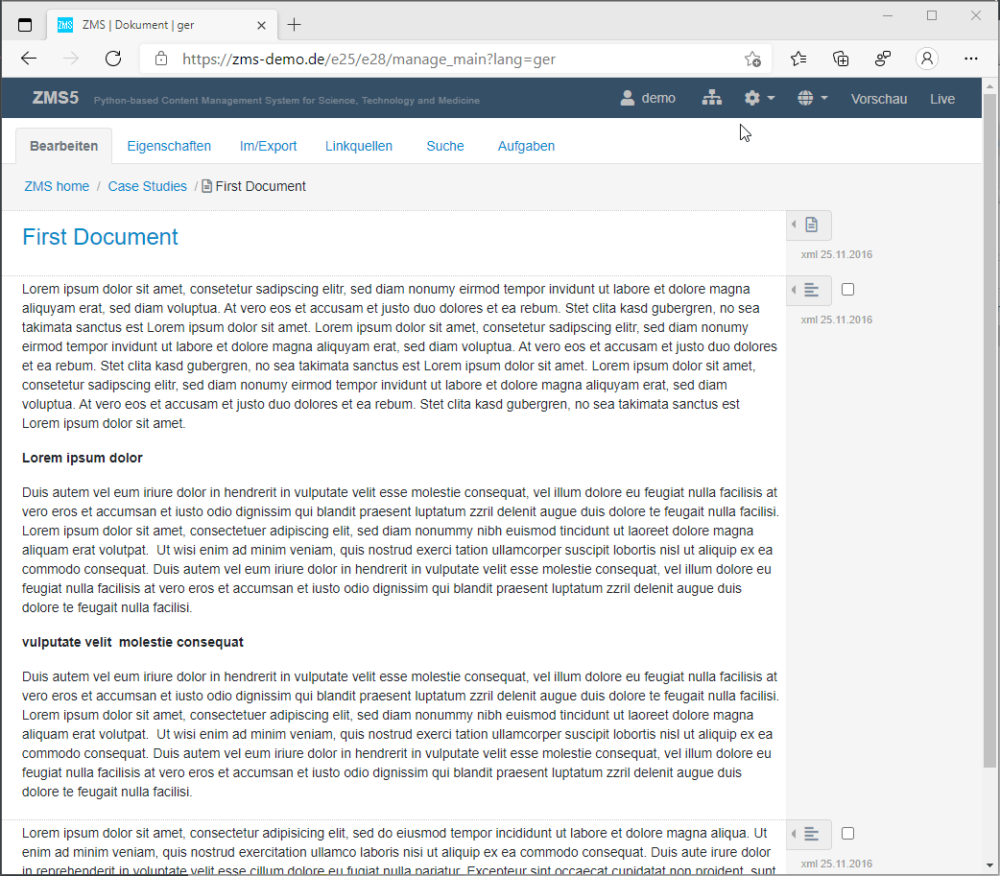
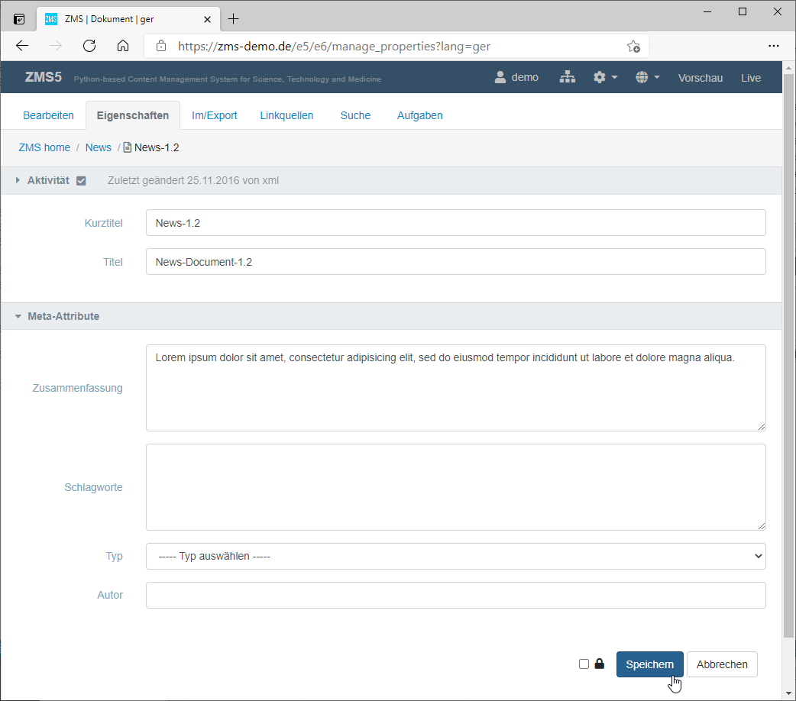
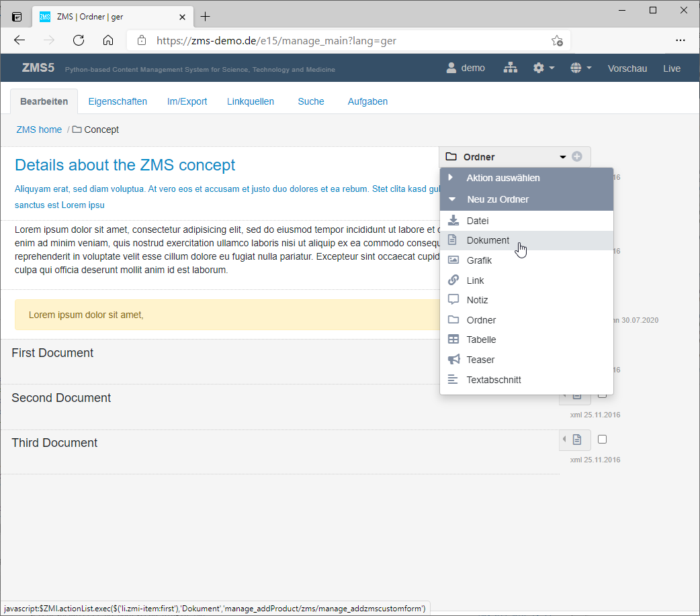
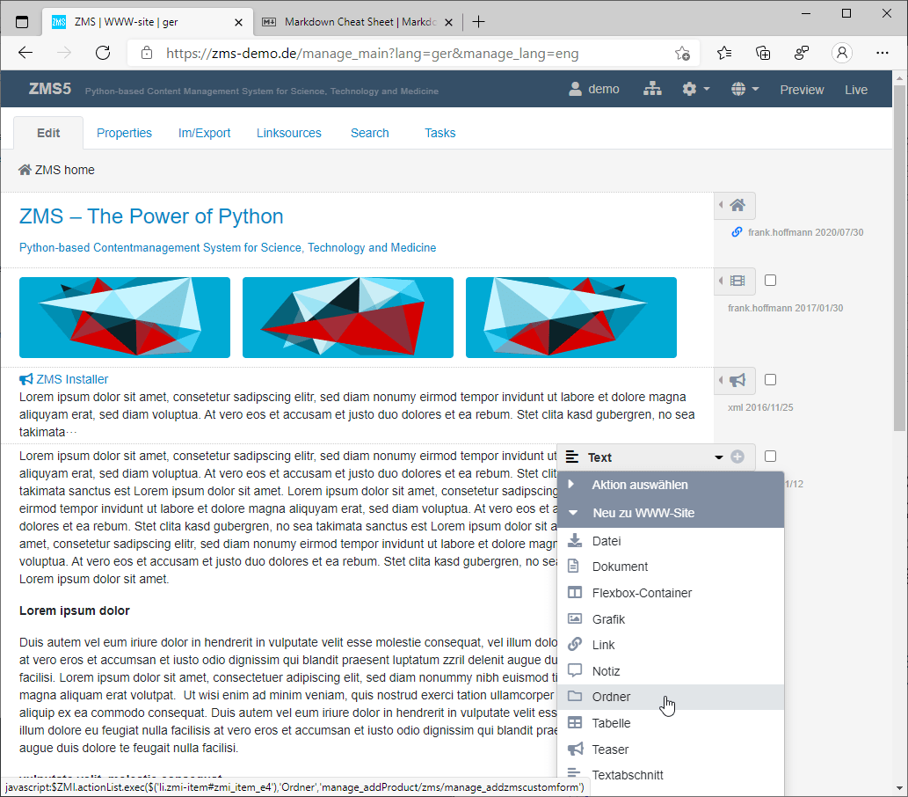
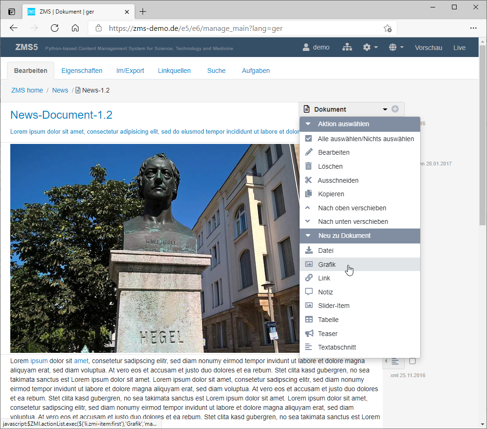
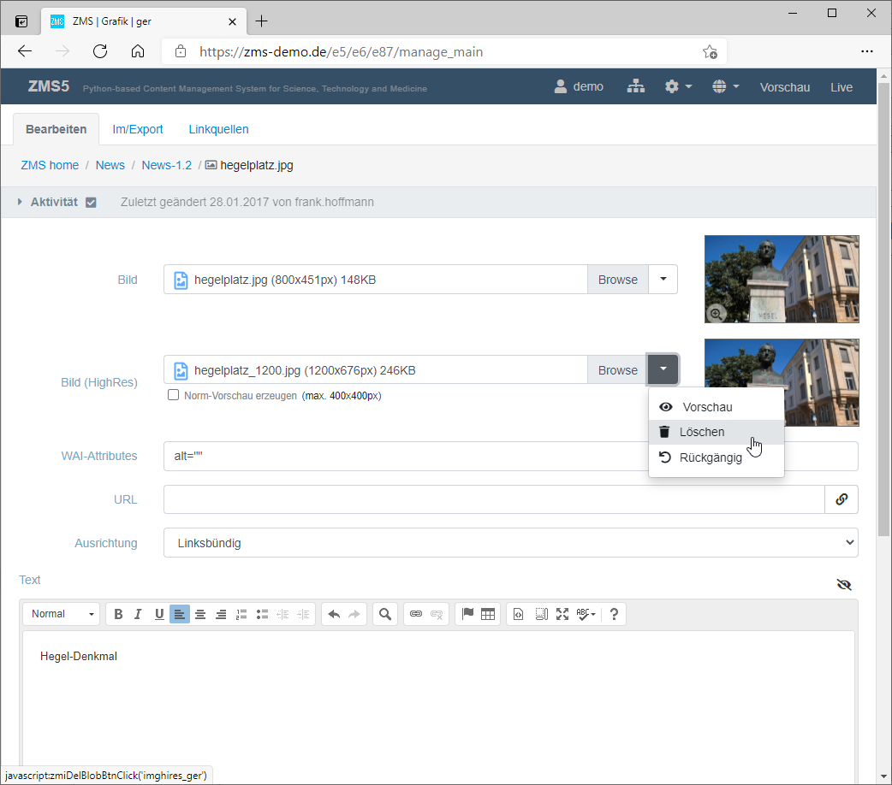
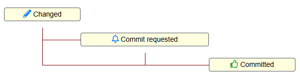

# B. For Editors

This chapter is the editorial guide for day-to-day content production in ZMS. It covers navigating the ZMS Management Interface (ZMI), creating and editing pages and content blocks, working with multiple languages, and publishing content through the workflow.

---

## 1. The ZMS Management Interface (ZMI)

The ZMI serves two primary purposes: **navigation** and **editing**.

For **navigation**, the ZMI provides:
1. The top bar — administrative meta-functions
2. The main menu — a tab menu for switching between editing modes
3. The breadcrumb navigation — micronavigation showing position in the tree
4. The sitemap — a full tree view on the left side

For **editing**, the ZMI provides:
1. The context menu — for adding new content objects and executing actions
2. Specific input forms — for structured, design-neutral content production

### 1.1 Top Bar

The top bar is always visible and provides meta-functions that are relevant in any context:

1. **User name** — links to your profile.
2. **Sitemap icon** — toggles the left-hand tree navigation panel.
3. **Configuration menu** — lists role-specific functions (e.g. switching to the content-model configuration for administrators).
4. **Flag icon** — lists the content languages available on a multilingual site.
5. **Globe icon** — switches the GUI language.
6. **Preview link** — opens the rendered website view (third view) of the current node.
7. **Live link** — switches to the production server (when separate from the preview server).

### 1.2 Main Menu

The tabbed main menu sits below the top bar and exposes different views of the current content node:

| Tab | Purpose |
|---|---|
| **Editing** | Sequence of content blocks that make up the page |
| **Properties** | Meta-attributes (title, short title, description, …) |
| **Import / Export** | Export in various formats; XML-based import |
| **Link Sources** | Incoming links pointing to this node |
| **History** | Change history (requires versioning to be active) |
| **Search** | Full-text search through the document tree |
| **Tasks** | Document nodes in a particular workflow state |

### 1.3 Breadcrumb Navigation

The breadcrumb path below the main menu shows the current position in the document tree as a list of ancestor nodes from root to the current node. Click any ancestor to navigate up.

### 1.4 Site Map

Click the sitemap icon in the top bar to open a collapsible left-hand panel with a full content-tree view. The sitemap is the fastest way to jump between document nodes.

*Site map navigation browsing the document tree*

---

## 2. Pages: Building the Content Tree

ZMS distinguishes two kinds of content classes:

1. **Page-like objects** (*nodes*): `ZMSFolder` and `ZMSDocument` — they aggregate content blocks and may contain other page objects.
2. **Block elements** (*page elements*): `ZMSTextarea`, `ZMSFile`, `ZMSGraphic`, etc. — they hold the actual content.

Think of a page as a blank sheet of paper. A **Folder** can contain other folders and documents (used to structure the site hierarchy), while a **Document** is a leaf node that holds a sequence of blocks.

A practical approach when starting a new website is to first build the folder structure as a mockup. The resulting empty tree already drives the navigation automatically.

*Adding a new page: entering bibliographic meta-data (title, short title, description)*

### Adding a new page

*A new document is inserted into the current folder via the context menu.*

1. Navigate to the parent folder where the new page should appear.
2. Open the **context menu** (right-hand pop-up) and select the desired object type (*Folder* or *Document*).
3. Fill in the required meta-attributes and click **Save**.

When creating a new page, the input form captures the following properties:

- **Short title** (`titlealt`) — a short, technical title used in navigation menus; keep it concise
- **Title** — the editorial long title displayed in the page body
- **Description** — a brief summary of the document content (used for search results and meta tags)
- **Keywords** — used for search indexing
- **Type** — the content type
- **Author name**

---

## 3. Blocks: Filling Pages with Content

ZMS uses a **design-neutral** approach to content production: editors create a sequential stream of content blocks without directly controlling visual layout. The configured theme handles all rendering and styling. This keeps editorial work focused on structure and meaning rather than presentation.

Page-objects are filled sequentially with **content blocks**. Typical built-in block types include:

- Textblock (plain or rich-text)
- File (downloadable attachment)
- Link (internal or external)
- Image / Graphic
- Table
- Video embed

*The editing view lists all content blocks on a page. The context menu on the right adds new blocks.*

### Adding a block

*A new content block (e.g. an image) is inserted into the current document via the context menu.*

1. Open the page in the **Editing** tab.
2. Click the **context menu** (➕ icon) at the position where the new block should be inserted.
3. Select the block type from the pop-up list.
4. Fill in the form fields specific to that block type (e.g. upload an image, enter text, provide a URL).
5. Click **Save**.

### Editing an existing block

Click the block title or the **edit** icon to open its edit form. After making changes, click **Save** to confirm. Use the **drag handles** or **up/down arrows** to reorder blocks within a page.

*Image block (`ZMSGraphic`): the edit form lets you upload an image in two resolutions (standard and high-resolution), enter a caption, specify a link URL, set WAI/accessibility attributes, and choose image alignment.*

---

## 4. Multilingual Content Production

ZMS uses a **symmetric** and **hierarchical** multilingual model:

- **Symmetric**: every content object stores all its language variants in parallel (no separate sites per language).
- **Hierarchical**: languages are organised in a dependency tree rooted at a *primary language*. Translations flow from parent to child language.

### Switching language

Use the **flag icon** in the top bar to switch the active language. The current language is shown in the breadcrumb and all edit forms will save in that language slot.

### Language-neutral attributes

Some attributes are designated as *language-independent* (e.g. a publication date or a document ID). These are edited once and shared across all languages. The configuration of which attributes are multilingual is done by the site administrator in the content model.

### Language dictionary

Display labels in the ZMI can be translated using the **Language Dictionary** (configured under *Administration → Languages*). Labels for content classes use the prefix `TYPE_` and labels for attributes use the prefix `ATTR_`, written in capital letters (e.g. `ATTR_TITLE`, `TYPE_BOX`).

> For the full multilingual configuration reference see [C. For Site Administrators](c_for_site_administrators.md#languages).

---

## 5. Workflow and Publishing

ZMS supports a configurable content approval workflow. Even without a custom workflow, content passes through a basic two-state lifecycle:

| State | Meaning |
|---|---|
| *Working version* | Currently being edited; not yet visible on the live site |
| *Live version* | The published, publicly visible version |

### Basic publishing (no workflow)

When the workflow is not activated, clicking **Commit** immediately publishes the working version and it becomes the new live version.

### Workflow-based publishing

When a workflow is configured, content moves through a sequence of states:

1. **Changed** (`AC_CHANGED`) — triggered automatically when any edit is saved.
2. **Commit requested** — an editor requests review/approval.
3. **Committed** — a reviewer approves and publishes the content.

Each transition can be restricted to specific user roles (see [C. For Site Administrators](c_for_site_administrators.md#workflow)).

*Workflow activity states and transitions*

To publish content:

1. Open the document in the **Editing** tab.
2. Click the **workflow action** button corresponding to your role (e.g. *Request commit* or *Commit*).
3. The document state changes and the page is (or is queued to be) published.

### History and versioning

Open the **History** tab to see previous versions of a document. You can compare versions or restore an earlier one. Version numbers follow the scheme `major.minor.patch`.

> For full versioning details see [E. Appendices — Versioning](e_appendices.md#versioning).

---

## 6. Search

Use the **Search** tab to run a full-text search across the document tree. The search leverages the configured catalog (ZCatalog or Apache Solr). Results show matching nodes and a snippet of the matching text.

---

## 7. Import and Export

The **Import / Export** tab lets you:

- Export the current node and its children as an XML file.
- Import content from an XML file (ZMS XML format) into the current node.
- Export pages as HTML snapshots (depending on site configuration).

Bulk import is useful for migrating content from external sources or restoring backups.

---

## Tips for editors

- Build the folder hierarchy **before** filling pages with content — the navigation is generated automatically from the tree structure.
- Use **short titles** (`titlealt`) for navigation labels to keep menus compact.
- Keep block sequences **short and focused**. Use separate documents for long-form content.
- Check the **Preview** link (top bar) frequently to see how your edits look in the live theme.
- If a page is not appearing on the live site, check that it has been **committed** and that the `active` flag is set in its properties.
