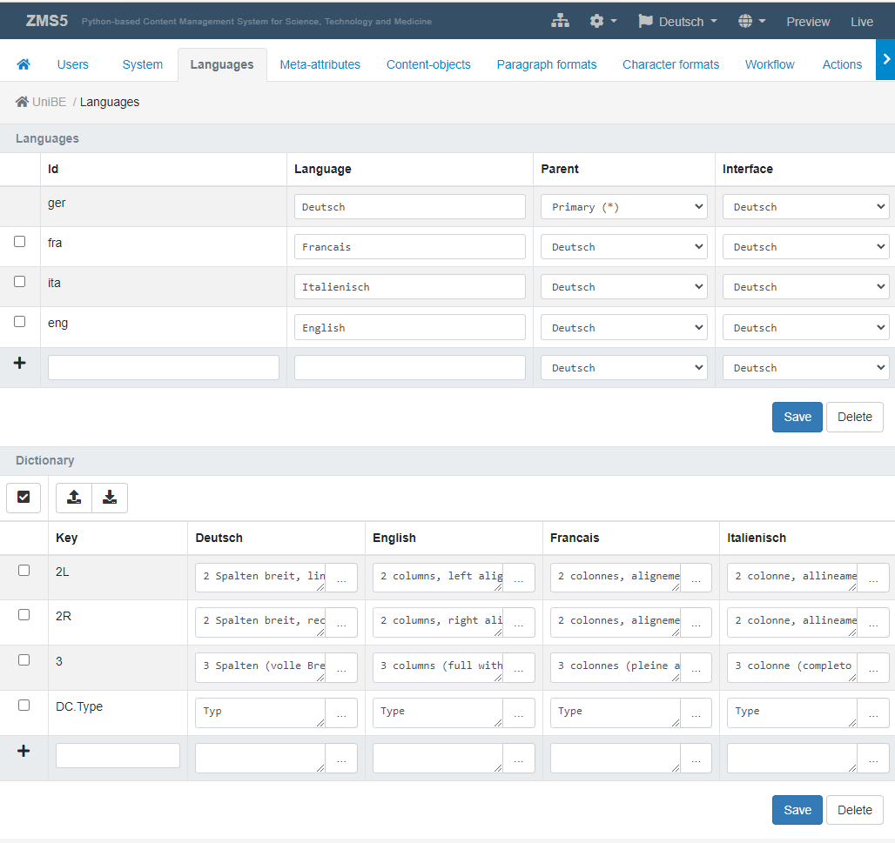
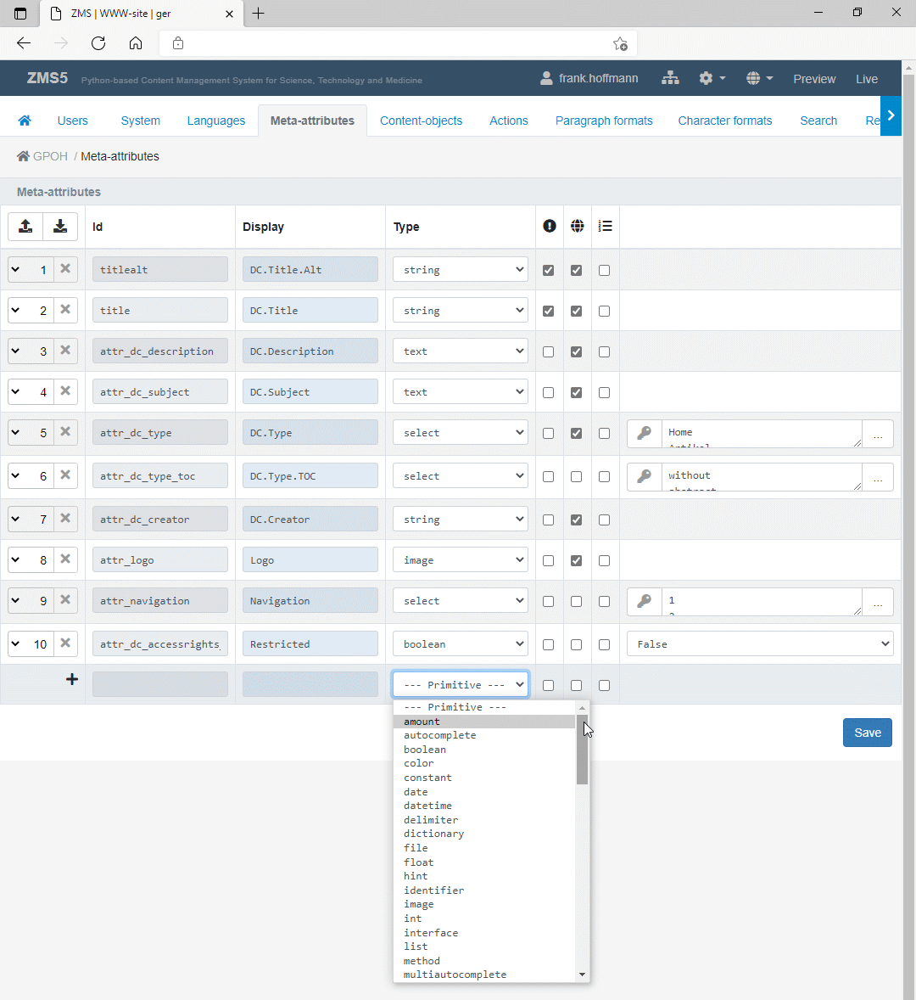
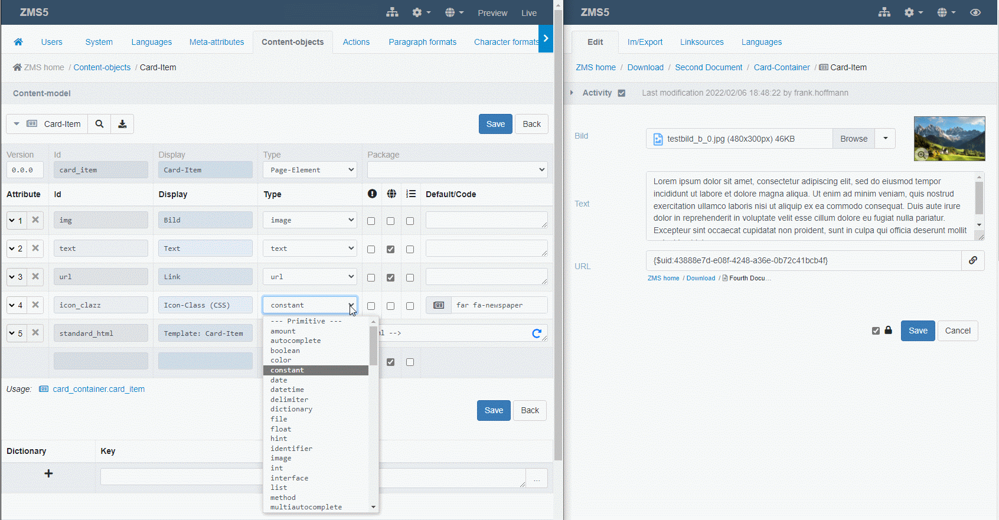
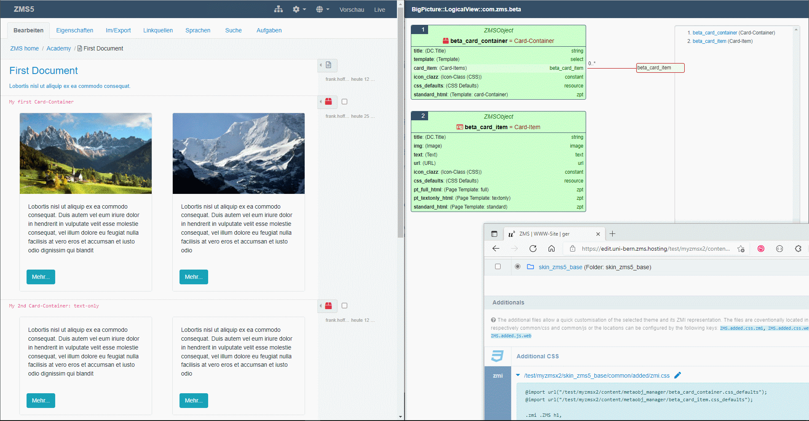
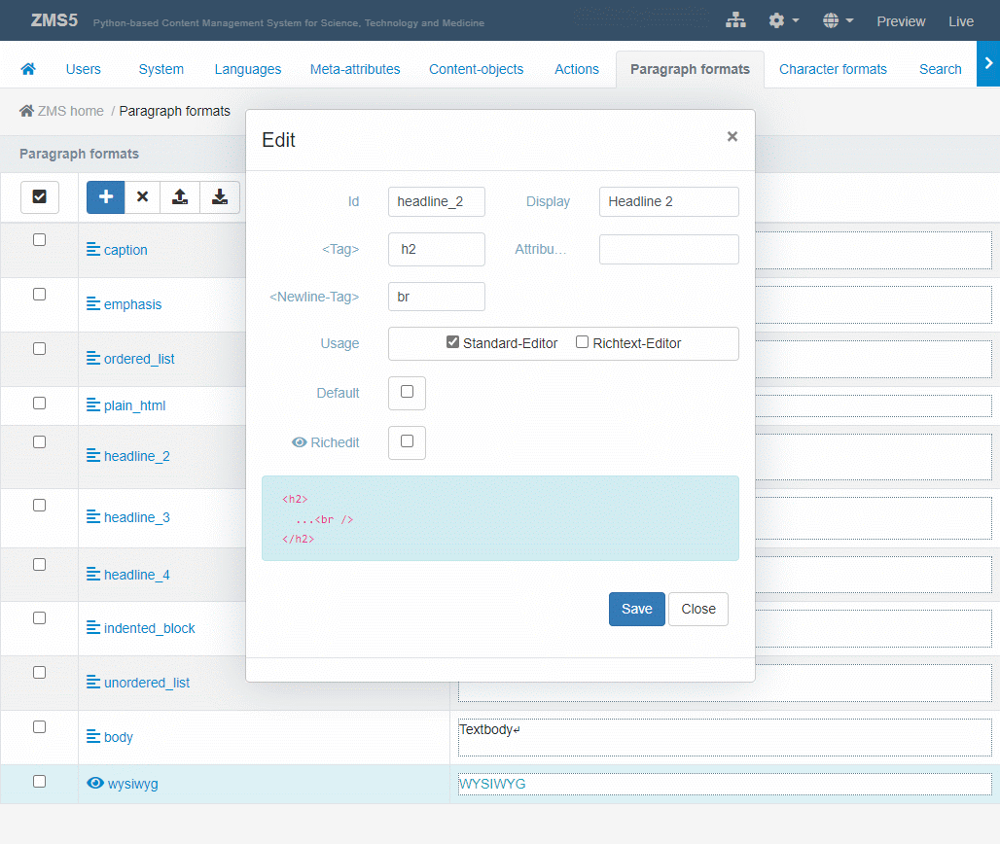
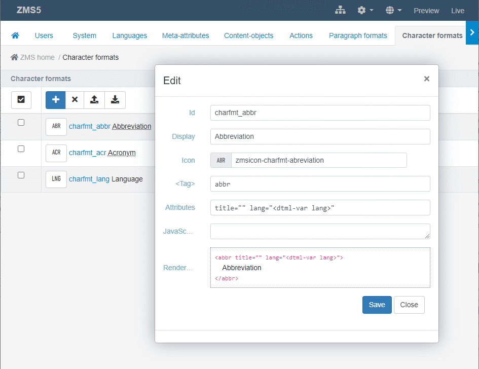
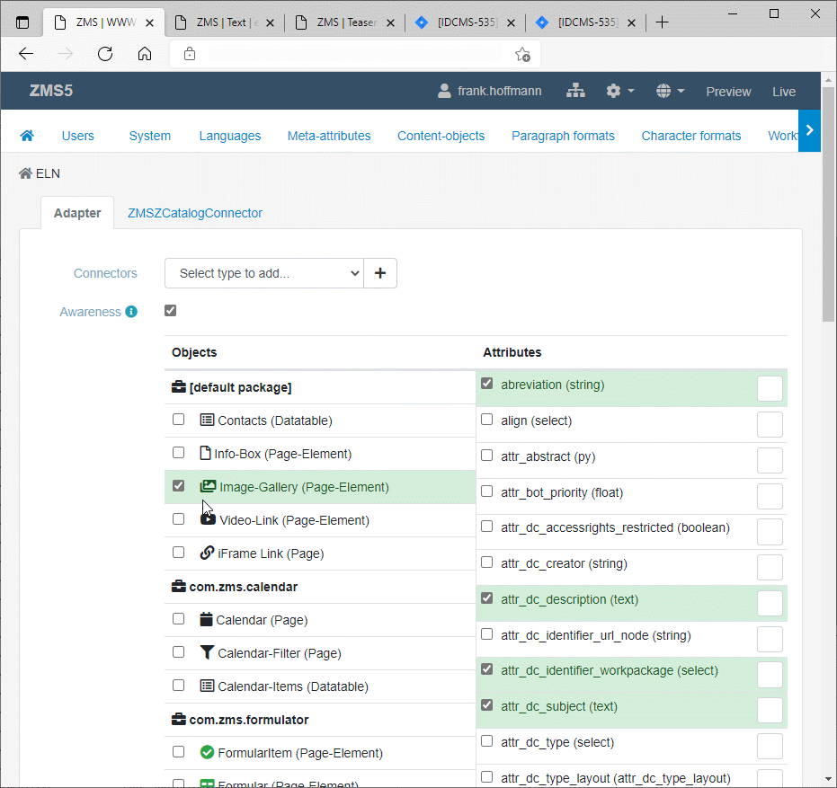
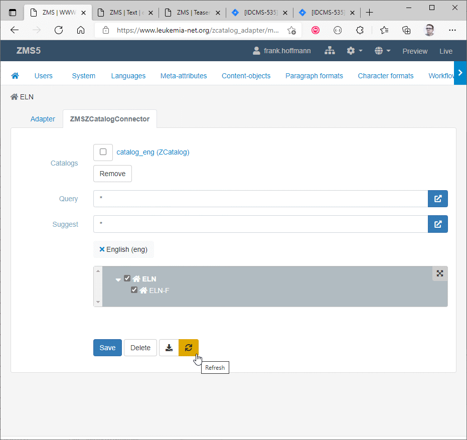
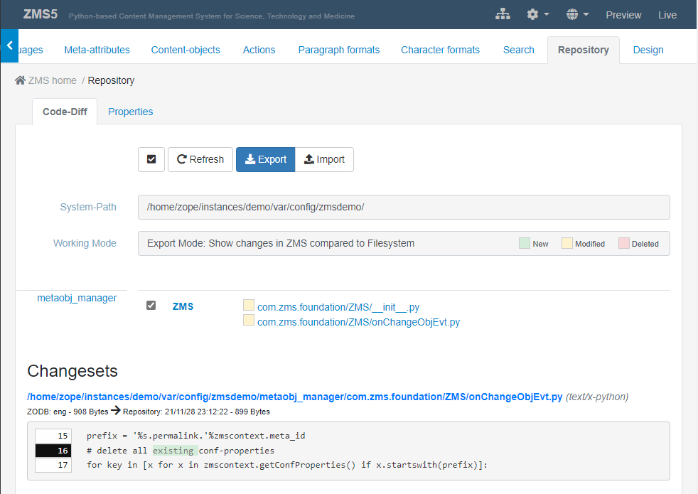
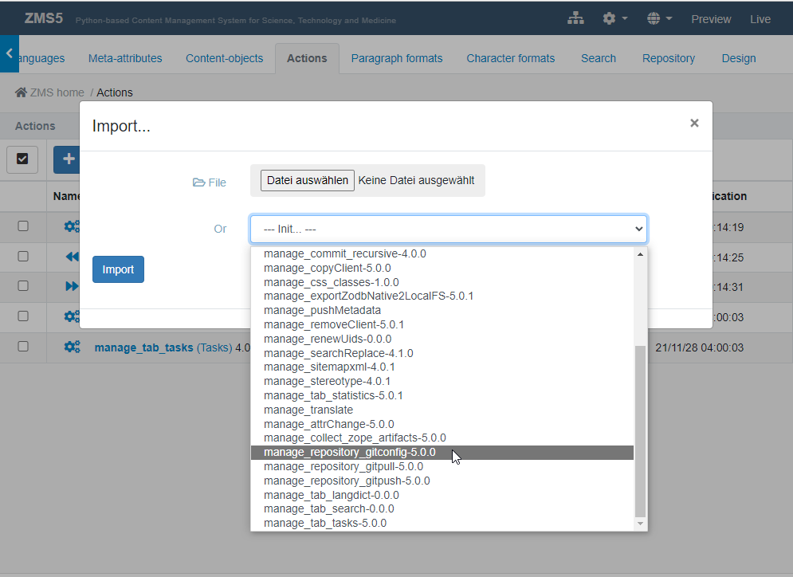

# C. For Site Administrators

This chapter covers the configuration and operation of a ZMS installation. It addresses user management, multilingual configuration, content-model design, search indexing, AI/LLM connectors, theming, and production deployment topics such as caching and reverse-proxy integration.

> **See also:**
> - [admin_intro_en.md](admin_intro_en.md) — full configuration menu reference
> - [admin_solr_en.md](admin_solr_en.md) — Apache Solr connector step-by-step guide
> - [llm_configuration.md](llm_configuration.md) — detailed LLM provider configuration reference
> - [develop_cache.md](develop_cache.md) — proxy cache and NGINX control in depth

---

## 1. The Configuration Menu

The ZMS configuration menu (accessible via the gear icon in the top bar, visible to users with admin privileges) provides ten main sections:

| # | Section | Purpose |
|---|---|---|
| 1 | **User** | Manage user accounts and access rights |
| 2 | **System** | System variables, multisite hierarchies, functional components |
| 3 | **Languages** | Languages and their editorial dependencies |
| 4 | **Meta-Attributes** | General content attributes (Dublin Core-style metadata) |
| 5 | **Content-Objects** | Model content classes and their attribute schemas |
| 6 | **Paragraph-Formats** | Text block formatting presets |
| 7 | **Character-Formats** | Text inline formatting (bold, italic, custom spans) |
| 8 | **Actions** | Additional / self-programmed helper functions |
| 9 | **Search** | Configure content indexing (ZCatalog, Solr) |
| 10 | **Design** | Design themes and JS/CSS customization |

---

## 2. User Management

The **User** section of the configuration menu lets the administrator:

- Create, edit, and delete local ZMS user accounts.
- Assign users to roles: *Reader*, *Author*, *Editor*, *Manager*.
- Delegate authentication to Zope's built-in user folder or an external LDAP/Active Directory source.

Roles control which workflow transitions a user can trigger and which parts of the configuration menu are visible.

---

## 3. Languages {#languages}

ZMS uses a **symmetric hierarchical** multilingual model:

- **Symmetric** — all language variants of a content object are stored side-by-side in a single object (not in separate sub-sites).
- **Hierarchical** — languages are organised in a dependency tree. A *primary language* is the source; *secondary* or *dependent* languages inherit content from their parent and can override it with local variants.

### Configuring languages

Open **Administration → Languages**. The upper section defines available languages and their dependency structure. The lower section provides the **Language Dictionary** — a table of language-neutral keys and their translations.


*Language configuration: available languages and dependencies (upper); language dictionary (lower)*

### Language dictionary

Display labels for content classes and attributes in the ZMI can be internationalised. Naming conventions:

- `TYPE_<NAME>` — translation key for a content class display name (e.g. `TYPE_BOX`).
- `ATTR_<NAME>` — translation key for an attribute display name (e.g. `ATTR_TITLE`).

If a matching entry exists in the language dictionary, it overrides the literal label stored in the content model.

---

## 4. Meta-Attributes

Meta-attributes (or *metas*) are site-wide descriptive attributes inspired by the [Dublin Core Metadata Initiative](https://en.wikipedia.org/wiki/Dublin_Core). Every content object automatically inherits all configured meta-attributes.

Common defaults include:

- `attr_dc_title` — document title
- `attr_dc_description` — summary / abstract
- `attr_dc_creator` — author
- `attr_dc_date` — publication date
- `attr_dc_subject` — keyword tags

Administrators can add further meta-attributes and assign a data type to each. Because any meta-attribute becomes a new data type usable across all content classes, a coherent metadata concept reduces template complexity and supports consistent full-text indexing.


*Meta-attribute administration*

---

## 5. Content Objects (Content Model)

ZMS uses a **content model** (also called *schema*) that defines an arbitrary number of content class definitions.

### Pages and blocks

- **Page-like objects** (`ZMSFolder`, `ZMSDocument`) aggregate block elements and may nest other page objects.
- **Block elements** (`ZMSTextarea`, `ZMSFile`, `ZMSGraphic`, …) hold actual content and are arranged in sequences inside pages.

### Defining a content class

1. Open **Administration → Content-Objects**.
2. Add a new class and give it an ID and display label.
3. Add attributes by selecting from the available data types (text, integer, image, resource, TAL expression, Python script, …).
4. Mark attributes as **multilingual** (globe icon) if they need language-specific values.
5. After the attribute list is complete, edit the `standard_html` TAL template to render the content. Use the **Refresh** button to generate a prototype TAL snippet from the current attribute schema.


*Example: a `carditem` object model with image, text, and URL attributes*


*Nested models: a `card_container` aggregating `carditem` instances*

### Multilingual attribute labels

Attribute display names in the content model can be made multilingual by following the `TYPE_`/`ATTR_` naming convention described in [§ 3 Languages](#languages).

---

## 6. Paragraph and Character Formats

### Paragraph formats

Paragraph formats define the block-level HTML element wrapping a `ZMSTextarea` content. They are used by both the plain-text editor (applied to the whole block) and the rich-text editor (applied to individual paragraphs).

Each format is defined by:

- ID, display name
- Wrapping HTML element and attributes
- Newline tag
- Whether it is available in plain and/or rich-text editors
- Whether it is the default format
- Whether it forces use of the rich-text editor


*Paragraph format configuration form*

### Rich-text editors (RTE)

ZMS ships with four RTEs selectable via the system parameter `ZMS.richtext.plugin`:

1. **CKEditor** (HTML)
2. **TinyMCE** (HTML)
3. **SimpleMDE** (Markdown)
4. **EasyMDE** (Markdown)

To add a custom RTE, create a folder at `Products/zms/plugins/rte/MyRTE/` containing a TAL template `manage_form.zpt` that renders the editor's HTML snippet. Place JavaScript and CSS resources in `Products/zms/plugins/www/MyRTE/` and reference them with ZMS resource links.

### Character formats

Inline (character) formats add custom `<span>` wrappers or other inline HTML elements inside text blocks. Each format is defined by ID, display name, button icon, wrapping HTML element/attributes, and optional JavaScript event handling.


*Inline character-format configuration*

---

## 7. Search

### 7.1 ZCatalog (built-in)

ZMS integrates with Zope's built-in **ZCatalog** for lightweight full-text search.

- Open **Administration → Search → Adapter** to choose which content classes and attributes to index.
- Index objects are named `catalog_<lang>` (e.g. `catalog_eng`) and are held inside the ZMS `content` object.
- In a **multisite** hierarchy only the root ZMS catalog collects all index data. Local content classes not inherited from the root must be registered individually in each client's Search configuration. **Important:** attribute schemas defined in sub-sites are ignored for global indexing — all indexed attributes must be declared in the root ZMS object.


*Selecting content classes and attributes for indexing*


*ZCatalog connector administration*

### Integrating the search form in your theme

Your theme template must:

1. Provide a `ZMSDocument` page node containing a `ZMSTextarea` with the TAL-based search form (input field + results placeholder).
2. Include the ZMS search JavaScript module:

```html
<script type="text/javascript" src="/++resource++zms_/zmi.core.js"></script>
<script type="text/javascript" src="/++resource++zms_/ZMS/zmi_body_content_search.js"></script>
```

Reference the search page via a permalink system property `ZMS.permalink.search` to avoid hardcoded IDs across templates.

### 7.2 Apache Solr connector

For large sites or advanced search features (facets, highlighting, PDF indexing) ZMS provides a Solr connector.

> **Detailed guide:** [admin_solr_en.md](admin_solr_en.md)

**Overview:**

1. Import the two default ZMS actions from **Administration → Actions**:
   - `manage_zcatalog_create_sitemap` — generates a Solr-schema-conformant XML file.
   - `manage_zcatalog_update_documents` — transfers the XML to the Solr server.

2. Under **Administration → Search**, add the `ZMSZCatalogSolrConnector` and configure:
   - **URL** — HTTP API URL of the Solr server.
   - **Core** — name of the Solr core.

3. Create the Solr core on the server:
   ```shell
   solr@server:~$ solr create_core -c mysite
   ```

4. Run *Create XML Sitemap* then *Update SOLR Document Index* to perform the initial index load.

**PDF indexing:** Install `pdfminer.six` to enable automatic PDF text extraction into the sitemap XML.

---

## 8. Repository Manager and Git Bridge

### 8.1 Repository Manager

The **ZMS Repository Manager** synchronises custom ZMS code (metadata, content models, actions, workflow definitions) between the ZODB and a filesystem folder. Activate it under **Administration → System**.

Key properties:

| Property | Description |
|---|---|
| **System Path** | Filesystem location for code replication (default: `$INSTANCE_HOME/var/$zms_id`) |
| **Working Mode** | *Export* (ZODB → filesystem) or *Import* (filesystem → ZODB) |
| **Ignore Orphans** | Skip files not managed by version control |
| **Auto-Sync** | Export automatically on model changes (requires `ZMS.debug = True`) |

Diff colour conventions: green = new, red = deleted, yellow = modified.


*Repository Manager: diff view with Export/Import controls*

### 8.2 Git Bridge

The ZMS Git Bridge allows TTW (through-the-web) development to coexist with Git-based collaboration.

1. Configure the filesystem repository folder as a Git clone.
2. Import the three Git actions (`gitconfig`, `gitpull`, `gitpush`) from **Administration → Actions**.



After importing, the Repository Manager gains a **Repository Interactions** pop-up menu:

- **Git Configuration** — enter the Git remote URL and optionally clone.
- **Git Pull** — pull the latest revision (or a specific commit). Use *Hard Reset* to force-overwrite local changes.
- **Git Push** — enter a commit message and push.

A dedicated SSH key for the Zope user is recommended:

```ini
# ~/.ssh/config
Host github.com
    HostName github.com
    IdentityFile ~/.ssh/zope_deploy_key
    User git
```

---

## 9. LLM / AI Configuration {#llm}

ZMS supports multiple Large Language Model (LLM) providers through a unified connector object `ZMSLLMConnector`. Add it at the ZMS site root and configure the provider type and credentials.

> **Full reference:** [llm_configuration.md](llm_configuration.md)

### Supported providers

| Provider | Key requirement | Use case |
|---|---|---|
| **OpenAI** | API key + internet | Cloud GPT models, production quality |
| **Ollama** | Local GPU/CPU server | Privacy-sensitive or offline deployments |
| **RAG (Qdrant + Ollama)** | Qdrant + Ollama | Site-specific question answering |

### Quick setup (OpenAI)

1. Add a `ZMSLLMConnector` at the site root.
2. Set `llm.provider = openai`.
3. Set `llm.api.key` to your OpenAI API key.
4. Optionally set `llm.api.model` (default: `gpt-4o-mini`).

### LLM chat block

Enable the `llm_chat` metaobject from the package `com.zms.llm` to embed a chat widget directly on content pages. The block communicates with the `++rest_api/llm_chat` endpoint and supports multi-turn history and optional agent mode (tool-calling).

### Security considerations

- Never store API keys in version control — set them via the ZMS properties form or environment variables.
- Restrict network access to Ollama and Qdrant services to the Zope host.
- Rotate OpenAI API keys regularly.
- Be aware that `llm.store = True` sends interaction data to OpenAI for training.

---

## 10. Theming and Design

ZMS themes live in `docs/theming/` and the bundled theme templates are found under `Products/zms/zpt/`. The **Design** configuration menu section allows uploading and activating custom CSS/JS resources.

Key theming documentation:

| Document | Topic |
|---|---|
| [theming/structure.md](theming/structure.md) | Theme folder layout |
| [theming/templates.md](theming/templates.md) | TAL/METAL template conventions |
| [theming/css.md](theming/css.md) | CSS architecture |
| [theming/assets.md](theming/assets.md) | Static asset management |
| [theming/automation.md](theming/automation.md) | Build automation |
| [theming/ai.md](theming/ai.md) | AI-assisted theming |
| [theming/figma.md](theming/figma.md) | Figma-to-ZMS workflow |

---

## 11. Workflow Configuration {#workflow}

ZMS workflows are configured under **Administration → System → Workflow**. A workflow defines a set of *activity states* and *transitions* that content must pass through before publication.

Key concepts:

- **`TR_ENTER`** — implicit transition triggered whenever a content object is first modified (enters the workflow).
- **`TR_LEAVE`** — implicit transition that marks the end of the workflow cycle (content is committed/published).
- Each transition can be restricted to specific user roles.
- A transition may start from more than one state (e.g. *Commit* can be triggered from both *Changed* and *Commit requested*).

> For full workflow and versioning details see [E. Appendices](e_appendices.md).

---

## 12. Caching and Reverse-Proxy Deployment

In production ZMS sits behind a reverse proxy (NGINX, Apache). ZMS controls HTTP cache behaviour via response headers set by the helper function:

```python
# Products/zms/standard.py
set_response_headers_cache(context, request, cache_max_age=24*3600, cache_s_maxage=-1)
```

Key behaviours:

- **Preview / restricted content**: `Cache-Control: no-cache` is set automatically — proxies will not cache restricted pages.
- **Public content**: `Cache-Control: s-maxage=<proxy_ttl>, max-age=<browser_ttl>, public` is set.
- **Dynamic expiry**: when a page has a future `attr_active_start` or `attr_active_end` date, the TTL is automatically tightened to the nearest upcoming change. The `X-Accel-Expires` header carries this value to NGINX.
- **ETag cache-busting**: URLs with `?ETag=<token>` are cached indefinitely by the proxy; a changing token forces a new cache entry.

Typical production tuning:

```python
# In standard_html template (TAL)
<tal:block tal:define="
  standard modules/Products.zms/standard;
  dummy python:standard.set_response_headers_cache(this, request, cache_max_age=6*3600, cache_s_maxage=86400)">
</tal:block>
```

For instant cache invalidation, import the `manage_cachepurge` ZMS action and configure the external `cache_purge` method to call your NGINX cache-purge script.

> **Full reference:** [develop_cache.md](develop_cache.md)

---

## 13. Security Hardening Checklist

- [ ] Run Zope as a dedicated non-root user.
- [ ] Restrict the Zope management interface (`/manage`) to localhost or a VPN.
- [ ] Use HTTPS with a valid certificate (Let's Encrypt or corporate CA) in front of the proxy.
- [ ] Rotate the Zope admin password after initial setup.
- [ ] Set `ZMS.debug = False` in production.
- [ ] Limit LDAP/Solr/Qdrant/Ollama network access to the Zope host.
- [ ] Keep ZMS, Zope, and all Python dependencies up to date.
- [ ] Never commit API keys or credentials to version control.
