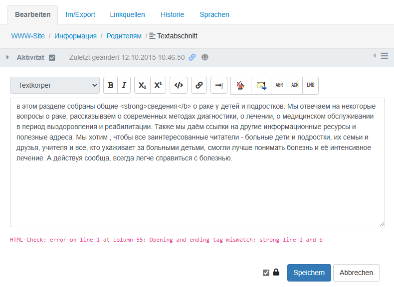
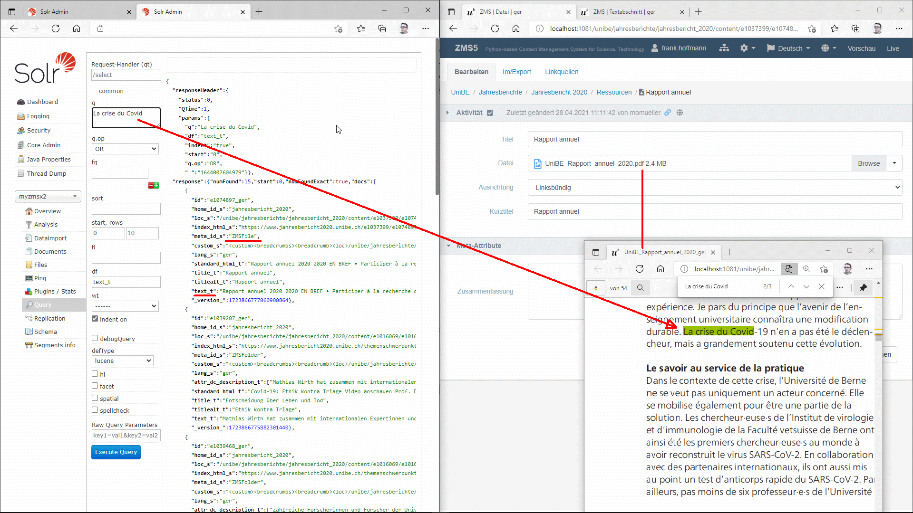
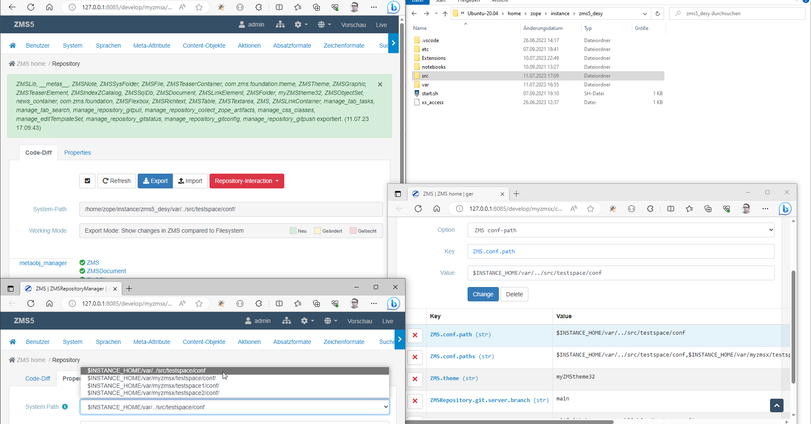
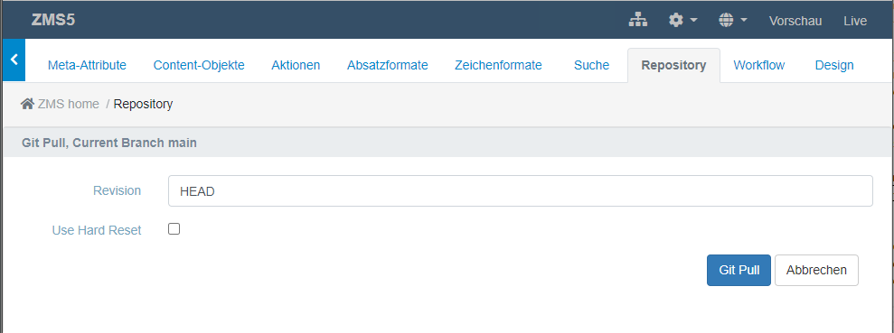
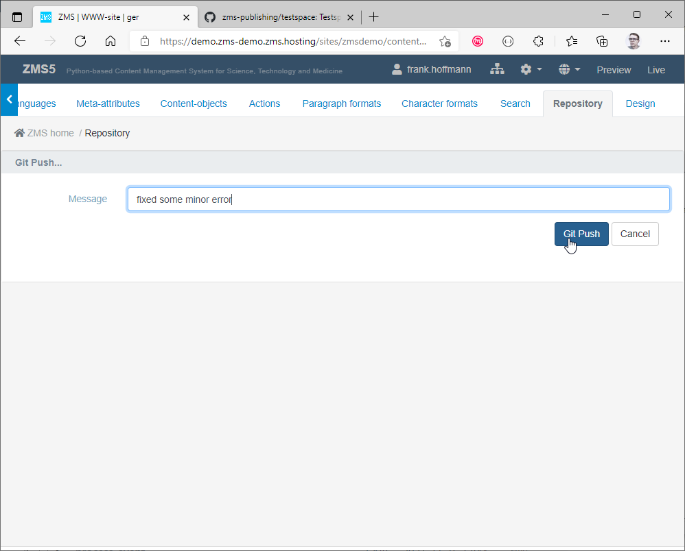

# C. For Site Administrators

This chapter covers the configuration and operation of a ZMS installation. It addresses user management, multilingual configuration, content-model design, search indexing, AI/LLM connectors, theming, and production deployment topics such as caching and reverse-proxy integration.

---

## 1. The Configuration Menu

The ZMS configuration menu (accessible via the gear icon in the top bar, visible to users with admin privileges) provides ten main sections:

| # | Section | Purpose |
|---|---|---|
| 1 | **User** | Manage user accounts and access rights |
| 2 | **System** | System variables, multisite hierarchies, functional components |
| 3 | **Languages** | Languages and their editorial dependencies |
| 4 | **Meta-Attributes** | General content attributes (Dublin Core-style metadata) |
| 5 | **Content-Objects** | Model content classes and their attribute schemas |
| 6 | **Paragraph-Formats** | Text block formatting presets |
| 7 | **Character-Formats** | Text inline formatting (bold, italic, custom spans) |
| 8 | **Actions** | Additional / self-programmed helper functions |
| 9 | **Search** | Configure content indexing (ZCatalog, Solr) |
| 10 | **Design** | Design themes and JS/CSS customization |

---

## 2. User Management

The **User** section of the configuration menu lets the administrator:

- Create, edit, and delete local ZMS user accounts.
- Assign users to roles: *Reader*, *Author*, *Editor*, *Manager*.
- Delegate authentication to Zope's built-in user folder or an external LDAP/Active Directory source.

Roles control which workflow transitions a user can trigger and which parts of the configuration menu are visible.

---

## 3. Languages {#languages}

ZMS uses a **symmetric hierarchical** multilingual model:

- **Symmetric** — all language variants of a content object are stored side-by-side in a single object (not in separate sub-sites).
- **Hierarchical** — languages are organised in a dependency tree. A *primary language* is the source; *secondary* or *dependent* languages inherit content from their parent and can override it with local variants.

### Configuring languages

Open **Administration → Languages**. The upper section defines available languages and their dependency structure. The lower section provides the **Language Dictionary** — a table of language-neutral keys and their translations.

\
*Language configuration: available languages and dependencies (upper); language dictionary (lower)*

### Language dictionary

Display labels for content classes and attributes in the ZMI can be internationalised. Naming conventions:

- `TYPE_<NAME>` — translation key for a content class display name (e.g. `TYPE_BOX`).
- `ATTR_<NAME>` — translation key for an attribute display name (e.g. `ATTR_TITLE`).

If a matching entry exists in the language dictionary, it overrides the literal label stored in the content model.

---

## 4. Meta-Attributes

Meta-attributes (or *metas*) are site-wide descriptive attributes inspired by the [Dublin Core Metadata Initiative](https://en.wikipedia.org/wiki/Dublin_Core). Every content object automatically inherits all configured meta-attributes.

Common defaults include:

- `attr_dc_title` — document title
- `attr_dc_description` — summary / abstract
- `attr_dc_creator` — author
- `attr_dc_date` — publication date
- `attr_dc_subject` — keyword tags

Administrators can add further meta-attributes and assign a data type to each. Because any meta-attribute becomes a new data type usable across all content classes, a coherent metadata concept reduces template complexity and supports consistent full-text indexing.

\
*Meta-attribute administration*

---

## 5. Content Objects (Content Model)

ZMS uses a **content model** (also called *schema*) that defines an arbitrary number of content class definitions.

### Pages and blocks

- **Page-like objects** (`ZMSFolder`, `ZMSDocument`) aggregate block elements and may nest other page objects.
- **Block elements** (`ZMSTextarea`, `ZMSFile`, `ZMSGraphic`, …) hold actual content and are arranged in sequences inside pages.

### Defining a content class

1. Open **Administration → Content-Objects**.
2. Add a new class and give it an ID and display label.
3. Add attributes by selecting from the available data types (text, integer, image, resource, TAL expression, Python script, …).
4. Mark attributes as **multilingual** (globe icon) if they need language-specific values.
5. After the attribute list is complete, edit the `standard_html` TAL template to render the content. Use the **Refresh** button to generate a prototype TAL snippet from the current attribute schema.

\
*Example: a `carditem` object model with image, text, and URL attributes*

\
*Nested models: a `card_container` aggregating `carditem` instances*

### Multilingual attribute labels

Attribute display names in the content model can be made multilingual by following the `TYPE_`/`ATTR_` naming convention described in [§ 3 Languages](#languages).

---

## 6. Paragraph and Character Formats

### Paragraph formats

Paragraph formats define the block-level HTML element wrapping a `ZMSTextarea` content. They are used by both the plain-text editor (applied to the whole block) and the rich-text editor (applied to individual paragraphs).

Each format is defined by:

- ID, display name
- Wrapping HTML element and attributes
- Newline tag
- Whether it is available in plain and/or rich-text editors
- Whether it is the default format
- Whether it forces use of the rich-text editor

\
*Paragraph format configuration form*

### Standard (plain-text) editor

The standard text editor provides a plain-text `<textarea>` input. It is possible to add inline HTML tags manually, but invalid HTML can creep in. To help catch this, enable the realtime HTML validity check via the system parameter:

```
ZMS.ZMSTextarea.show_htmlcheck = True
```

\
*HTML validity check indicator controlled by `ZMS.ZMSTextarea.show_htmlcheck`*

### Rich-text editors (RTE)

ZMS ships with four RTEs selectable via the system parameter `ZMS.richtext.plugin`:

1. **CKEditor** (HTML)
2. **TinyMCE** (HTML)
3. **SimpleMDE** (Markdown)
4. **EasyMDE** (Markdown)

To add a custom RTE, create a folder at `Products/zms/plugins/rte/MyRTE/` containing a TAL template `manage_form.zpt` that renders the editor's HTML snippet. Place JavaScript and CSS resources in `Products/zms/plugins/www/MyRTE/` and reference them with ZMS resource links.

### Character formats

Inline (character) formats add custom `<span>` wrappers or other inline HTML elements inside text blocks. Each format is defined by ID, display name, button icon, wrapping HTML element/attributes, and optional JavaScript event handling.

\
*Inline character-format configuration*

---

## 7. Search

### 7.1 ZCatalog (built-in)

ZMS integrates with Zope's built-in **ZCatalog** for lightweight full-text search.

- Open **Administration → Search → Adapter** to choose which content classes and attributes to index.
- Index objects are named `catalog_<lang>` (e.g. `catalog_eng`) and are held inside the ZMS `content` object.
- In a **multisite** hierarchy only the root ZMS catalog collects all index data. Local content classes not inherited from the root must be registered individually in each client's Search configuration. **Important:** attribute schemas defined in sub-sites are ignored for global indexing — all indexed attributes must be declared in the root ZMS object.

\
*Selecting content classes and attributes for indexing*

\
*ZCatalog connector administration*

### Integrating the search form in your theme

Your theme template must:

1. Provide a `ZMSDocument` page node containing a `ZMSTextarea` with the TAL-based search form (input field + results placeholder).
2. Include the ZMS search JavaScript module:

```html
<script type="text/javascript" src="/++resource++zms_/zmi.core.js"></script>
<script type="text/javascript" src="/++resource++zms_/ZMS/zmi_body_content_search.js"></script>
```

Full search form TAL template (input section + asynchronous results placeholder):

```html
<form class="search" method="get" xmlns:tal="http://xml.zope.org/namespaces/tal">

  <tal:block tal:condition="python:request.get('searchform',True)">
    <input tal:condition="python:request.get('searchform')" type="hidden" name="searchform"
           tal:attributes="value python:request.get('searchform')" />
    <input tal:condition="python:request.get('lang')" type="hidden" name="lang"
           tal:attributes="value python:request.get('lang')" />
    <input tal:condition="python:request.get('preview')" type="hidden" name="preview"
           tal:attributes="value python:request.get('preview')" />
    <legend tal:content="python:here.getZMILangStr('SEARCH_HEADER')">Search header</legend>
    <div class="form-group">
      <div class="col-md-12">
        <div class="input-group">
          <tal:block tal:content="structure python:here.getTextInput(fmName='searchform',elName='search',value=request.get('search',''))">the value</tal:block>
          <span class="input-group-btn">
            <button type="submit" class="btn btn-primary">
              <i class="fa fa-search icon-search"></i>
            </button>
          </span>
        </div>
      </div>
    </div><!-- .form-group -->
    <div class="form-group row"
         tal:condition="python:here.getPortalMaster() is not None or len(here.getPortalClients())>0">
      <div class="control-label col-md-12" tal:define="home_id python:here.getHome().id">
        <input type="hidden" name="home_id"
               tal:attributes="value python:request.get('home_id',home_id); data-value home_id" />
        <input type="checkbox" class="form-check-input"
               onchange="var $i=$('input[name=home_id]');$i.val(this.checked?$i.attr('data-value'):'');"
               tal:attributes="checked python:['','checked'][request.get('home_id',home_id)==home_id]" />
        <label class="form-check-label control-label">
          <strong tal:content="home_id">the home-id</strong> (local)
        </label>
      </div>
    </div><!-- .form-group -->
  </tal:block>

  <div id="search_results" class="form-group" style="display:none">
    <div class="col-md-12">
      <h4 tal:content="python:here.getZMILangStr('SEARCH_HEADERRESULT')">Result</h4>
      <div class="header row">
        <div class="col-md-12">
          <span class="small-head">
            <span class="glyphicon glyphicon-refresh fas fa-spinner fa-spin" alt="Loading..."></span>
            <tal:block tal:content="python:here.getZMILangStr('MSG_LOADING')">loading</tal:block>
          </span>
        </div>
      </div><!-- .header.row -->
      <div class="line row"></div>
      <div class="pull-right"><ul class="pagination"></ul></div>
    </div>
  </div>

</form>
```

The form's request is answered by an XML stream transformed into HTML by JavaScript.

**Permalink for the search page:** Instead of hardcoding the node ID, define a permalink property `ZMS.permalink.search` on the ZMS root node. Reference it in master templates like this:

```html
<html lang="en"
  tal:define="zmscontext options/zmscontext;
    search_node python: zmscontext.getLinkObj(
      zmscontext.getConfProperty('ZMS.permalink.search', default='{$@content}'), request);">
```

Generate the search link:

```html
<a href="#"
  tal:attributes="href python:search_node.getHref2IndexHtml(request)">
  <i class="fas fa-search"></i>&nbsp;
  <span tal:replace="python:zmscontext.getLangStr('SEARCH')">Search</span>
</a>
```

**Multisite search filtering:** To restrict search results to the current ZMS client, pass `home_id` in the form:

```html
<form class="search" method="get">
  <input type="hidden" name="home_id" value="myzms">
  ...
</form>
```

Reference the search page via a permalink system property `ZMS.permalink.search` to avoid hardcoded IDs across templates.

### 7.2 Apache Solr connector

For large sites or advanced search features (facets, highlighting, PDF indexing) ZMS provides a Solr connector.

**Overview:**

1. Import the two default ZMS actions from **Administration → Actions**:
   - `manage_zcatalog_create_sitemap` — generates a Solr-schema-conformant XML file.
   - `manage_zcatalog_update_documents` — transfers the XML to the Solr server.

2. Under **Administration → Search**, add the `ZMSZCatalogSolrConnector` and configure:
   - **URL** — HTTP API URL of the Solr server.
   - **Core** — name of the Solr core.

3. Create the Solr core on the server:
   ```shell
   solr@server:~$ solr create_core -c mysite
   ```

4. Run *Create XML Sitemap* then *Update SOLR Document Index* to perform the initial index load.

**PDF indexing:** Install `pdfminer.six` to enable automatic PDF text extraction into the sitemap XML:

```shell
zope@server:~$ ~/venv/bin/pip install pdfminer.six
```

\
*ZMS transfers PDF content by extracting plain text and adding it to the sitemap XML.*

### Running Solr as a Docker container

#### Dockerfile

```docker
FROM solr:8

# Apply security updates
USER root
RUN apt-get update && apt-get -y upgrade && apt-get clean
USER solr
```

#### systemd service for Solr (Docker / Podman)

Place the following file at `/etc/systemd/system/solr.service` on the host:

```ini
[Unit]
Description=Apache SOLR search engine

[Service]
Type=simple
User=solr
Restart=always
Environment="GODEBUG=netdns=go"
# Remove old container before building a new image
ExecStartPre=-/usr/bin/podman container stop solr
ExecStartPre=-/usr/bin/podman container rm solr
# Apply security updates on each restart
ExecStartPre=/usr/bin/podman build --pull --no-cache -f /home/solr/Dockerfile -t solr:8-security-updated
ExecStart=/usr/bin/podman run --rm -it -v "/home/solr/data:/var/solr" -p 8983:8983 --name solr solr:8-security-updated
ExecStop=/usr/bin/podman stop solr

[Install]
WantedBy=multi-user.target
```

Enable and start:

```shell
root@server:~$ systemctl daemon-reload
root@server:~$ systemctl enable solr
root@server:~$ systemctl start solr
```

#### Creating a Solr core in a Docker container

```shell
localhost:~$ ssh root@solr.server.hosting
root@server:~$ su - solr
solr@server:~$ podman exec -it solr bash
solr@container:/opt/solr-8.11.2$ solr create_core -c playground
```

---

## 8. Repository Manager and Git Bridge

### 8.1 Repository Manager

The **ZMS Repository Manager** synchronises custom ZMS code (metadata, content models, actions, workflow definitions) between the ZODB and a filesystem folder. Activate it under **Administration → System**.

Key properties:

| Property | Description |
|---|---|
| **System Path** | Filesystem location for code replication. Default: `$INSTANCE_HOME/var/$zms_id`. The variable `$INSTANCE_HOME` resolves to the Zope instance folder. The system property `ZMS.conf.path` stores the active path; `ZMS.conf.paths` can hold a comma-separated list of candidates for selection. |
| **Working Mode** | *Export* (ZODB → filesystem) or *Import* (filesystem → ZODB) |
| **Ignore Orphans** | Skip files not managed by version control |
| **Auto-Sync** | Export automatically on model changes (requires `ZMS.debug = True`). In *Import* mode, Auto-Sync still requires manual confirmation. |

Diff colour conventions: green = new, red = deleted, yellow = modified. The colour perspective inverts between Export and Import modes: in Export mode, new ZODB code is green; in Import mode, newer filesystem code is green.

\
*Repository Manager: diff view with Export/Import controls*

\
*Repository Manager properties: System Path supports `$INSTANCE_HOME` path components*

### 8.2 Git Bridge

The ZMS Git Bridge allows TTW (through-the-web) development to coexist with Git-based collaboration.

1. Configure the filesystem repository folder as a Git clone.
2. Import the three Git actions (`gitconfig`, `gitpull`, `gitpush`) from **Administration → Actions**.


After importing, the Repository Manager gains a **Repository Interactions** pop-up menu:

- **Git Configuration** — enter the Git remote URL and optionally clone.
- **Git Pull** — pull the latest revision (or a specific commit). Use *Hard Reset* to force-overwrite local changes.
- **Git Push** — enter a commit message and push.

A dedicated SSH key for the Zope user is recommended:

```ini
# ~/.ssh/config
Host github.com
    HostName github.com
    IdentityFile ~/.ssh/zope_deploy_key
    User git
```

The `.git/config` file in the repository folder should be pre-configured before using it with ZMS:

```ini
[user]
    name = mygituser
    email = mygituser@mydomain.tld
[core]
    repositoryformatversion = 0
    filemode = true
    bare = false
    logallrefupdates = true
[remote "origin"]
    url = git@github.com:mydomain/myproject.git
    fetch = +refs/heads/*:refs/remotes/origin/*
[branch "master"]
    remote = origin
    merge = refs/heads/master
```

> The Git URL saved via *Git Configuration* is only needed if cloning via the ZMS GUI. If the `.git/config` file is already in place, the URL does not need to be entered again.

The Git Bridge uses a minimal command set:

- **Git Pull** — pulls (with checkout) the latest `HEAD` or a specific revision ID; *Hard Reset* forces an overwrite of local changes.
- **Git Push** — pushes the current state to the main branch with a commit message.

\
*Git pull menu: optionally enter a revision ID and enable Hard Reset to force-overwrite local changes.*

\
*Git push menu: enter a commit message before pushing.*

---

## 9. LLM / AI Configuration {#llm}

ZMS now supports multiple Large Language Model (LLM) providers through an abstract interface. This allows you to use different AI backends including OpenAI, local Ollama deployments, and RAG (Retrieval-Augmented Generation) with Qdrant vector database.

### Overview

The LLM integration provides a chat interface accessible from the ZMS management interface. You can configure different providers based on your needs:

- **OpenAI**: Cloud-based GPT models (requires API key and internet connection)
- **Ollama**: Local LLM deployment (no API key needed, runs on your infrastructure)
- **RAG**: Retrieval-Augmented Generation using Qdrant vector database with Ollama

### LLM-Chat content block (`llm_chat`)

Besides the connector management UI, ZMS ships the metaobject class `llm_chat` so you can embed a chat frontend directly in web documents as a normal block element.

- Add a **ZMSLLMConnector** at the site root and configure provider/model as usual.
- Import or enable the `llm_chat` metaobject from package `com.zms.llm`.
- Insert an `llm_chat` block into a page.

The block uses the existing `++rest_api/llm_chat` endpoint, supports multi-turn history, optional agent mode (tool-calling via built-in or profile-based `llmtools`), and stores chat history per block in browser localStorage.

### Configuration Properties

All configuration is done via the **ZMSLLMConnector** object in your ZMS instance. You can configure it through the ZMS management interface or by setting properties on the ZMSLLMConnector instance.

#### General Settings

| Property | Description | Default |
|----------|-------------|---------|
| `llm.provider` | Provider type: `openai`, `ollama`, or `rag` | `openai` |
| `llm.api.model` | Model name to use | `gpt-4o-mini` (OpenAI), `llama2` (Ollama) |
| `llm.temperature` | Sampling temperature 0.0-2.0 (higher = more creative) | `0.7` (RAG: `0.1` recommended) |
| `llm.top_p` | Nucleus sampling 0.0-1.0 | `0.9` |
| `llm.max_tokens` | Maximum tokens to generate (optional) | (not set) |
| `llm.num_ctx` | Context window size for Ollama/RAG | `4096` |
| `llm.llmtools.id` | Custom `*_llmtools` profile id for agent mode (empty = built-in tools) | (not set) |

#### Agent tools profile abstraction (`*_llmtools`)

Agent mode can be extended without editing core `llmtools.py`:

1. Install/import a `ZMSLibrary` meta-object whose id ends with `_llmtools` (or connector-style `_connector` in package `com.zms.llmtools.*`).
2. Add script `get_llmtools(connector, context)` that returns OpenAI-compatible tool schemas.
3. Add optional scripts `llmtool_<name>(connector, context, args)` for custom execution.
4. Select this profile in **ZMSLLMConnector → Configuration → LLM Tools Profile**.

Connector-style naming is also supported for package-based profiles:
- id ends with `_connector`
- package starts with `com.zms.llmtools.`

Example: `com.zms.llmtools.ollama/ollama_connector`.

If no profile is selected, ZMS falls back to the built-in core tools.

#### OpenAI Configuration

For using OpenAI's cloud API:

| Property | Description | Default |
|----------|-------------|---------|
| `llm.api.key` | Your OpenAI API key | (required) |
| `llm.api.endpoint` | Custom endpoint URL | `https://api.openai.com/v1/chat/completions` |
| `llm.api.model` | Model name | `gpt-4o-mini` |
| `llm.store` | Enable storage for OpenAI's responses API | `False` |

#### Ollama Configuration

For using local Ollama deployment:

| Property | Description | Default |
|----------|-------------|---------|
| `llm.ollama.host` | Ollama server URL | `http://localhost:11434` |
| `llm.api.model` | Model name (e.g., `llama2`, `mistral`, `codellama`) | `llama2` |
| `llm.num_ctx` | Context window size | `4096` |

> **Agent mode requires a tool-capable model.** Many older models (including `llama2`, `mistral`, `codellama`) do not support Ollama's tool-calling protocol and will return an error like *"does not support tools"* when agent mode is enabled. Use one of the following models instead:
>
> | Model | Pull command |
> |-------|-------------|
> | `llama3.1` | `ollama pull llama3.1` |
> | `llama3.2` | `ollama pull llama3.2` |
> | `llama3.3` | `ollama pull llama3.3` |
> | `qwen2.5` | `ollama pull qwen2.5` |
> | `qwen2.5-coder` | `ollama pull qwen2.5-coder` |
> | `mistral-nemo` | `ollama pull mistral-nemo` |
>
> Plain chat (without agent mode) continues to work with any model.

#### RAG Configuration

For using RAG with Qdrant vector database and Ollama:

| Property | Description | Default |
|----------|-------------|---------|
| `llm.qdrant.host` | Qdrant server URL | `http://localhost:6333` |
| `llm.qdrant.collection` | Collection name for vector search | `zms_docs` |
| `llm.ollama.host` | Ollama server URL | `http://localhost:11434` |
| `llm.api.model` | Model name | `llama2` |
| `llm.embedding.model` | SentenceTransformer model for embeddings | `all-MiniLM-L6-v2` |
| `llm.rag.top_k` | Number of documents to retrieve | `16` |
| `llm.rag.score_threshold` | Minimum similarity score (0.0-1.0) | `0.0` |
| `llm.temperature` | Temperature for RAG responses | `0.1` (recommended) |
| `llm.num_ctx` | Context window size | `4096` |

**Important**: RAG requires the `sentence-transformers` package:
```bash
pip install sentence-transformers
```

### Configuration Examples

#### Example 1: OpenAI (Cloud)

```python
# In your ZMS configuration
llm.provider = openai
llm.api.key = sk-your-openai-api-key-here
llm.api.model = gpt-4o-mini
llm.temperature = 0.7
llm.top_p = 0.9
llm.store = True  # Enable responses API storage
```

#### Example 2: Ollama (Local)

```python
# In your ZMS configuration
llm.provider = ollama
llm.ollama.host = http://localhost:11434
llm.api.model = llama3.1  # use a tool-capable model for agent mode
llm.temperature = 0.7
llm.num_ctx = 4096
```

For Docker deployments, you might use:
```python
llm.provider = ollama
llm.ollama.host = http://ollama:11434  # Docker service name
llm.api.model = mistral
llm.temperature = 0.8
llm.num_ctx = 8192
```

#### Example 3: RAG with Qdrant

```python
# In your ZMS configuration
llm.provider = rag
llm.qdrant.host = http://localhost:6333
llm.qdrant.collection = zms_documentation
llm.ollama.host = http://localhost:11434
llm.api.model = llama2
llm.embedding.model = all-MiniLM-L6-v2
llm.rag.top_k = 16
llm.rag.score_threshold = 0.0
llm.temperature = 0.1  # Lower temperature for factual answers
llm.num_ctx = 4096
```

For Docker Compose setup:
```python
llm.provider = rag
llm.qdrant.host = http://qdrant:6333
llm.ollama.host = http://ollama:11434
llm.qdrant.collection = zms_docs
llm.api.model = llama2
llm.embedding.model = all-MiniLM-L6-v2
llm.rag.top_k = 16
llm.rag.score_threshold = 0.3  # Filter low-quality matches
llm.temperature = 0.1
```

**Note**: Make sure to use the same embedding model (`llm.embedding.model`) that was used to ingest your data into Qdrant!

### Setting Up Ollama

#### Installation

1. **Install Ollama**: Visit [https://ollama.ai](https://ollama.ai) and download for your platform
2. **Pull a model**:
   ```bash
   ollama pull llama2
   # or
   ollama pull mistral
   # or
   ollama pull codellama
   ```
3. **Start Ollama**: 
   ```bash
   ollama serve
   ```

#### Docker Setup

Add to your `docker-compose.yml`:

```yaml
services:
  ollama:
    image: ollama/ollama:latest
    ports:
      - "11434:11434"
    volumes:
      - ollama_data:/root/.ollama
    networks:
      - zms_network

volumes:
  ollama_data:
```

Then pull your desired model:
```bash
docker exec -it ollama ollama pull llama2
```

### Setting Up RAG with Qdrant

#### Docker Compose Setup

```yaml
services:
  qdrant:
    image: qdrant/qdrant:latest
    ports:
      - "6333:6333"
      - "6334:6334"
    volumes:
      - qdrant_storage:/qdrant/storage
    networks:
      - zms_network

  ollama:
    image: ollama/ollama:latest
    ports:
      - "11434:11434"
    volumes:
      - ollama_data:/root/.ollama
    networks:
      - zms_network

volumes:
  qdrant_storage:
  ollama_data:

networks:
  zms_network:
```

#### Populate Qdrant

You'll need to populate your Qdrant collection with embeddings. Here's a Python example:

```python
from qdrant_client import QdrantClient
from qdrant_client.models import Distance, VectorParams, PointStruct
from sentence_transformers import SentenceTransformer

# Initialize embedding model (use the same as llm.embedding.model)
model = SentenceTransformer('all-MiniLM-L6-v2')

# Connect to Qdrant
client = QdrantClient(host="localhost", port=6333)

# Create collection
client.create_collection(
    collection_name="zms_docs",
    vectors_config=VectorParams(size=384, distance=Distance.COSINE),
)

# Add documents with embeddings
documents = [
    "ZMS is a content management system...",
    "To configure LLM settings...",
    # ... your documents
]

points = []
for idx, doc in enumerate(documents):
    vector = model.encode(doc).tolist()
    points.append(
        PointStruct(
            id=idx,
            vector=vector,
            payload={"text": doc}
        )
    )

client.upsert(collection_name="zms_docs", points=points)
```

### API Usage

#### REST API Endpoint

The LLM chat is available via REST API:

```
GET /++rest_api/llm_chat?message=Your+question+here
```

Response format (OpenAI /v1/chat/completions compatible):
```json
{
  "id": "chatcmpl-abc123",
  "object": "chat.completion",
  "created": 1677652288,
  "model": "gpt-4o-mini",
  "choices": [{
    "index": 0,
    "message": {
      "role": "assistant",
      "content": "The AI's response"
    },
    "finish_reason": "stop"
  }],
  "usage": {
    "prompt_tokens": 10,
    "completion_tokens": 20,
    "total_tokens": 30
  },
  "message": {
    "role": "assistant",
    "content": "The AI's response"
  }
}
```

Error format:
```json
{
  "error": {
    "code": "ERROR_CODE",
    "message": "Error description"
  }
}
```

#### Provider Info Endpoint

Get information about the current provider:

```
GET /++rest_api/llm_provider_info
```

Response:
```json
{
  "provider": "ollama",
  "model": "llama2",
  "endpoint": "http://localhost:11434"
}
```

#### Python API

You can use the LLM API from Python code:

```python
from Products.zms import llmapi

# Send a simple message (string)
response = llmapi.chat(context, "What is ZMS?")

# Send a conversation (list of messages)
messages = [
    {"role": "system", "content": "You are a helpful assistant."},
    {"role": "user", "content": "What is ZMS?"}
]
response = llmapi.chat(context, messages)

# With additional parameters
response = llmapi.chat(
    context, 
    "Explain ZMS configuration",
    temperature=0.5,
    max_tokens=500
)

# Check for errors
if 'error' in response:
    print(f"Error: {response['error']['message']}")
else:
    # Access the response content
    print(f"Response: {response['message']['content']}")
    # Or using the OpenAI format
    print(f"Response: {response['choices'][0]['message']['content']}")

# Get provider info
info = llmapi.get_provider_info(context)
print(f"Using {info['provider']} with model {info['model']}")
```

### Configuration Parameters Explained

#### Temperature (`llm.temperature`)
Controls randomness in responses:
- **0.0**: Deterministic, always picks most likely tokens
- **0.7**: Balanced (default for general use)
- **0.1**: More focused and deterministic (recommended for RAG)
- **1.5-2.0**: Very creative, more random

#### Top P (`llm.top_p`)
Nucleus sampling threshold (0.0-1.0):
- **0.9**: Default, good balance
- Lower values = more focused responses
- Higher values = more diverse responses

#### Max Tokens (`llm.max_tokens`)
Maximum length of generated response. Useful to control costs or response length.

#### Context Window (`llm.num_ctx`)
Size of context window for Ollama/RAG models:
- **4096**: Default, good for most use cases
- **8192** or higher: For longer conversations or documents

#### Score Threshold (`llm.rag.score_threshold`)
Minimum similarity score for RAG document retrieval:
- **0.0**: Include all retrieved documents (default)
- **0.3-0.5**: Filter out low-quality matches
- **0.7+**: Only very relevant documents

#### Top K (`llm.rag.top_k`)
Number of documents to retrieve for RAG context:
- **3**: Quick, focused answers
- **16**: Default, good balance (updated from 3)
- **30+**: Comprehensive context (may exceed token limits)

#### Store (`llm.store`)
When set to `True`, enables OpenAI's responses API storage for model training and fine-tuning.

### Troubleshooting

#### Connection Errors

**Problem**: "Cannot connect to Ollama" or "Cannot connect to Qdrant"

**Solutions**:
1. Check if the service is running: `curl http://localhost:11434/api/tags` (Ollama)
2. Check Docker containers: `docker ps`
3. Verify network connectivity between containers
4. Check firewall settings

#### Model Not Found

**Problem**: "Model 'xyz' not found"

**Solution**: Pull the model first:
```bash
ollama pull llama2
# or in Docker
docker exec -it ollama ollama pull llama2
```

#### OpenAI API Key Issues

**Problem**: "API key not configured" or "Invalid API key"

**Solutions**:
1. Set `llm.api.key` property with your OpenAI API key
2. Verify the key is correct at [https://platform.openai.com/api-keys](https://platform.openai.com/api-keys)
3. Check for any whitespace in the key

#### Slow Responses

**Problem**: Ollama responses are very slow

**Solutions**:
1. Use a smaller model (e.g., `llama2:7b` instead of `llama2:13b`)
2. Increase Docker memory allocation
3. Use GPU acceleration if available
4. Consider using OpenAI for faster responses
5. Reduce `llm.num_ctx` if using very large context windows

#### RAG Not Finding Relevant Documents

**Problem**: RAG returns generic answers or "I don't know"

**Solutions**:
1. Check that documents are properly ingested in Qdrant
2. Verify `llm.embedding.model` matches the model used for ingestion
3. Lower `llm.rag.score_threshold` to include more documents
4. Increase `llm.rag.top_k` to retrieve more context
5. Check Qdrant collection: `curl http://localhost:6333/collections/zms_docs`

### Agentic RAG Indexing with `index_qdrant`

ZMS ships an `index_qdrant` LLM tool that lets the agent crawl and index the entire site content into Qdrant on demand — no separate script or notebook required.

#### How it works

When agent mode is enabled (`agent_mode=1` on the `++rest_api/llm_chat` endpoint, or the `llm_chat` block's agent toggle), the LLM can call the `index_qdrant` tool automatically. Simply ask in natural language:

> *"Please index all content of this ZMS site."*
> *"Update the RAG index."*
> *"Re-index the site in German."*

The tool will:

1. Query the ZCatalog for all active pages in the tree.
2. Render each page's body content via `getBodyContent()` — the same HTML a visitor sees.
3. Strip HTML tags and split the text into overlapping chunks (default 1 200 chars / 200 overlap).
4. Embed each chunk with the configured `llm.embedding.model` (SentenceTransformer).
5. Upsert all vectors into Qdrant with rich payload metadata: `path`, `url`, `title`, `lang`, `meta_id`, `chunk_index`.
6. Reply with a summary: pages indexed, chunks stored, pages skipped.

The tool runs entirely inside the Zope process — no external HTTP calls to ZMS are made.

#### Parameters

| Parameter | Description | Default |
|-----------|-------------|---------|
| `lang` | Index only this language code, e.g. `eng` | all site languages |
| `collection` | Qdrant collection name | `llm.qdrant.collection` property |
| `reset` | Drop and recreate the collection before indexing | `true` |
| `chunk_size` | Maximum characters per chunk | `1200` |
| `chunk_overlap` | Overlap between consecutive chunks | `200` |

#### Prerequisites

- A `ZMSLLMConnector` with `llm.provider = rag` configured (Qdrant host, collection, embedding model).
- `qdrant-client` and `sentence-transformers` installed in the Zope Python environment:
  ```bash
  pip install qdrant-client sentence-transformers
  ```
- Qdrant running and reachable at `llm.qdrant.host`.

#### Example agent conversation

```
User:   Please index all content of this ZMS site.

Agent:  [calls index_qdrant()]

Agent:  Done. Indexed 312 pages (1 847 chunks) into collection 'zms_docs'
        across languages ['eng', 'deu']. 4 pages were skipped (no body content).
```

After indexing, the RAG provider will automatically use the freshly populated collection for all subsequent questions.

---

### Best Practices

1. **Use OpenAI for production** if you need reliable, fast responses and can afford the API costs
2. **Use Ollama for development** or when you need privacy and control over your data
3. **Use RAG** when you need the LLM to answer questions based on your specific documentation
4. **Monitor costs** when using OpenAI - set up billing alerts
5. **Test locally first** with Ollama before switching to OpenAI
6. **Keep models updated** - regularly update Ollama models for improvements
7. **Use lower temperature (0.1-0.3) for RAG** to ensure factual, grounded responses
8. **Match embedding models** - always use the same `llm.embedding.model` for ingestion and retrieval
9. **Tune score threshold** - adjust `llm.rag.score_threshold` based on your data quality
10. **Enable OpenAI storage** (`llm.store = True`) only if you want to contribute to model training
11. **Re-index after content changes** - ask the agent to `index_qdrant` whenever significant content has been published so the RAG answers stay current
12. **Index per language** - on multi-language sites, use the `lang` parameter to index languages separately if you want language-scoped Qdrant collections


### Security Considerations

- Never commit API keys to version control
- Use environment variables for sensitive configuration
- Limit network access to Ollama/Qdrant in production
- Regularly rotate OpenAI API keys
- Use HTTPS endpoints when possible
- Implement rate limiting for the chat endpoint
- Be aware that `llm.store = True` sends your data to OpenAI for training

---

## 10. Theming and Design

ZMS themes live in `docs/theming/` and the bundled theme templates are found under `Products/zms/zpt/`. The **Design** configuration menu section allows uploading and activating custom CSS/JS resources.

Key theming documentation:

| Document | Topic |
|---|---|
| [theming/structure.md](theming/structure.md) | Theme folder layout |
| [theming/templates.md](theming/templates.md) | TAL/METAL template conventions |
| [theming/css.md](theming/css.md) | CSS architecture |
| [theming/assets.md](theming/assets.md) | Static asset management |
| [theming/automation.md](theming/automation.md) | Build automation |
| [theming/ai.md](theming/ai.md) | AI-assisted theming |
| [theming/figma.md](theming/figma.md) | Figma-to-ZMS workflow |

---

## 11. Workflow and Versioning {#workflow}

### Overview

The two primary tools for content quality assurance in ZMS are *workflow* and *versioning*:

- **Workflow** ensures that the right person edits or reviews content at the right time.
- **Versioning** ensures that the history of editing steps remains transparent and traceable.

A workflow requires at least two versions of a document:

1. *Working version* — being edited (not yet publicly visible).
2. *Published version* (live version) — the current public state.

When a document enters the workflow, a copy of the currently published version is created as the working version. When the document is committed, the working version overwrites the live version permanently.

---

### Configuration

ZMS workflows are configured under **Administration → System → Workflow**. A workflow defines a set of *activity states* and *transitions* that content must pass through before publication.

Key concepts:

- **`TR_ENTER`** — implicit transition triggered whenever a content object is first modified (enters the workflow).
- **`TR_LEAVE`** — implicit transition that marks the end of the workflow cycle (content is committed/published).
- Each transition can be restricted to specific user roles.
- A transition may start from more than one state (e.g. *Commit* can be triggered from both *Changed* and *Commit requested*).

---

### Content States

#### Basic States (STATE)

Assigned automatically whenever an editor saves a change:

| State | Meaning |
|---|---|
| `STATE_NEW` | Object was just created |
| `STATE_MODIFIED` | Object was modified |
| `STATE_DELETED` | Object was marked for deletion |
| `STATE_MODIFIED_OBJS` | Has modified child objects |
| `None` | No pending change — content is committed / published |

Basic states operate independently of the workflow. When a workflow is active, saving triggers the implicit `TR_ENTER` transition, which assigns the initial activity state `AC_CHANGED` to the parent page container.

#### Activity States (AC)

Activity states are induced by workflow transitions:

| State | Meaning |
|---|---|
| `AC_CHANGED` | Content modified; workflow entered |
| `AC_COMMIT_REQUESTED` | Commit requested by an editor |
| `AC_COMMITTED` | Content approved and published |

\
*Workflow activity states and transitions*

---

### Transitions (TR)

A transition moves a document from one activity state to another:

```
State-A ──── Transition-AB ───► State-B
State-B ──── Transition-BC ───► State-C
```

Two preset transitions bound the workflow:

- **`TR_ENTER`** — triggered implicitly when basic state is set (enters the workflow).
- **`TR_LEAVE`** — triggered when the document is committed (leaves the workflow, content is published).

A simple workflow model:

```
TR_ENTER ──────────────────► AC_CHANGED
AC_CHANGED ─── Request Commit ─► AC_COMMIT_REQUESTED
AC_COMMIT_REQUESTED ─── Commit ─► TR_LEAVE → published
```

An extended workflow allows shortcuts (e.g. *Commit* directly from `AC_CHANGED`) and additional transitions such as *Reject* or *Rollback*:

\
*Extended workflow with reject and express-commit transitions*

Transitions can be restricted to specific user roles (e.g. only a *Manager* can execute *Commit*).

### Selective workflow

Workflow can be assigned to individual content nodes and applies recursively to all children. Assigning it to the root node activates it site-wide.

---

### Versioning

#### Two-slot versioning

Each block-level content object maintains two version slots:

| Slot | Description |
|---|---|
| `version_live_id` | ID of the currently published version |
| `version_work_id` | ID of the version currently being edited |

#### Container aggregate versioning

Because a ZMS page is composed of many block objects, the parent container tracks an aggregate version that increments with every child change. This creates a traceable history of which block was changed when:

```
document-e1:  0.0.1  {e2:0.0.1, e3:0.0.1, e4:0.0.1}
              0.0.2  {e2:0.0.1, e3:0.0.2, e4:0.0.1}
              0.0.3  {e2:0.0.1, e3:0.0.3, e4:0.0.1}
```

#### Version numbering

Versions follow `major.minor.patch`:

| Component | When incremented |
|---|---|
| `patch` | Each state transition within a workflow cycle |
| `minor` | Each save (without workflow) or on commit |
| `major` | Explicitly by user action ("Create Major Version") |

Creating a major version prunes all minor/patch history and reduces storage.

#### Versioning with workflow

When the workflow is active, each workflow transition creates a new *patch* version. A commit creates a new *minor* version and discards intermediate patches.

#### Versioning without workflow

Each save creates a new *minor* version. Users can manually review, compare, and restore previous versions from the **History** tab.

In both cases ZMS does not implicitly create a *major* version (like *patch* and *minor*) — it must be done explicitly by a user interaction ("Create Major Version"). Creating a major version prunes all minor and patch history and reduces data storage.

#### Implementation notes (DRAFT)

To implement versioning for a container that holds individually versioned sub-objects, a *version vector* tracks the composite state:

```python
class VersionedObject:
    def __init__(self, id):
        self.id = id
        self.version = 0
        self.sub_objects = {}
        self.change_log = []

    def add_sub_object(self, sub_object):
        self.sub_objects[sub_object.id] = sub_object
        self.update_version()

    def update_sub_object(self, sub_object_id, new_version):
        if sub_object_id in self.sub_objects:
            self.sub_objects[sub_object_id].version = new_version
            self.update_version()

    def update_version(self):
        self.version += 1
        self.change_log.append(self.get_version_vector())

    def get_version_vector(self):
        version_vector = {self.id: self.version}
        for sub_id, sub in self.sub_objects.items():
            version_vector[sub_id] = sub.version
        return version_vector

class SubObject:
    def __init__(self, id):
        self.id = id
        self.version = 0

# Usage
container = VersionedObject('container')
block1 = SubObject('block1')
block2 = SubObject('block2')
container.add_sub_object(block1)
container.add_sub_object(block2)
container.update_sub_object('block1', 1)
container.update_sub_object('block2', 2)
print(container.get_version_vector())
# → {'container': 4, 'block1': 1, 'block2': 2}
```

Key points of this approach:

- **Version Vector Structure** — includes the container version and all sub-object versions.
- **Composite Versioning** — the container's version reflects the combined state of all its sub-objects.
- **Change Log** — each `update_version` call appends a snapshot, providing a traceable history.
- **Incremental Updates** — the container increments whenever any sub-object changes.


---

## 12. Caching and Reverse-Proxy Deployment

In production ZMS sits behind a reverse proxy (NGINX, Apache). ZMS controls HTTP cache behaviour via response headers set by the helper function:

```python
# Products/zms/standard.py
set_response_headers_cache(context, request, cache_max_age=24*3600, cache_s_maxage=-1)
```

Key behaviours:

- **Preview / restricted content**: `Cache-Control: no-cache` is set automatically — proxies will not cache restricted pages.
- **Public content**: `Cache-Control: s-maxage=<proxy_ttl>, max-age=<browser_ttl>, public` is set.
- **Dynamic expiry**: when a page has a future `attr_active_start` or `attr_active_end` date, the TTL is automatically tightened to the nearest upcoming change. The `X-Accel-Expires` header carries this value to NGINX.
- **ETag cache-busting**: URLs with `?ETag=<token>` are cached indefinitely by the proxy; a changing token forces a new cache entry.

Typical production tuning:

```python
# In standard_html template (TAL)
<tal:block tal:define="
  standard modules/Products.zms/standard;
  dummy python:standard.set_response_headers_cache(this, request, cache_max_age=6*3600, cache_s_maxage=86400)">
</tal:block>
```

For instant cache invalidation, import the `manage_cachepurge` ZMS action and configure the external `cache_purge` method to call your NGINX cache-purge script. See [D. For Developers — Proxy Cache](d_for_developers.md#4-proxy-cache-and-http-caching) for the full proxy cache reference including ETag-based busting, parameter tuning, and purge script examples.

---

## 13. Security Hardening Checklist

- [ ] Run Zope as a dedicated non-root user.
- [ ] Restrict the Zope management interface (`/manage`) to localhost or a VPN.
- [ ] Use HTTPS with a valid certificate (Let's Encrypt or corporate CA) in front of the proxy.
- [ ] Rotate the Zope admin password after initial setup.
- [ ] Set `ZMS.debug = False` in production.
- [ ] Limit LDAP/Solr/Qdrant/Ollama network access to the Zope host.
- [ ] Keep ZMS, Zope, and all Python dependencies up to date.
- [ ] Never commit API keys or credentials to version control.
