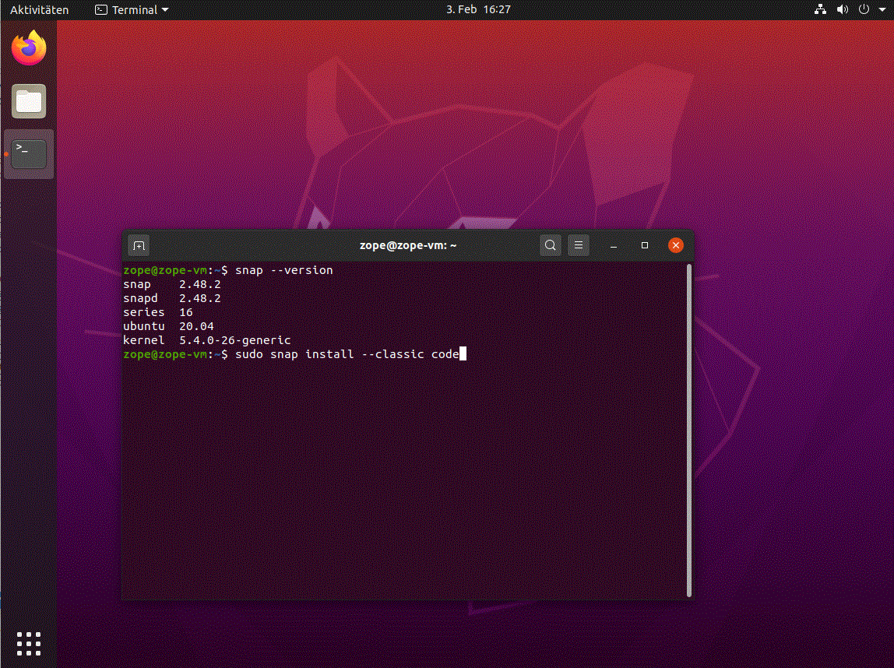
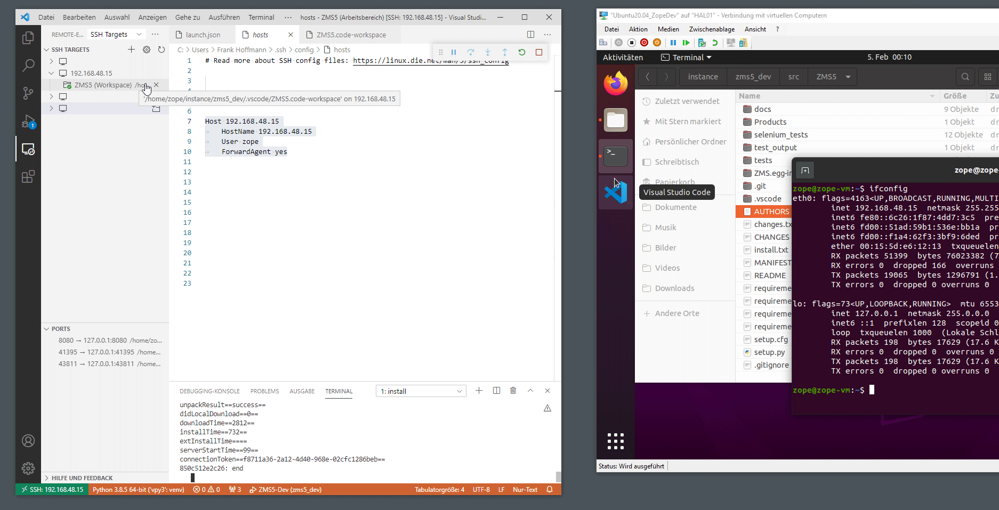
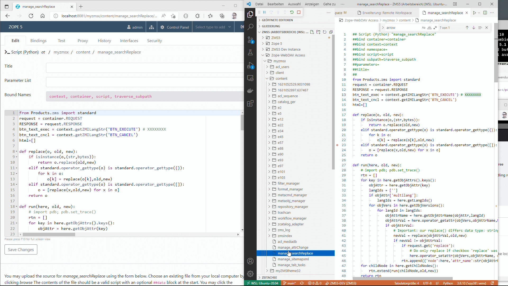
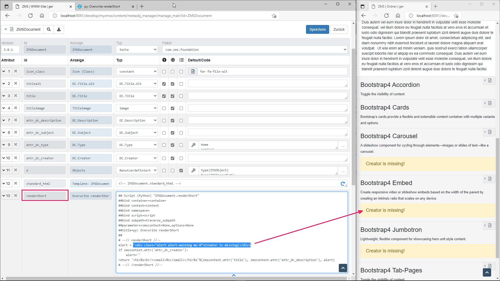
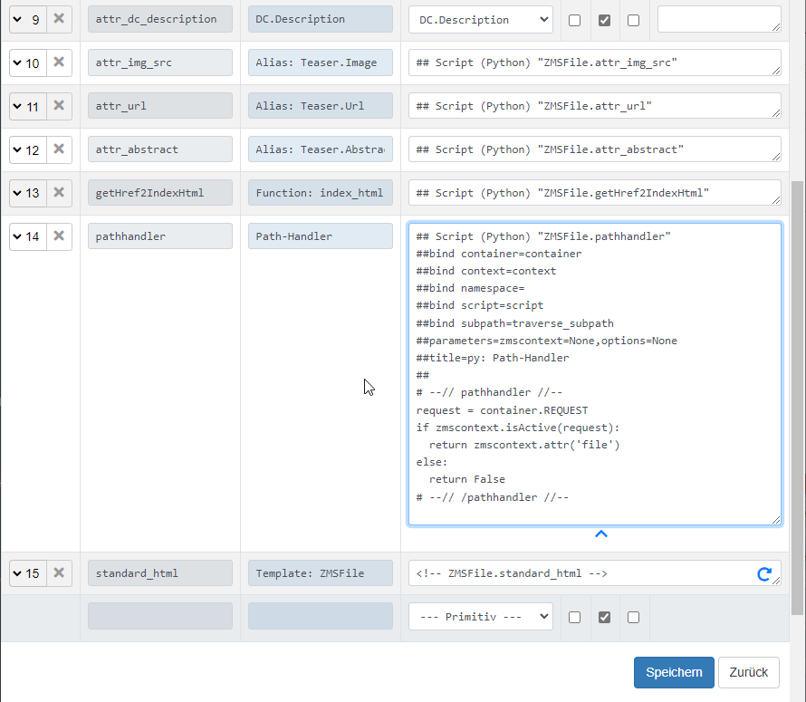
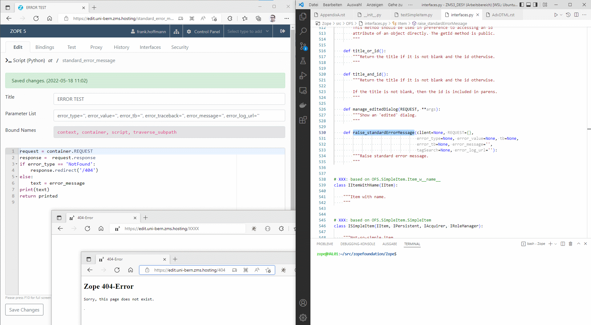

# D. For Developers

This chapter covers setting up a development environment, understanding the ZMS object model, and using the ZMS Python/TAL API. It also explains cache-control integration and how to extend ZMS with custom content classes, actions, and themes.

---

## 1. Development Environment Setup

Follow the standard installation from [A. Getting Started](a_getting_started.md). For development, the editable install is strongly recommended:

```console
~$ ./pip install --use-pep517 --config-settings editable_mode=compat \
       -e git+https://github.com/zms-publishing/ZMS.git@main#egg=Products.zms
```

This places the ZMS source under `/home/zope/src/ZMS/` so code changes take effect after a Zope restart (or without restart for TAL templates and Python scripts stored in ZODB).

### Enabling debug mode

Set the system property `ZMS.debug = True` in your ZMS instance to activate:

- Detailed error tracebacks in the ZMI.
- Auto-sync of the Repository Manager on model changes.
- Additional logging output.

### Running tests

```console
~$ cd /home/zope/src/ZMS
~$ python -m pytest -q
```

> **Note:** Tests import Zope/OFS modules. A fully installed Zope environment is required — `pytest` alone without Zope will fail.

---

### 1.1 Visual Studio Code Setup

[Visual Studio Code](https://code.visualstudio.com/) (VSCode) is a free source-code editor made by Microsoft for Windows, Linux, and macOS — and an excellent environment for developing ZMS websites. On Linux you can install VSCode by running:

```console
sudo snap install --classic code
```



After installation, add at least two extensions:

1. [Python](https://marketplace.visualstudio.com/items?itemName=ms-python.python) — syntax highlighting and debugging
2. [Remote Development Extension Pack](https://marketplace.visualstudio.com/items?itemName=ms-vscode-remote.vscode-remote-extensionpack) — SSH connections to remote servers, VMs, or WSL

#### VSCode Workspace Files

The ZMS repository contains customisable VSCode JSON config files for the workspace and for running Zope/ZMS in debug mode:

- [ZMS_host.code-workspace](https://github.com/zms-publishing/ZMS5/blob/master/.vscode/ZMS_host.code-workspace) — native host environment
- [ZMS_docker.code-workspace](https://github.com/zms-publishing/ZMS5/blob/master/.vscode/ZMS_docker.code-workspace) — Docker container environment

The workspace file defines settings such as shown folders, Python path, file associations, hidden files, and the VSCode theme.

#### Launch configuration

The `launch` section of the workspace file tells VSCode how to start the Python debugger. The following example assumes:

1. A `zope` user with home folder used for the virtual Python (`~/vpy3/`) and Zope instances (`~/instance/`)
2. The Zope instance is named `zms_dev`
3. Zope/ZMS source code is cloned under `~/src`

```json
{
  "configurations": [
    {
      "name": "ZMS5-DEV",
      "type": "python",
      "request": "launch",
      "program": "~/vpy3/bin/runwsgi",
      "justMyCode": false,
      "console": "integratedTerminal",
      "args": [
        "--debug", "--verbose",
        "~/instance/zms_dev/etc/zope.ini",
        "debug-mode=on"
      ],
      "env": {
        "PYTHONUNBUFFERED": "1",
        "CONFIG_FILE": "~/instance/zms_dev/etc/zope.ini",
        "INSTANCE_HOME": "~/instance/zms_dev",
        "CLIENT_HOME": "~/instance/zms_dev",
        "PYTHON": "~/vpy3/bin/python",
        "SOFTWARE_HOME": "~/vpy3/bin/"
      }
    }
  ]
}
```

The most important setting is `python.defaultInterpreterPath` — it must point to the virtual environment's Python executable.

#### Git connection in VSCode

VSCode has built-in Git support. Prerequisites:

1. Git must be installed on the system.
2. Public keys of Git domains should be in `~/.ssh/known_hosts`.
3. Private keys should be referenced in `~/.ssh/config`:

```txt
host github.com
    HostName github.com
    IdentityFile ~/.ssh/myname_openssh.ppk
    User myname
```

#### Remote Development

The [Remote Development Extension Pack](https://marketplace.visualstudio.com/items?itemName=ms-vscode-remote.vscode-remote-extensionpack) allows opening a remote folder over SSH and taking full advantage of VSCode's feature set. After connecting, VSCode installs a Node.js server on the remote host that enables editing and debugging as if the source were local.

Configure remote connections using your existing `~/.ssh/config` file. Connect with the username used to run Zope:

```
Host 192.168.48.15
    HostName 192.168.48.15
    User zope
    ForwardAgent yes
```



---

### 1.2 ZEO Configuration

In a [ZEO environment](https://zope.readthedocs.io/en/latest/zopebook/ZEO.html) VSCode can launch an additional Zope instance in parallel to the running ZEO clients. Pass an extra `http_port` argument so the debug instance does not conflict:

```json
"args": [
  "--debug", "--verbose",
  "~/instance/zms_dev/etc/zope.ini",
  "debug-mode=on",
  "http_port=8086"
]
```

#### Configuring Zope for ZEO

The `zope.conf` database section must be changed to use `clientstorage`:

```xml
%define INSTANCE /home/zope/instances/zms5

instancehome $INSTANCE
trusted-proxy 127.0.0.1

%import ZEO

<zodb_db main>
    <clientstorage>
        server $INSTANCE/var/zeosocket
        storage main
        name zeostorage Data.fs
        client-label zms5_zeo 8080
    </clientstorage>
    mount-point /
</zodb_db>
```

Create a companion `zeo.conf`:

```xml
%define INSTANCE /home/zope/instances/zms5

<zeo>
    address $INSTANCE/var/zeosocket
</zeo>

<filestorage main>
    path $INSTANCE/var/Data.fs
</filestorage>
```

The `zope.ini` HTTP port should be parameterised so that multiple instances can run on different ports:

```ini
[server:main]
use = egg:waitress#main
host = 127.0.0.1
port = %(http_port)s
```

Example start script:

```sh
#!/bin/bash
instance_dir="/home/zope/instances/zms_dev"
venv_bin_dir="/home/zope/vpy3/bin"

nohup $venv_bin_dir/runzeo --configure $instance_dir/etc/zeo.conf 1>/dev/null 2>/dev/null &
echo "ZEO started"
nohup $venv_bin_dir/runwsgi --debug --verbose $instance_dir/etc/zope.ini debug-mode=on http_port=8085 1>/dev/null 2>/dev/null &
echo "ZOPE 8085 started"
nohup $venv_bin_dir/runwsgi --debug --verbose $instance_dir/etc/zope.ini debug-mode=on http_port=8086 1>/dev/null 2>/dev/null &
echo "ZOPE 8086 started"
```

For full ZEO configuration details see the [ZEO documentation](https://zeo.readthedocs.io/en/latest/clients.html#configuration-strings-files).

---

### 1.3 WebDAV Editing of Zope Objects

> **Important:** WebDAV should only be used in a safe development environment (localhost and/or SSL port-forwarding).

Since Zope's WSGI server does not provide FTP communication, WebDAV can be used for Zope object editing. Enable it in two steps:

1. Add to `etc/zope.conf`:
   ```
   webdav-source-port 8091
   ```

2. Update `etc/zope.ini` to listen on both the normal and WebDAV ports using the `listen` argument:
   ```ini
   [server:main]
   use = egg:waitress#main
   listen = 127.0.0.1:8080 127.0.0.1:8091
   ```
   To accept WebDAV from any IP (development only):
   ```ini
   listen = 127.0.0.1:8080 *:8091
   ```

After restarting, install the VSCode [Remote Workspace](https://marketplace.visualstudio.com/items?itemName=Liveecommerce.vscode-remote-workspace) extension and add a WebDAV entry to your `.code-workspace` file:

```json
{
  "name": "Zope-WebDAV Access",
  "uri": "******localhost:8091/"
}
```

The Zope object tree then appears as an editable file tree in the VSCode Explorer view.


*WebDAV editing: left screen shows the browser-based ZMI; right screen shows the VSCode editor view of the same Zope object tree*

---

## 2. The ZMS Object Model

### 2.1 ZODB persistence

ZMS objects are stored in the Zope Object Database (ZODB), a Python object graph database. Each ZMS content node is a persistent Python object. The object graph is traversed by Zope to handle URL requests.

### 2.2 Content tree structure

```
ZMS (site root)
└── content/
    ├── metaobj_manager/       ← content class definitions
    ├── metacmd_manager/       ← custom actions
    ├── zmsindex_catalog       ← fast ID→path lookup catalog
    ├── catalog_eng            ← ZCatalog for English full-text search
    └── e1/                    ← ZMSFolder (root content node)
        ├── e2/                ← ZMSDocument
        │   ├── e3             ← ZMSTextarea (block element)
        │   └── e4             ← ZMSGraphic (block element)
        └── e5/                ← ZMSFolder (sub-section)
```

Object IDs follow the pattern `e<integer>` (sequential). The `zmsindex_catalog` object maps ZMS IDs, UUID strings, and Zope paths, enabling link resolution by any of these identifiers.

### 2.3 Metaobjects

Content classes are defined as metaobjects in `Products/zms/conf/metaobj_manager/`. Each metaobject is a folder containing:

- `__init__.yaml` — class definition (id, label, type, attributes).
- Sibling `.zpt`, `.py`, or resource files for attribute templates and scripts.

Custom metaobjects added through the ZMS configuration menu are stored in the ZODB and can be exported to the filesystem via the Repository Manager.

### 2.4 Versioning model

Each block-level content object exists in two versioned slots:

- `version_live_id` — the currently published version.
- `version_work_id` — the version being edited.

The parent page container keeps an aggregate version vector, incrementing its version on any child change. See [E. Appendices — Versioning](e_appendices.md#versioning) for the full model.

---

## 3. ZMS API Examples

### 3.1 `renderShort()` — custom ZMI block view

Override the default ZMI summary view for a content class by adding a `renderShort` Python attribute:

```python
## Script (Python) "ZMSDocument.renderShort"
##parameters=zmscontext=None,options=None
# --// renderShort //--
alert = '<div class="alert alert-warning">Creator is missing!</div>'
if zmscontext.attr('attr_dc_creator'):
    alert = ''
return '<h1>%s<br/><small>%s</small></h1>%s' % (
    zmscontext.attr('title'),
    zmscontext.attr('attr_dc_description'),
    alert,
)
# --// /renderShort //--
```



### 3.2 `pathhandler` — custom URL traversal

Add a `pathhandler` Python attribute to a content class to intercept URL traversal and control when binary assets are delivered:

```python
## Script (Python) "ZMSFile.pathhandler"
##parameters=zmscontext=None,options=None
# --// pathhandler //--
request = container.REQUEST
if zmscontext.isActive(request):
    return zmscontext.attr('file')
else:
    return False
# --// /pathhandler //--
```



### 3.3 `getNavItems()` — navigation generation

Generate a hierarchical `<ul>/<li>/<a>` navigation from the content tree:

```python
nav = zmscontext.getNavItems(zmscontext, request, {
    'add_self': False,
    'deep': True,
    'complete': True,
    'maxdepth': 2,
    'id': 'sidebarnav',
    'cssclass': 'sidenav',
})
```

Equivalent TAL:

```html
<nav tal:content="structure python: zmscontext.getNavItems(zmscontext, request, {
    'add_self': False, 'deep': True, 'complete': True,
    'maxdepth': 2, 'id': 'sidebarnav', 'cssclass': 'sidenav'
})"></nav>
```

### 3.4 `evalMetaobjAttr()` — cross-context attribute execution

Python (`py`) attributes stored in the metaobject manager have a dot in their Zope ID (e.g. `test.primitive_py`), which prevents direct attribute access from outside the owning object. Use `evalMetaobjAttr()` to call them from any context:

```python
res = zmscontext.getRootElement().metaobj_manager.evalMetaobjAttr(
    'test', 'primitive_py', options={'zmscontext': zmscontext}
)
```

### 3.5 `standard_error_message` — custom Zope error handler

Zope expects an object named `standard_error_message` to handle errors. It receives parameters defined in `interfaces.IItem.raise_standardErrorMessage()`. The following example redirects 404 errors to a dedicated page:

```python
## Script (Python) "standard_error_message"
##parameters=error_type='', error_value='', error_tb='', error_traceback='', error_message='', error_log_url=''
##title=py: MY ERROR HANDLER
##
request = container.REQUEST
response = request.response
if error_type == 'NotFound':
    response.redirect('/404')
else:
    text = error_message
print(text)
return printed
```

Requesting a non-existent URL (e.g. `/XXXX`) causes a redirect to a page-template object named `/404`.



### 3.6 `ZMSIndex.catalog()` — short URL / ID resolution

The `zmsindex_catalog` enables ID-to-path resolution for implementing short URLs:

```python
catalog = zmscontext.getZMSIndex().get_catalog()
results = catalog({'id': 'e1758'})
for r in results:
    return r['getPath']
```

To resolve by UUID:

```python
results = catalog({'get_uid': 'uid:d67ef401-db9b-46bd-9108-35f3c8d959a0'})
```

Or use `getLinkObj()` in TAL with ZMS internal URL syntax:

```python
obj = zmscontext.getLinkObj('{$uid:d67ef401-db9b-46bd-9108-35f3c8d959a0}')
```

### 3.7 `getObjOptions()` — select list labels

Retrieve the human-readable labels for a `select` or `multiselect` attribute:

```python
opt = zmscontext.getObjAttrs().get('attr_event_category')
opt_list = zmscontext.getObjOptions(opt, request)
opt_dict = {k: v for k, v in opt_list}
label = opt_dict.get('social')   # → "Social / Networking Event"
```

### 3.8 `internal_dict` — per-node metadata storage

The built-in multilingual attribute `internal_dict` is a Python dict attached to every content object. It can store arbitrary technical metadata (e.g. CSS class overrides for ZMI customisation):

```python
# Add CSS classes via ZMS action (manage_css_classes)
self.setObjProperty('internal_dict', {'css_classes': ['ZMSAuthor_special']}, request)
```

### 3.9 Custom logout endpoint

Customise ZMS logout behaviour (e.g. for `Products.PluggableAuthService`) via the configuration parameter `ZMS.logout.href`:

```python
# Zope Python Script: "zmi_logout"
redirect_url = 'https://%s' % zmscontext.getConfProperty('ASP.ip_or_domain', 'example.com')
request.set('HTTP_REFERER', redirect_url)
context.manage_zmi_logout(request, response)
response.redirect(redirect_url)
```

Set `ZMS.logout.href = zmi_logout` in the root ZMS node's system properties. Zope acquisition ensures the correct context is used in multisite setups.

---

## 4. Proxy Cache and HTTP Caching

This section explains how ZMS controls HTTP caching for reverse proxies (especially NGINX) and browsers, and how this behaviour is connected to content activation times.

### 4.1 Why this matters

In production, ZMS is usually behind a reverse proxy such as NGINX or Apache. The proxy serves cached responses quickly, but editorial use cases require precise invalidation:

- publish content immediately
- unpublish at a specific date/time
- avoid stale pages for preview or restricted content

### 4.2 Core helper

```python
from Products.zms import standard
standard.set_response_headers_cache(context, request, cache_max_age=6*3600, cache_s_maxage=86400)
```

Call this near the top of your `standard_html` template. The function writes cache headers into the outgoing response and can set `Cache-Control`, `Expires`, `Pragma`, and `X-Accel-Expires` (NGINX-specific).

### 4.3 Cache behaviour summary

| Scenario | Headers set |
|---|---|
| Preview or restricted content | `Cache-Control: no-cache`, `Expires: -1`, `Pragma: no-cache` |
| Public content, static TTL | `Cache-Control: s-maxage=<proxy>, max-age=<browser>, public, must-revalidate, proxy-revalidate` |
| Content with future publish/unpublish date | TTL tightened; `X-Accel-Expires: <seconds>` added |
| Versioned asset (`?ETag=<token>`) | Very long TTL; cache key changes with token |

If `cache_s_maxage` is `-1`, ZMS uses `cache_max_age` for both shared and private caches.

### 4.4 Dynamic expiry from content lifecycle

The key to precise invalidation is the request variable `ZMS_CACHE_EXPIRE_DATETIME`.

During rendering, `ObjAttrs.isActive` (in `Products/zms/_objattrs.py`) evaluates attributes such as `active`, `attr_active_start`, and `attr_active_end`. When a future start/end timestamp is found, ZMS stores the nearest relevant datetime in the current request as `ZMS_CACHE_EXPIRE_DATETIME`. `set_response_headers_cache` reads this and tightens the proxy TTL accordingly.

### 4.5 How `X-Accel-Expires` is used

After computing the dynamic expiration, ZMS calculates `expire_in_secs` and compares it with the configured `cache_s_maxage`. If the dynamic expiry is earlier, ZMS tightens the headers and sets:

```
X-Accel-Expires: <expire_in_secs>
```

This allows NGINX to expire cache entries exactly when content timing requires it, instead of waiting for a static longer TTL.

> **Important:** NGINX treats `Expires` as the final cache-lifetime header when both `Expires` and `X-Accel-Expires` are present. ZMS separates the responsibilities: the application layer computes the real content deadline, while the proxy layer forwards the final value only when authoritative.

In provisioning NGINX snippets this is handled in two steps:

- `add_cache_headers.include` — sets the default proxy policy, handles static assets, request arguments, and the explicit `?ETag=...` cache-busting pattern.
- `add_cache_headers_override.include` — resolves the final `X-Accel-Expires` value lazily in the HTTP context so that a later response-time override can still win.

Practical result:

- Static TTL defines an upper bound.
- Dynamic content dates can reduce that TTL per response.
- The proxy configuration can honour a server-side override when ZMS provides one.

### 4.6 ETag-based cache busting

ZMS supports explicit cache busting by ETag-like URL variants. URLs of the form `?ETag=<token>` are treated as a deliberate version token:

- If the ETag token changes, the resource is considered changed.
- The proxy can cache that URL effectively forever because the cache key changes with the token.
- Useful for static assets or generated resources where the caller can embed a content hash or revision identifier.

In the current NGINX include logic:

- Regular URLs with query arguments are not cached by default.
- `?ETag=...` is the exception — its cache lifetime is promoted to a long-lived value.

ZMS also uses ETags in its binary/resource handling layer for blob fields and browser resources, advertising `Last-Modified` and `ETag` headers and honouring `If-Range` / ETag checks for partial transfers.

### 4.7 Integration in page templates

Apply cache headers near the top of `standard_html` templates via TAL:

```html
<tal:block tal:define="
  standard modules/Products.zms/standard;
  cache_expire python:standard.set_response_headers_cache(this, request, cache_max_age=6*3600, cache_s_maxage=-1)">
</tal:block>
```

This pattern is used in bundled themes and can be adapted per project.

### 4.8 Parameter tuning strategy

- Use lower `max-age` when browser freshness is important.
- Use higher `s-maxage` when proxy offloading is important.
- Rely on dynamic expiry plus `X-Accel-Expires` to avoid stale windows around scheduled publish/unpublish times.

A common setup:

```python
cache_max_age=0    # or low — for browsers
cache_s_maxage=86400  # 24 h for proxy caches
```

### 4.9 Relationship to NGINX config

This logic assumes an NGINX proxy cache setup that honours upstream cache headers:

```nginx
proxy_cache_path /var/cache/nginx levels=2:2 keys_zone=varcachenginx:10m;
proxy_cache_key $scheme://$host$request_uri;
```

If your proxy cache-key strategy differs, purge scripts must be adapted accordingly.

### 4.10 Instant cache purge by action

Besides passive expiration headers, ZMS can trigger active cache removal.

#### ZMS action workflow

Import the `manage_cachepurge` ZMS action. It adds single-page and list-purge options to the contextual UI and triggers an External Method `cache_purge`.

#### External Method example

```python
import subprocess, shlex

def cache_purge(arg):
    args = ['sudo', '-u', 'nginx', '/usr/local/bin/cache_purge'] + shlex.split(arg)
    subprocess.check_call(args)
    return 'Cache Deleted: %s' % arg
```

#### Shell/Python purge script example

```python
#!/usr/bin/env python

import os
from hashlib import md5
from os import path

"""
    Assumes nginx proxy configuration:
    proxy_cache_path /var/cache/nginx levels=2:2 keys_zone=varcachenginx:10m;
    proxy_cache_key $scheme://$host$request_uri;
"""

PROXY_CACHE_PATH = "/var/cache/nginx"

def proxy_cache_key(url):
    m = md5()
    m.update(url.encode())
    return m.hexdigest()

def purge(url):
    key = proxy_cache_key(url)
    level1 = key[-2:]
    level2 = key[-4:-2]
    potential_cache_file = path.join(PROXY_CACHE_PATH, level1, level2, key)
    if path.exists(potential_cache_file):
        os.unlink(potential_cache_file)
    else:
        print("File %s for URL %r does not exist" % (potential_cache_file, url))

def _main():
    import sys
    for url in sys.argv[1:]:
        purge(url)

if __name__ == '__main__':
    _main()
```

### 4.11 Practical verification checklist

When validating caching behaviour in staging/production:

1. Request a public page and inspect headers: `Cache-Control`, `Expires`, `X-Accel-Expires` (when dynamic tightening applies).
2. Request preview or restricted content and verify `no-cache` headers.
3. Configure a future `attr_active_start` or `attr_active_end` and verify that the response TTL drops toward the nearest change.
4. Trigger a manual purge and verify cache file/key invalidation in proxy storage.

### 4.12 References

- <https://developer.mozilla.org/en-US/docs/Web/HTTP/Headers/Cache-Control>
- <http://nginx.org/en/docs/http/ngx_http_headers_module.html#expires>
- <https://github.com/nginxinc/nginx-wiki/blob/master/source/start/topics/examples/x-accel.rst>

---

## 5. Extending ZMS

### 5.1 Custom content classes

1. Design the attribute schema in **Administration → Content-Objects**.
2. Write the `standard_html` TAL template.
3. Add optional Python attributes (`renderShort`, `pathhandler`, …) as `py` primitives.
4. Export to the filesystem via the Repository Manager and commit to Git.

### 5.2 Custom actions (metacmd)

ZMS *actions* are Python scripts or external methods that appear in the ZMS context menus. Store them under `Products/zms/conf/metacmd_manager/<action_id>/` with a `__init__.yaml` manifest. Import them via **Administration → Actions**.

### 5.3 Custom RTE plugins

Add a rich-text editor plugin at `Products/zms/plugins/rte/<MyRTE>/manage_form.zpt`. Place JavaScript/CSS under `Products/zms/plugins/www/<MyRTE>/`. The plugin will appear as a choice in the `ZMS.richtext.plugin` system parameter.

### 5.4 Theming

Themes live in your site's filesystem and are composed of TAL/METAL templates referencing ZMS API calls. Use `getNavItems()`, `getLangStr()`, `getConfProperty()`, and `attr()` to drive navigation, i18n, configuration, and content rendering.

For theming documentation see [C. For Site Administrators — Theming](c_for_site_administrators.md#theming-and-design) and the files under `docs/theming/`.

### 5.5 REST API

ZMS exposes a REST API at `++rest_api/`. Endpoints include:

- `++rest_api/content` — read content tree as JSON.
- `++rest_api/llm_chat` — chat with the configured LLM connector.

The REST API is consumed by the built-in search JavaScript module and the `llm_chat` block widget.

---

## 6. Useful Patterns and Tips

### Accessing the ZMS root from any context

```python
root = context.content.getRootElement()
```

### Generating a content URL

```python
url = zmscontext.getHref2IndexHtml(request)
```

### Checking if content is active/published

```python
is_active = zmscontext.isActive(request)
```

### Reading a configuration property with a fallback

```python
val = zmscontext.getConfProperty('ZMS.myconfig', default='fallback')
```

### Getting a translated ZMI string

```python
label = zmscontext.getLangStr('ATTR_TITLE')
```

### Iterating child nodes

```python
children = zmscontext.getChildNodes(request, ['ZMSDocument', 'ZMSFolder'])
```

---

## 7. Contributing

1. Fork the repository on GitHub: <https://github.com/zms-publishing/ZMS>
2. Install in editable mode (see § 1).
3. Create a feature branch, make your changes, and run the test suite.
4. Submit a pull request with a clear description of the change.

Follow the existing code style (PEP 8 for Python, consistent indentation in ZPT templates). When adding a new feature, also update the relevant documentation file in `docs/`.
