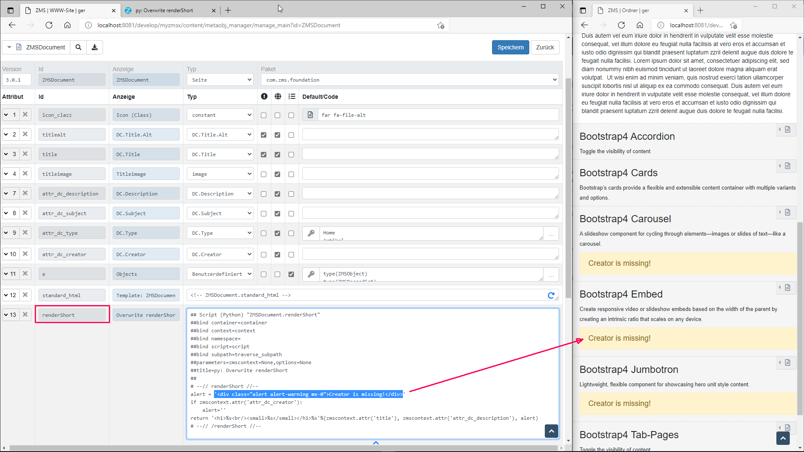
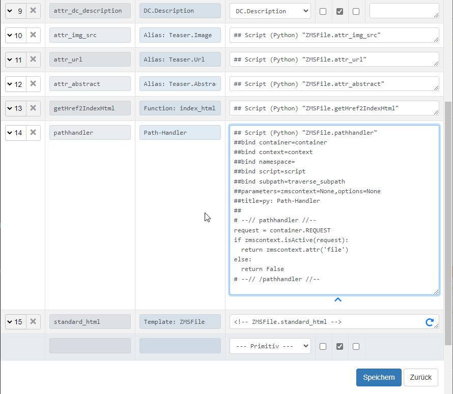
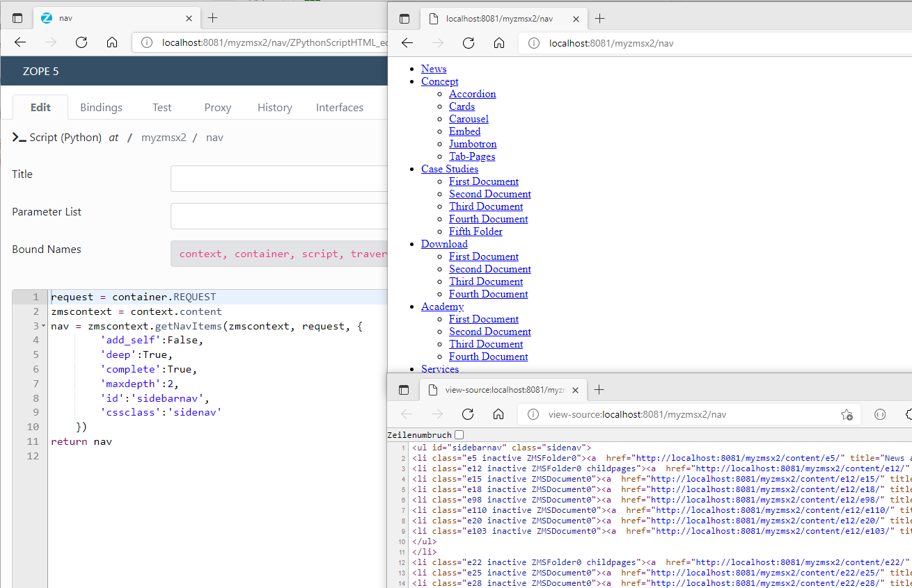
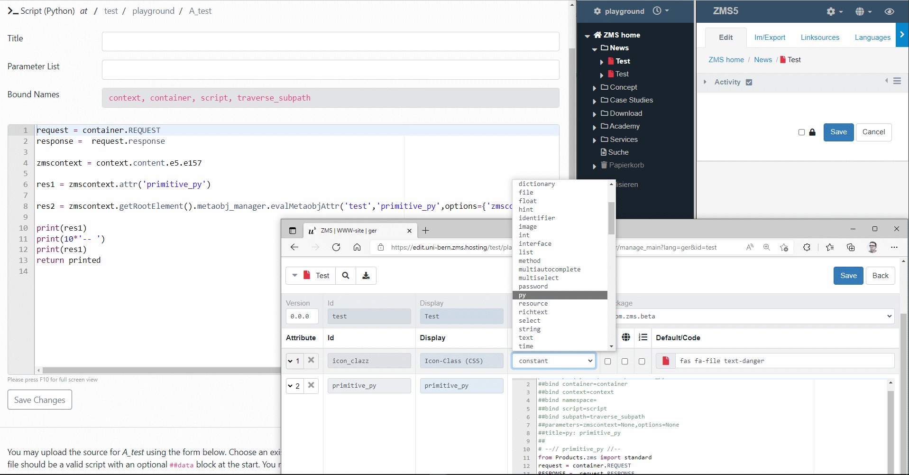
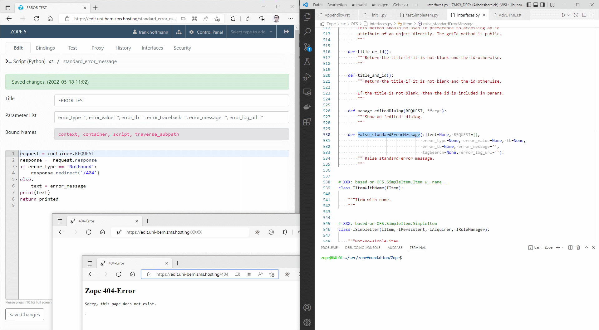
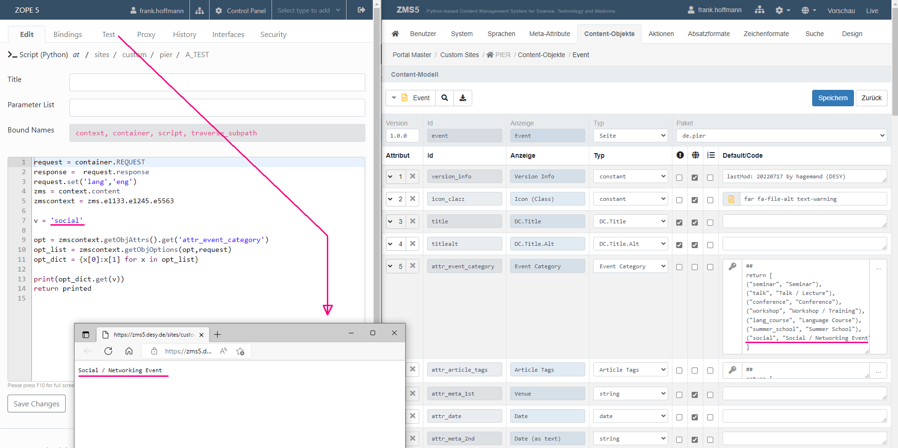

# ZMS Development: Practical Examples for Using API Functions

## 1. renderShort()
The function `renderShort()` renders a plain view of a content block shown in the ZMI. For page-like container objects this might be just the short title (titlealt) attribute; actually this is what happens by default when you see a sequence of ZMSDocument containers in the ZMI.
For content-containing objects like ZMSTextarea their function `standard_html()` is used as the *renderShort*-view by default.

To any object class defined via ZMS configuration menu a custom `renderShort()` function (primitive type *py* or *zpt*) can be added optionally. This will overwrite its default ZMI view. The following picture shows an enhanced view of the ZMSDocument items followed by a python snippet generating this view:



*Adding a renderShort function as a py-primitive allow you to customize the objects view in the ZMS GUI*

### Custom Code Example
The code shows the title and the desciption attribute. Conditionally a warning is shown if the editor forgot naming the creator of the document:
```python
## Script (Python) "ZMSDocument.renderShort"
##bind container=container
##bind context=context
##bind namespace=
##bind script=script
##bind subpath=traverse_subpath
##parameters=zmscontext=None,options=None
##title=py: Overwrite renderShort
##
# --// renderShort //--
alert = '<div class="alert alert-warning mx-0">Creator is missing!</div>'
if zmscontext.attr('attr_dc_creator'): 
	alert=''
return '<h1>%s<br/><small>%s</small></h1>%s'%(zmscontext.attr('title'), zmscontext.attr('attr_dc_description'), alert)
# --// /renderShort //--
```

## 2. pathhandler Attribute
Handling of object paths as URL is mainly done by Zope, but some specific details are handled by ZMS. For instance a path addressing a binary file contained by a ZMSFile object: the file itself is uploaded into an object attribute. Usually object attributes cannot be reached directly by URL. Zope handles this by "traversal" (handling URL paths step by step) and in this case the containing object may decide when to deliver the binary data. Usually the ZMSFile object starts publishing the file data, if the URL ends with the file name or its language specific derivatives. This even works if the ZMSFile object is marked as inactive and thus not rendered as a block element on the html page.
If you may want to change this behaviour the `ZMS.pathandler` module offers a *hook* to implant your own code dealing with traversal of the URL path.
So simply add your own _pathhandler_ attribute (python type, "py") to the ZMSFile object class definition like this: 
```python
## Script (Python) "ZMSFile.pathhandler"
##bind container=container
##bind context=context
##bind namespace=
##bind script=script
##bind subpath=traverse_subpath
##parameters=zmscontext=None,options=None
##title=py: Path-Handler
##
# --// pathhandler //--
request = container.REQUEST
if zmscontext.isActive(request):
	return zmscontext.attr('file')
else:
	return False
# --// /pathhandler //--
```
Now ZMS.pathhandler will executes this attribute code when traversing the URL path: the file will only be returned if the ZMSFile object is marked as active.



*ZMSFile content object definition: Adding a pathhandler function as a py-primitive allow you to customize the response on URL pathes*


## 3. getNavItems()
*getNavItems()* allows a quick and simple creation of a navigation. It generates a HTML output as a hierarchical list if li>a elements with a set of helpful css classes:
1. ZMS-ID
2. Meta-ID
3. in/active 
2. current (if current document node)
4. childpages (if sub documents exists)

The functon parameters are
1. document context
2. request
3. parameter dictionary
	- I{id} (C{str=''}) id of base ul-element
	- I{cssclass} (C{str=''}) css class of base ul-element
	- I{add_self} (C{boolean=False}) add self to list
	- I{deep} (C{boolean=True}) process child nodes
	- I{complete} (C{boolean=False}) process complete subtree
	- I{maxdepth} (C{int=100}) limits node list to a given depth
	- I{getrestricted} (C{boolean=True}) get is restricted

```python
request = container.REQUEST
zmscontext = context.content
nav = zmscontext.getNavItems(zmscontext, request, {
		'add_self':False,
		'deep':True,
		'complete':True,
		'maxdepth':2,
		'id':'sidebarnav',
		'cssclass':'sidenav'
	})
return nav
```



*Example code: a Zope Python Script object creating a two level list of the document tree*

The corresponding TAL-code looks like this:

```html
<nav aria-label="context-navigation" 
	tal:content="structure python: zmscontext.getNavItems(zmscontext, request, {
		'add_self':False,
		'deep':True,
		'complete':True,
		'maxdepth':2,
		'id':'sidebarnav',
		'cssclass':'sidenav'
	})"></nav>
```

## 4. set_response_headers_cache()
In a production enviroment ZMS does not communicate with the web browser by the Zope web server but this is done by a web server application like Apache or nginx. These applications are specialized on scaling, handling the virtual hosts und work as a proxy server. Controlling the caching latency may be an important issue if some documents must be published instantly or to a definied date.
ZMS allows to set a starting date and an ending date to any item. When rendering a page the item with the closest date defines the maximun duration the document may be published by the caching server or the browser cache. This closest expiry date is written as a parameter into the Zope request object and can be read when the page is rendered by the Zope Page Template (TAL) or any other output codes (Py-Script, DTML) generating the http repsonse.
To write the expiring time of a web document into the _http header_ as a parameter like `cache-control` the function `set_response_headers_cache()` of the module zms.standard is used. The following TAL-snippet can be added to the end of the standard_html template of the pages and will set cache control parameters to the http header:

```html
<tal:block 
	tal:define="standard modules/Products.zms/standard;
		cache_expire python:standard.set_response_headers_cache(
			this, 
			request, 
			cache_max_age=0, 
			cache_s_maxage=6*3600
		)">
</tal:block>
```
The crucial parameters are `cache_max_age` (sets `max-age`) for the latency the browser (as _private proxy_) should save the document and `cache_s_maxage` (sets `s-maxage`) for the (public) proxy cache latency. If the website often publishes documents which are time critical, it will be useful to set the max-age parameter very low so that the browser cache latency is minimized (but do not forget your mobile users and their connectivity costs).

### Instant removal of cache storage

To let the editor manually initialize the removal of a single page or a list of pages from the cache storage a ZMS action _manage_cachepurge_ can be imported into the ZMS configuration. Two ZMS Actions (Purge a single page, Purge a list of pages) will appear in the contextual action menu and triggers an External Python Method named `cache_purge` [1] which controls the final backend job [2] and should be fitted to the system environment. 

[1] External Method cache_purge the ZMS Action needs to trigger the cache purging in the backend; this method just calls the final shell script as a (non-blocking) subprocess :
```python
import subprocess, shlex
import os

def cache_purge(arg):
    args = ['sudo', '-u', 'nginx', '/usr/local/bin/cache_purge'] + shlex.split(arg)
    subprocess.check_call(args)
    return ('Cache Deleted: %s' % arg)
```


[2] Shell scipt for identifying and defeting a cached document: 
```python
#!/usr/bin/env python

import os
from hashlib import md5
from os import path

"""
    This script assumes an nginx proxy configuration that looks similar to this:
    
    proxy_cache_path /var/cache/nginx levels=2:2 keys_zone=varcachenginx:10m;
    proxy_cache_key $scheme://$host$request_uri;
"""

PROXY_CACHE_PATH="/var/cache/nginx"

def proxy_cache_key(url):
    # This assumes exactly the URL is the cache key for nginx.
    # If that ever changes, this script needs adaptation.
    m = md5()
    m.update(url)
    return m.hexdigest()

def purge(url):
    key = proxy_cache_key(url)
    level1 = key[-2:]
    level2 = key[-4:-2]
    potential_cache_file = path.join(PROXY_CACHE_PATH, level1, level2, key)
    
    if path.exists(potential_cache_file):
        os.unlink(potential_cache_file)
    else:
        print("File %s for URL %r does not exist" % (potential_cache_file, url))


def _main():
    import sys
    for url in sys.argv[1:]:
        purge(url)

if __name__ == '__main__':
    _main()
```

## 5. evalMetaobjAttr()
A content model can use primitive _py_-attributes for specific functions. In contrast to the Zope object _Script (Python)_ these primitive attributes are hidden in the ZMS metaobject manager  and preserve a tidy look of your upper Zope folder hierarchy.
Actually these py-Methods are stored like this (_hint: the Zope ID contains a dot!_):
`content/metaobj_manager/test.primitive_py`

On the object class' content instance (aka. _zmscontext_) the execution of the py-attributes is similar to any other attribute calls, it's done 'object-like': 
`
zmscontext.attr('primitive_py')
`

But in some cases it might be useful to call the py-code from a different context. 
A direct access via object notation does not work, because the _py_-attributes Zope representation contains a dot in its id.

<a href="https://github.com/zms-publishing/ZMS/blob/dd9ef2de2c84d8b54d31c01a5210af1b634b5011/Products/zms/ZMSMetaobjManager.py#L692" target="_blank">`ZMSMetaobjManager.evalMetaobjAttr()`</a> is the helper that resolves the object path correctly.

_Code-Example: 
res1 uses the attribute call from the object's context, res2 calls the function directly via evalMetaobjAttr()_

```py
request = container.REQUEST
response =  request.response

zmscontext = context.content.e5.e157

res1 = zmscontext.attr('primitive_py')

res2 = zmscontext.getRootElement().metaobj_manager.evalMetaobjAttr('test','primitive_py',options={'zmscontext':zmscontext})

print(res1)
print(10*'-- ')
print(res1)
return printed
```

_Screen shot: shows the corresponding object setup: the py-attribute code can be executed from a different context, here a Zope Py-Script object._



## 6. standard_error_message
The Zope Error Handler expects a Zope object named  _standard_error_message_. This object gets a set of parameters (as defined in (`interfaces.IItem. raise_standardErrorMessage()`) that can be used to control the behaviour on certain types of errors.
The following picture shows a simple example for redirecting to a special 404-page in case of the error type 'NotFound'; otherwise it return the standard error message:

```python
## Script (Python) "standard_error_message"
##bind container=container
##bind context=context
##bind namespace=
##bind script=script
##bind subpath=traverse_subpath
##parameters=error_type='', error_value='', error_tb='', error_traceback='', error_message='', error_log_url=''
##title=py: MY ERROR HANDLER
##
request = container.REQUEST
response =  request.response
if error_type == 'NotFound':
    response.redirect('/404')
else:
    text = error_message
print(text)
return printed
```

_Screen shot: shows the effect of the example code. Requesting a not existing URL like /XXXX results in a redirect to a Page Template object named /404_



## 7. getObjOptions()
The default values of the attribute types _select_ or _multiselect_ can be configured in two ways:
1. as a return-separated list of terms or
2. as a python snippet (marked by intial comment literals) that returns a list tuples showing the second value via ZMS-GUI (ZMI) as a label whereas first (invisible) value is actually stored. (To make it work like a key/value dict the tuple construct can be transformed by a list comprehension).

The second way is practical if the label value of the select list may change sometimes or it contains multiple words (ending up in unreadable or dysfunctional template code).
The following example returns select list for some event categories:

```python
## attr_event_category
return [
("seminar", "Seminar"),
("talk", "Talk / Lecture"),
("conference", "Conference"),
("workshop", "Workshop / Training"),
("lang_course", "Language Course"),
("summer_school", "Summer School"),
("social", "Social / Networking Event")
]
```
The list can be accessed by two sequential API-Calls:
1. `ObjAttrs.getObjAttrs(self, meta_id=None)`: returns the definition of all contextual attributes
2. `ObjAttrs.getObjOptions((self, obj_attr, REQUEST))`: returns as value set as a list of tuples

This following Python-Script illustrates how a specific label text can be returned by a given key

```python
request = container.REQUEST
response =  request.response
request.set('lang','eng')
zms = context.content

# Example ZMS Object (see following image)
zmscontext = zms.e1133.e1245.e5563
v = 'social'

opt = zmscontext.getObjAttrs().get('attr_event_category')
opt_list = zmscontext.getObjOptions(opt,request)
# list comprehension: list of tuples becomes dict
opt_dict = {x[0]:x[1] for x in opt_list}

print(opt_dict.get(v)) 
return printed
```


_Screen shot: the content model uses a select list for declaring the contents category. The list values are given as a tuple: The ZMS-GUI (ZMI) allways show the 2nd value but stores the tuple's corresponding first value. To show the label text by a HTML/TAL template a dict of of all values is needed to gain the lable text by the stored value._

