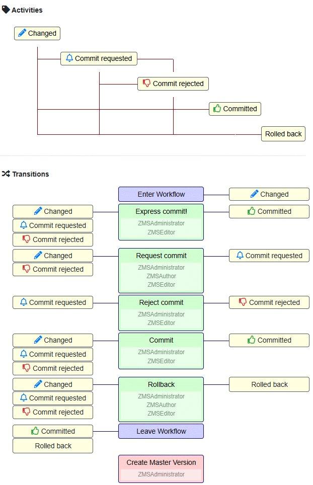

# E. Appendices

This appendix collects reference material that supports all audience groups: a full workflow and versioning reference, a glossary of ZMS-specific terms, and a curated list of external resources.

---

## Workflow and Versioning {#versioning}

### Overview

The two primary tools for content quality assurance in ZMS are *workflow* and *versioning*:

- **Workflow** ensures that the right person edits or reviews content at the right time.
- **Versioning** ensures that the history of editing steps remains transparent and traceable.

A workflow requires at least two versions of a document:

1. *Working version* — being edited (not yet publicly visible).
2. *Published version* (live version) — the current public state.

When a document enters the workflow, a copy of the currently published version is created as the working version. When the document is committed, the working version overwrites the live version permanently.

---

### Content States

#### Basic States (STATE)

Assigned automatically whenever an editor saves a change:

| State | Meaning |
|---|---|
| `STATE_NEW` | Object was just created |
| `STATE_MODIFIED` | Object was modified |
| `STATE_DELETED` | Object was marked for deletion |
| `STATE_MODIFIED_OBJS` | Has modified child objects |
| `None` | No pending change — content is committed / published |

Basic states operate independently of the workflow. When a workflow is active, saving triggers the implicit `TR_ENTER` transition, which assigns the initial activity state `AC_CHANGED` to the parent page container.

#### Activity States (AC)

Activity states are induced by workflow transitions:

| State | Meaning |
|---|---|
| `AC_CHANGED` | Content modified; workflow entered |
| `AC_COMMIT_REQUESTED` | Commit requested by an editor |
| `AC_COMMITTED` | Content approved and published |


*Workflow activity states and transitions*

---

### Transitions (TR)

A transition moves a document from one activity state to another:

```
State-A ──── Transition-AB ───► State-B
State-B ──── Transition-BC ───► State-C
```

Two preset transitions bound the workflow:

- **`TR_ENTER`** — triggered implicitly when basic state is set (enters the workflow).
- **`TR_LEAVE`** — triggered when the document is committed (leaves the workflow, content is published).

A simple workflow model:

```
TR_ENTER ──────────────────► AC_CHANGED
AC_CHANGED ─── Request Commit ─► AC_COMMIT_REQUESTED
AC_COMMIT_REQUESTED ─── Commit ─► TR_LEAVE → published
```

An extended workflow allows shortcuts (e.g. *Commit* directly from `AC_CHANGED`) and additional transitions such as *Reject* or *Rollback*:


*Extended workflow with reject and express-commit transitions*

Transitions can be restricted to specific user roles (e.g. only a *Manager* can execute *Commit*).

### Selective workflow

Workflow can be assigned to individual content nodes and applies recursively to all children. Assigning it to the root node activates it site-wide.

---

### Versioning

#### Two-slot versioning

Each block-level content object maintains two version slots:

| Slot | Description |
|---|---|
| `version_live_id` | ID of the currently published version |
| `version_work_id` | ID of the version currently being edited |

#### Container aggregate versioning

Because a ZMS page is composed of many block objects, the parent container tracks an aggregate version that increments with every child change. This creates a traceable history of which block was changed when:

```
document-e1:  0.0.1  {e2:0.0.1, e3:0.0.1, e4:0.0.1}
              0.0.2  {e2:0.0.1, e3:0.0.2, e4:0.0.1}
              0.0.3  {e2:0.0.1, e3:0.0.3, e4:0.0.1}
```

#### Version numbering

Versions follow `major.minor.patch`:

| Component | When incremented |
|---|---|
| `patch` | Each state transition within a workflow cycle |
| `minor` | Each save (without workflow) or on commit |
| `major` | Explicitly by user action ("Create Major Version") |

Creating a major version prunes all minor/patch history and reduces storage.

#### Versioning with workflow

When the workflow is active, each workflow transition creates a new *patch* version. A commit creates a new *minor* version and discards intermediate patches.

#### Versioning without workflow

Each save creates a new *minor* version. Users can manually review, compare, and restore previous versions from the **History** tab.

In both cases ZMS does not implicitly create a *major* version (like *patch* and *minor*) — it must be done explicitly by a user interaction ("Create Major Version"). Creating a major version prunes all minor and patch history and reduces data storage.

#### Implementation notes (DRAFT)

To implement versioning for a container that holds individually versioned sub-objects, a *version vector* tracks the composite state:

```python
class VersionedObject:
    def __init__(self, id):
        self.id = id
        self.version = 0
        self.sub_objects = {}
        self.change_log = []

    def add_sub_object(self, sub_object):
        self.sub_objects[sub_object.id] = sub_object
        self.update_version()

    def update_sub_object(self, sub_object_id, new_version):
        if sub_object_id in self.sub_objects:
            self.sub_objects[sub_object_id].version = new_version
            self.update_version()

    def update_version(self):
        self.version += 1
        self.change_log.append(self.get_version_vector())

    def get_version_vector(self):
        version_vector = {self.id: self.version}
        for sub_id, sub in self.sub_objects.items():
            version_vector[sub_id] = sub.version
        return version_vector

class SubObject:
    def __init__(self, id):
        self.id = id
        self.version = 0

# Usage
container = VersionedObject('container')
block1 = SubObject('block1')
block2 = SubObject('block2')
container.add_sub_object(block1)
container.add_sub_object(block2)
container.update_sub_object('block1', 1)
container.update_sub_object('block2', 2)
print(container.get_version_vector())
# → {'container': 4, 'block1': 1, 'block2': 2}
```

Key points of this approach:

- **Version Vector Structure** — includes the container version and all sub-object versions.
- **Composite Versioning** — the container's version reflects the combined state of all its sub-objects.
- **Change Log** — each `update_version` call appends a snapshot, providing a traceable history.
- **Incremental Updates** — the container increments whenever any sub-object changes.

---

## Glossary

| Term | Definition |
|---|---|
| **Block element** | A content object that holds actual content and is embedded in a sequence inside a page (e.g. `ZMSTextarea`, `ZMSGraphic`). |
| **Content model** | The site-specific schema of content classes and their attributes, configured in the ZMS administration menu. |
| **Dublin Core (DC)** | A standard set of metadata elements (title, creator, date, …) used by ZMS as the basis for meta-attributes. |
| **Language dictionary** | A table of `TYPE_` / `ATTR_` keys and their per-language translations, used to internationalise ZMI display labels. |
| **Metaobject** | A content class definition stored in the ZODB or filesystem under `metaobj_manager/`. |
| **Meta-attribute** | A site-wide descriptive attribute (Dublin Core–based) inherited by all content objects. |
| **Page node** | A `ZMSFolder` or `ZMSDocument` that aggregates block elements and may nest other page nodes. |
| **Primary language** | The root language in the multilingual dependency tree; the source for translations. |
| **Repository Manager** | The ZMS module that synchronises custom code between ZODB and a filesystem folder (and optionally Git). |
| **ZODB** | Zope Object Database — the native Python object persistence store used by Zope and ZMS. |
| **ZCatalog** | The Zope full-text search catalog, used by ZMS for built-in site search. |
| **ZMI** | ZMS / Zope Management Interface — the browser-based editorial and administrative GUI. |
| **ZMS** | Zope-based Content Management System — the CMS documented here. |
| **ZMSIndex** | A lightweight catalog (`zmsindex_catalog`) mapping ZMS IDs, UUIDs, and Zope paths for fast link resolution. |
| **`version_live_id`** | Pointer to the currently published version of a content block. |
| **`version_work_id`** | Pointer to the working (in-progress) version of a content block. |
| **`TR_ENTER` / `TR_LEAVE`** | Implicit workflow transitions that enter and exit the workflow cycle. |
| **`AC_CHANGED`** | The initial activity state assigned to a page container when any of its content is modified. |

---

## External Resources

### ZMS and Zope

| Resource | URL |
|---|---|
| ZMS source code | <https://github.com/zms-publishing/ZMS> |
| ZMS PyPI package | <https://pypi.org/project/Products.zms/> |
| Zope documentation | <https://zope.readthedocs.io/> |
| Zope source code | <https://github.com/zopefoundation/Zope> |
| Zope Foundation | <https://www.zope.dev/> |

### Python and deployment

| Resource | URL |
|---|---|
| Python 3 documentation | <https://docs.python.org/3/> |
| pip documentation | <https://pip.pypa.io/> |
| Virtualenv / venv | <https://docs.python.org/3/library/venv.html> |
| systemd unit files | <https://www.freedesktop.org/software/systemd/man/systemd.service.html> |

### Search and AI

| Resource | URL |
|---|---|
| Apache Solr | <https://solr.apache.org/> |
| Solr Docker image | <https://hub.docker.com/_/solr/> |
| Qdrant vector database | <https://qdrant.tech/> |
| Ollama local LLM | <https://ollama.com/> |
| OpenAI API | <https://platform.openai.com/docs/> |
| PDFMiner.six | <https://pypi.org/project/pdfminer.six/> |

### Content standards

| Resource | URL |
|---|---|
| Dublin Core Metadata Initiative | <https://www.dublincore.org/> |
| HTML Living Standard | <https://html.spec.whatwg.org/> |
| HTTP caching (MDN) | <https://developer.mozilla.org/en-US/docs/Web/HTTP/Caching> |
| NGINX X-Accel | <https://www.nginx.com/resources/wiki/start/topics/examples/x-accel/> |
