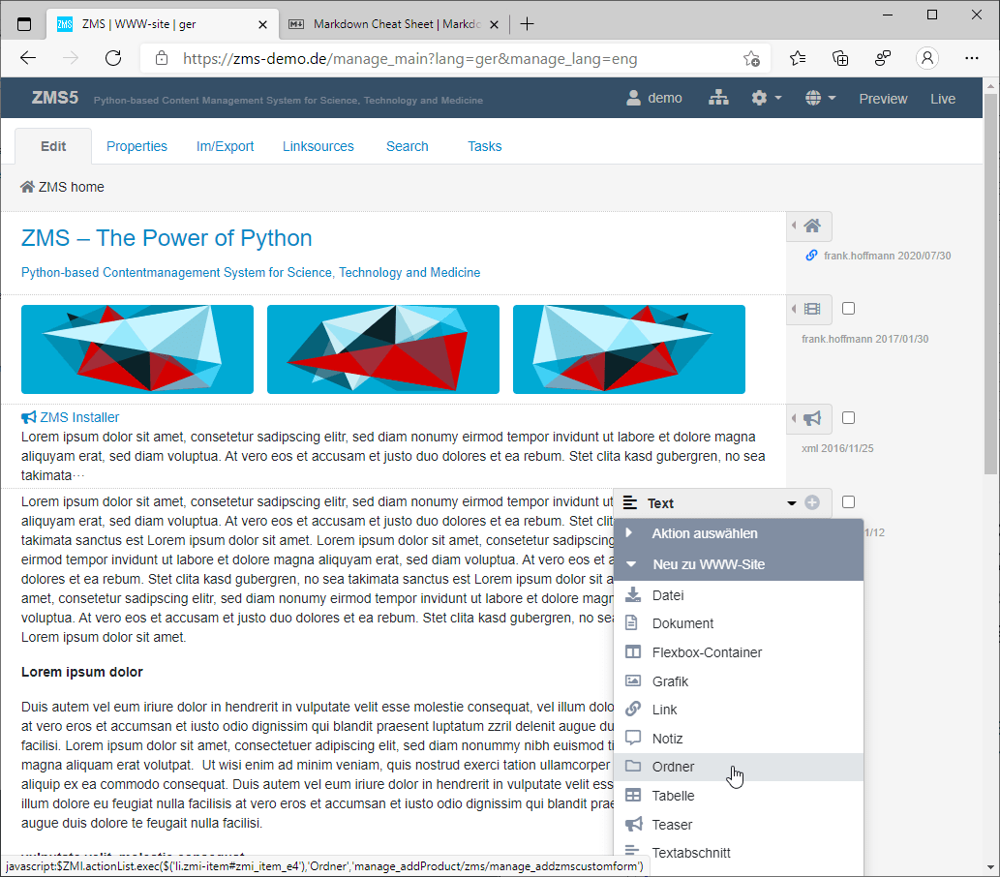
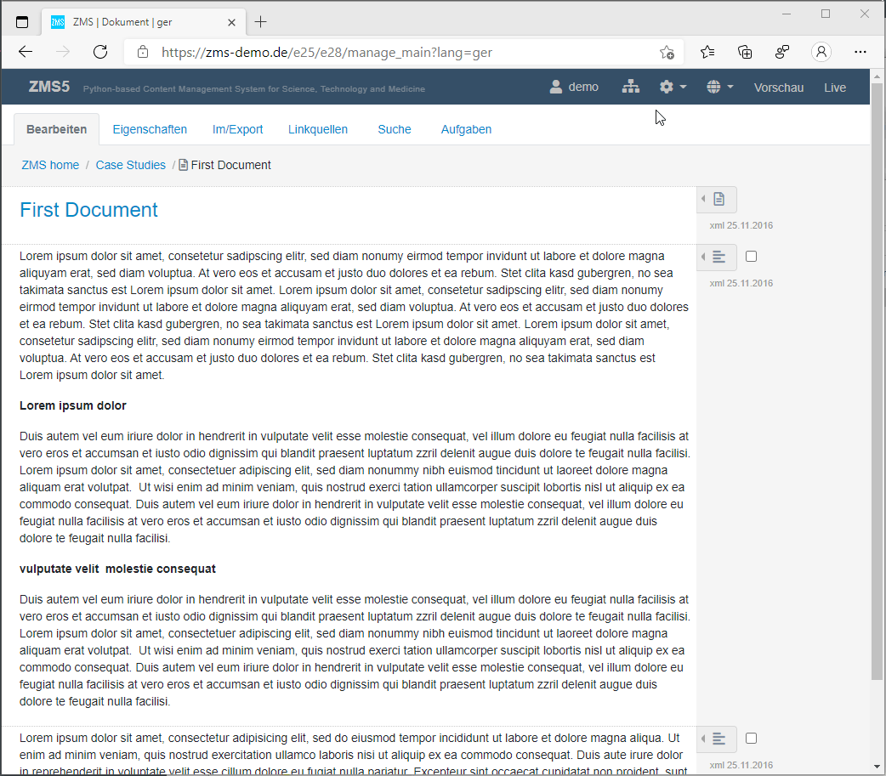

# Editor's Guide: Content Production

The ZMS GUI for editors is primarily focussed on the content. To archive a design-neutral content stream
the editor produces a document as a sequence of small content-blocks. A content-block may be a text block, a link, a picture, a video or any other content class which is availabe in the right pop-up menu ("context menu").
A new content block is added by clicking on one of the listed content classes and filling the following form.

*The ZMS editing GUI shows the reduced page preview by listing all its containing content blocks. New content blocks are added by clicking the pop-up menu on the right of the content-blocks*

## The ZMS Management Interface (ZMI)

The ZMI mainly has two functional purposes: navigating and editing. For navigation there are the following elements:
1. Top Bar (meta functions)
2. Main Menu (node modalities)
3. Path Navigation (breadcrumbs)
4. Site Map (content tree)

and for editing:
1. context menu (adds content items, executes functions)
2. content class specific data entry form (content production)

## Top Bar
The top bar contains some important functions that may be needed in any working context:
1. showing the authenticated user name linking to its profile data
2. the sitemap icon toggles the left handed document tree navigation
3. the configuration menu lists role specific meta functions (like switching to the conent model configuration)
4. the flag icon lists the content languages in case it's a multlingual site
5. the globe icon lists the available gui languages
6. the preview link sitches to the rendered website view (third view) of the current node
7. the live link switches to the production server (if different from preview server)

## Main Menu
The tabbed main menu is located below the top bar and shows different modalities of the current content node:
1. Editing: the fist tab shows the sequence of the content blocks a page consists of.
2. Properties: meta attribute
3. Import/Export: exporting the current node in to different data formats or XML-based content importing into the current node
4. Link Sources: list of links targetting the current node
5. History: if versioning is activated the menu shows the changes of the current node
5. Search: full-text search through the document tree
6. Tasks: lists document nodes of a certain status (of the workflow)

## Path Navigation 
The path or breadcrumb nagivation is located below the main menu and shows the depth of the position in the document tree: it os a list of parent nodes from the current node to the root node. 

## Site Map
Clicking onto the sitemap icon in the top menu generated a left handed navigation frame of the content. The sitemap can be used to browse through the document tree quickly.

*Site map navigation browsing the document tree*

