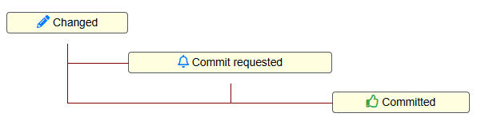
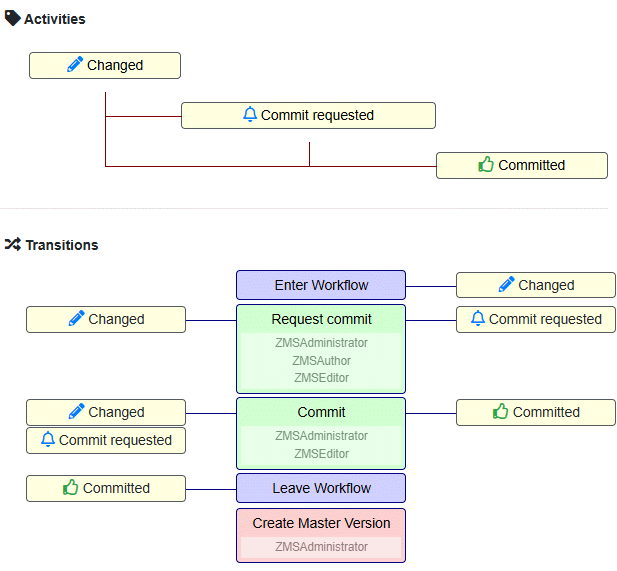
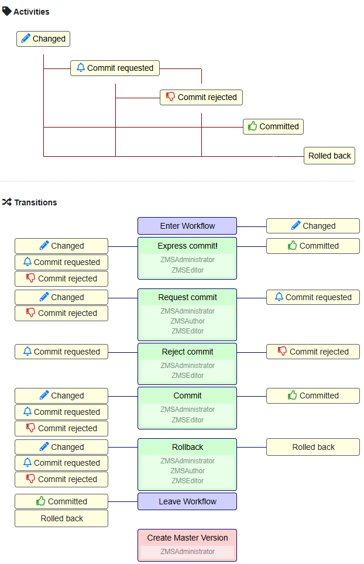

# Workflow

## Introduction

The key tools for content quality assurance are _workflow_ and _versioning_; 
both approaches go hand in hand in content production: 

* **workflow** ensures that the right person edits or reviews content at the right time, while
* **versioning**  ensures that the history of editing steps remains transparent and traceable.

A workflow requires at least two _versions_ of a document:  

1. _Working version_ that is being edited, and
2. _Published version_ (aka. _live version_).

When a document enters the workflow, a copy of the currently published document version is created and serves as the _working version_. And when the document is published, the working version becomes the current _live version_ by irrevocably overwriting the former live version.

To model a workflow ZMS allows you to define state names for the content and programm the transitions between these states. The following general principles apply:

1. A workflow is the sequence of predefined state _transitions_ in a logical order - with the goal of document release.
2. A workflow step requires a transition from one active workflow state (activity state) of the content object to another.
3. Starting from the basic state, the workflow always starts automatically with the `TR_ENTER` transition, i.e. with the transfer of the object to the active workflow-specific initial state _Changed_.
4. The workflow always ends with the `TR_LEAVE` transition to the target state `AC_COMMITTED` _Commmitted_ (corresponds to the empty basic state `None`).


## Content States

### Basic States (STATE)

When an editor makes a content change and clicks the save button, the system records this change by assigning four basic states to the object. 
Moreover there is the possibility that no state is assigned. So these basic states are: 

1. `STATE_NEW`
2. `STATE_MODIFIED`
3. `STATE_DELETED`
4. `None` (no state assigned, means _committed_/published)


These states are fundamental and operate independently of any activated workflow. Once the workflow is activated, _transitions_ become relevant to add more, workflow specific state values to the content: if a content object is assigned one of basic states it automatically triggers a virtual transition to enter the workflow process, specifically the transition (tr) `TR_ENTER` for the PAGE container of the edited content object.
As a result, the PAGE container, along with the affected content object, is assigned the initial workflow status, which is labeled as _changed_ by an activity (ac) status `AC_CHANGED`.


### Activity States (AC)

Activity states are induced by specific workflow transitions; so any _activity state_ can get changed to another activity state by a _transition_ method that will exactly perform this specific action.



The workflow model above starts implicitly with the basic state "Changed" and will be left implicitly with the activity state "committed"; besides the implicit initial activity state `AC_CHANGED` (as a result of the basic state settings like new, modified or deleted) the  use performed _activity states_ of the workflow are:

1. Commit requested
2. Committed

To perform the changes of the activity states two _transitions_ are needed:

1. Request commit
2. Commit

## Transitions (TR)

A _transition_ is the change of a document state from one to another executed by a transaction and fully decribed by these three elements:

```
State-A -----Transaction-----> State-B
```
To ensure a logical  _flow_ of transitions any ending state shall be the starting starting state of another transition. Otherwise the workflow may end prematurely and document changes cannot not be published.

```
State-A -----Transaction-AB-----> State-B
State-B -----Transaction-BC-----> State-C
```

This is a linear flow from _State-A_ to _State-C_. But how does a document get to _State-A_? And when does the flow end, when will the document be published? That is why two preset transitions for _entering_ (TR_ENTER) and _leaving_ (TR_LEAVE) the workflow are needed:

```
             Enter Workflow-----> State-A
State-A -----Transaction-AB-----> State-B
State-B -----Transaction-BC-----> State-C
State-C -----Leave Workflow
```

The ZMS-UI allows to model this stepwise: First you define a set of activity states beginning with `AC_CHANGED` (_Changed_). Then you add a set of _transitions_ starting with `TR_ENTER` and ending with `TR_LEAVE`. Any transition has one or more states where it can start from and exactly one state where it ends to.
The visualisation of a very simple workflow may look like this:



_Screen image: Simple workflow with two major transitions: 1. requesting a commit and 2. committing_

Besides the transitions from one state to another, the screen image shows two more important aspects for designing a workflow:

1. A transition can get started from more than one state, e.g. "Commit" can be performed from "Changed" (like a shortcut for faster publication) and from "Commit requested" (to get the approval first)
2. A transition can be performed by certain user roles

This very simple workflow can be made more flexible by adding more _transitions_, e.g. a transition for rejecting a request for document commit or a transition for rolling back all document changes. A _rollback_ would leave the workflow as well as a _commit_. And you can add a "Express Commit" transition for instant publishing.



_Screen image: The simple workflow has got some more transitions to cover variants in the workflow and to make it more flexible_


## Selective workflow

# Versioning

## Introduction

Each content block object (being a set of attributes) can be stored in its own version.
This object has a unique id and this id is referenced by the `ZMSCustom`-container.
Any object is designed to exist in two versions; its container-object aggregates these two versions by id-linking to the corresponding content object:
* `version_live_id` for the current published live-version
* `version_work_id` for the current version in progress

Because document a massively fragmented into small block objects, a useful aggregate is the committable container-object. Thus committing a container-object (document) will be equivalent to tagging a changeset.

###TODO###: 
tag each atomic block object or store all versions of atomic sub-objects in the container?
e.g.:

```
Folder e1 {1.0.0: AAA, 2.0.0: AAA}
    Textarea e2 {1.0.0: AAA: 2.0.0: ABA}
    Textarea e3 {1.0.0: AAA: 2.0.0: AAA}

Folder e1 {1.0.0: {e1: AAA, e2: AAA, e3: AAA},
           2.0.0: {e1: AAA, e2: ABA, e3: AAA}}
    Textarea e2
    Textarea e3
```

## Numbering

The version numbering follows the scheme 
:

```
major.minor.patch
```

* **major**: Significant changes, possibly incompatible with previous versions.
* **minor**: Minor feature additions, backward-compatible.
* **patch**: Bug fixes and minor changes, backward-compatible.

## Versioning without workflow

In scenarios where the workflow is not activated, versioning still ensures that changes are tracked and can be reverted if necessary. Each save action creates a new version of the content, and the system maintains a history of these versions. Users can manually switch between versions or restore previous versions as needed.

## Versioning with activated workflow

When the workflow is activated, versioning integrates seamlessly with the workflow states and transitions. Each state change or transition can trigger the creation of a new version, ensuring that every step in the workflow is documented and traceable. This integration provides a robust mechanism for content management, combining the benefits of both versioning and workflow to maintain high content quality and accountability.
